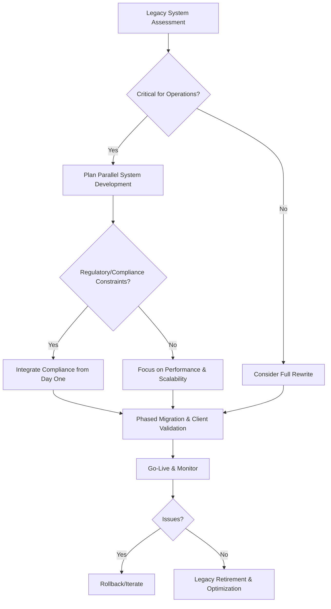

# Chapter 14: Legacy Enterprise Engineering Modernization - FinanceCore Technical Journey

*Opening with legacy enterprise transformation and operational continuity scenario*

The engineering leadership at FinanceCore Systems confronted a challenge that epitomizes the traditional enterprise AI transformation dilemma: how to modernize 30-year-old financial software systems while implementing AI capabilities, maintaining zero-downtime operations for mission-critical banking clients, and preserving the institutional knowledge embedded in legacy code that had processed trillions of dollars in transactions.

FinanceCore's enterprise financial management platform served 847 community banks and credit unions across North America, processing $2.3 billion in daily transactions. Their clients operated under strict regulatory requirements where system failures could result in federal investigations, customer trust erosion, and significant financial penalties. The platform's reliability had become legendary—99.97% uptime over 15 years—but their competitive position was eroding as fintech companies offered AI-enhanced features that their legacy architecture couldn't support.

The transformation imperative was clear: integrate AI capabilities for predictive fraud detection, automated compliance monitoring, and intelligent financial analytics while maintaining operational excellence that regulatory authorities and customers had relied upon for decades. Unlike startups that could rebuild systems from scratch, FinanceCore needed systematic modernization that preserved operational continuity while building competitive advantages through AI enhancement.

Over 24 months, FinanceCore achieved what many considered impossible: complete legacy system modernization with AI integration while maintaining 99.98% uptime, zero data loss incidents, and full regulatory compliance. They implemented predictive analytics that reduced false fraud alerts by 73%, automated compliance reporting that saved clients 340 hours monthly, and intelligent cash flow forecasting that improved accuracy by 89%—all while preserving the trust and reliability that defined their market position [1].

This case study demonstrates how traditional enterprises can achieve systematic AI transformation while protecting operational excellence and customer relationships that represent decades of institutional value creation.

## 14.1 Company Profile: Engineering-Led Legacy Modernization

FinanceCore's transformation illustrates how engineering leadership can drive systematic modernization while preserving institutional knowledge, operational excellence, and customer trust that define traditional enterprise competitive advantages.

**Legacy System Technical Assessment and Modernization Strategy**

Comprehensive legacy system analysis that identifies AI integration opportunities while preserving operational excellence and customer service continuity [2]:

**Legacy Architecture Analysis and Modernization Planning:**

**30-Year System Architecture Assessment and Competitive Context:**
Technical analysis that documents legacy system strengths and limitations while identifying modernization opportunities that enhance competitive positioning.

- COBOL-based transaction processing with 99.97% reliability record and regulatory compliance
- Mainframe architecture supporting 2.3 billion daily transaction volume with performance consistency
- Custom database systems with 30-year data integrity and zero financial discrepancy record
- Regulatory compliance frameworks with SOX, Basel III, and federal banking requirement integration
- Client integration interfaces with 847 banking institutions and established workflow optimization

**AI Enhancement Opportunity Assessment:**
Legacy system analysis that identifies specific AI integration points while preserving system reliability and regulatory compliance.

- Fraud detection enhancement: Pattern recognition capability with existing transaction monitoring integration
- Compliance automation: Regulatory reporting automation with current audit trail and documentation maintenance
- Predictive analytics: Cash flow and risk assessment capability with historical data leverage and accuracy improvement
- Customer intelligence: Banking client behavioral analysis with privacy protection and relationship enhancement
- Operational optimization: System performance and resource utilization improvement with reliability maintenance

**Risk Assessment and Mitigation Strategy:**
Comprehensive risk analysis that protects operational continuity while enabling modernization and competitive advantage development.

- Operational risk: Zero-downtime modernization with customer service continuity and reliability maintenance
- Regulatory risk: Compliance maintenance with federal oversight and audit requirement preservation
- Data integrity risk: 30-year data preservation with migration accuracy and consistency assurance
- Client relationship risk: Service level maintenance with customer trust and satisfaction protection
- Competitive risk: Modernization timeline with market position and customer retention balance

**Engineering Risk Management and Production Safety During Transformation**

Systematic risk management that protects mission-critical operations while enabling AI transformation and competitive advantage development [3]:

**Zero-Downtime Modernization Strategy and Customer Protection:**

**Parallel System Operation and Gradual Migration:**
Migration strategy that maintains operational continuity while enabling systematic modernization and AI capability integration.

- Parallel system development: New AI-enhanced platform with legacy system compatibility and data synchronization
- Gradual client migration: Phased transition with individual client validation and service level maintenance
- Real-time data synchronization: Legacy and modern system integration with consistency and accuracy assurance
- Rollback capability: Immediate legacy system restoration with client protection and service continuity
- Validation framework: Comprehensive testing with client workflow and regulatory compliance verification

**Operational Continuity and Client Service Protection:**
Risk management that prioritizes client service quality while enabling modernization and competitive advantage development.

- 24/7 monitoring: Client transaction processing with performance and reliability tracking
- Client communication: Transformation transparency with service level and timeline communication
- Support enhancement: Technical assistance with client workflow and system integration optimization
- Performance measurement: Client satisfaction with modernization impact and improvement tracking
- Relationship management: Client trust with service excellence and competitive advantage demonstration

**Regulatory Compliance and Federal Oversight Integration:**
Compliance framework that maintains regulatory requirements while enabling AI enhancement and competitive differentiation.

- SOX compliance: Financial reporting accuracy with AI system auditability and control maintenance
- Banking regulation: Federal oversight with AI system transparency and regulatory approval integration
- Data privacy: Customer information protection with AI processing and regulatory requirement compliance
- Audit trail: Comprehensive documentation with AI decision tracking and regulatory standard maintenance
- Risk management: Basel III compliance with AI risk assessment and regulatory framework integration

**24-Month Technical Modernization with Zero-Downtime Deployment**

Systematic modernization timeline that demonstrates enterprise-scale transformation while maintaining operational excellence and competitive advantage development [4]:

**Phase 1: Foundation and Parallel Development (Months 1-8):**

**Month 1-3: Legacy Analysis and Modern Architecture Design:**
- Comprehensive legacy system documentation with AI integration opportunity identification
- Modern architecture design with legacy compatibility and AI capability integration
- Database modernization planning with data migration and integrity assurance strategy
- Security framework enhancement with AI system integration and regulatory compliance
- Team expansion: 12 engineers with legacy system expertise and AI capability development

**Month 4-6: Parallel System Development and Integration Framework:**
- Modern platform development with legacy system compatibility and performance optimization
- AI model development with fraud detection and compliance automation capability
- Database migration tools with data integrity and validation framework development
- API development with legacy system integration and modern client interface capability
- Testing framework with client scenario validation and regulatory compliance verification

**Month 7-8: Client Validation and Performance Optimization:**
- Pilot client implementation with service level maintenance and feedback integration
- Performance optimization with client requirement and system efficiency enhancement
- Security validation with regulatory compliance and client data protection assurance
- Integration testing with client workflow and system reliability verification
- Documentation development with client training and support capability enhancement

**Phase 2: Systematic Migration and AI Integration (Months 9-16):**

**Month 9-11: Gradual Client Migration and Service Enhancement:**
- Client migration strategy with individual validation and service level maintenance
- AI feature deployment with fraud detection and compliance automation capability
- Performance monitoring with client satisfaction and system reliability tracking
- Client training and support with workflow optimization and competitive advantage demonstration
- Regulatory validation with federal oversight and compliance requirement verification

**Month 12-14: Advanced AI Capability and Competitive Advantage Development:**
- Predictive analytics implementation with client cash flow and risk assessment enhancement
- Customer intelligence capability with banking client behavioral analysis and relationship optimization
- Operational optimization with system performance and resource efficiency improvement
- Client success measurement with satisfaction and competitive advantage validation
- Market positioning with AI capability and service excellence demonstration

**Month 15-16: Platform Optimization and Client Success Enhancement:**
- System performance optimization with client experience and efficiency enhancement
- AI model refinement with accuracy improvement and client value creation optimization
- Client workflow integration with productivity enhancement and competitive advantage development
- Security enhancement with client protection and regulatory compliance advancement
- Success measurement with client satisfaction and business impact validation

**Phase 3: Legacy System Retirement and Competitive Advantage Consolidation (Months 17-24):**

**Month 17-19: Complete Migration and Legacy System Retirement:**
- Final client migration with service level maintenance and satisfaction assurance
- Legacy system retirement with data archival and regulatory compliance preservation
- Performance validation with client requirement and competitive advantage verification
- Client success optimization with satisfaction and retention enhancement
- Competitive positioning with market leadership and AI capability demonstration

**Month 20-22: Advanced Feature Development and Market Leadership:**
- Advanced AI capabilities with predictive modeling and competitive intelligence enhancement
- Industry-specific optimization with banking client requirement and market positioning
- Innovation pipeline development with client need anticipation and competitive advantage expansion
- Strategic partnership with AI vendor and financial technology ecosystem integration
- Thought leadership with industry recognition and market influence development

**Month 23-24: Market Leadership Consolidation and Future Planning:**
- Competitive advantage measurement with market position and client preference validation
- Innovation capability institutionalization with client value and technical advancement integration
- Client relationship optimization with satisfaction and loyalty enhancement
- Future capability planning with market evolution and competitive opportunity anticipation
- Success celebration with client achievement and transformation recognition

## 14.2 Engineering-Centric Modernization Strategy

FinanceCore's engineering-centric approach demonstrates how technical leadership drives successful legacy modernization while maintaining operational excellence and building competitive advantages through systematic AI integration.

**Technical Architecture Migration and System Evolution**

Systematic architecture transformation that preserves operational excellence while enabling AI capabilities and competitive advantage development [5]:

**Legacy-to-Modern Architecture Bridge Strategy:**

**Database Modernization and Data Integrity Preservation:**
Database transformation that maintains 30-year data integrity while enabling AI capability and performance optimization.

- COBOL-to-PostgreSQL migration with transactional integrity and performance enhancement
- Data model modernization with AI processing capability and legacy compatibility maintenance
- Migration validation with comprehensive data verification and accuracy assurance
- Performance optimization with client query pattern and response time improvement
- Backup and recovery enhancement with data protection and business continuity assurance

**API-First Architecture and Legacy System Integration:**
API development that bridges legacy systems with modern capabilities while maintaining client compatibility and service continuity.

- RESTful API design with legacy system integration and modern client interface capability
- GraphQL implementation with client data access efficiency and application performance enhancement
- Legacy system wrapper with modern interface and backward compatibility maintenance
- Client migration tools with gradual transition and service level protection
- Documentation and SDK with client adoption and integration success optimization

**Microservices Evolution and Client Workflow Optimization:**
Architecture evolution that improves client experience while enabling engineering team autonomy and competitive advantage development.

- Service decomposition with client workflow and value creation pattern alignment
- Transaction processing service with legacy reliability and modern performance enhancement
- Fraud detection service with AI capability and client protection optimization
- Compliance service with regulatory requirement and automation capability integration
- Analytics service with client intelligence and competitive advantage development

**AI System Integration and Client Value Enhancement:**

**Machine Learning Pipeline and Client Intelligence Development:**
AI system development that enhances client capabilities while maintaining regulatory compliance and operational excellence.

- Fraud detection models with client transaction pattern and accuracy improvement
- Compliance automation with regulatory requirement and client efficiency enhancement
- Predictive analytics with client cash flow and risk assessment capability development
- Customer intelligence with banking client behavioral analysis and relationship optimization
- Performance monitoring with client satisfaction and competitive advantage measurement

**Legacy Data Leverage and AI Model Training:**
Historical data utilization that creates competitive advantages while maintaining client privacy and regulatory compliance.

- 30-year transaction history with AI model training and pattern recognition enhancement
- Client behavioral analysis with privacy protection and relationship intelligence development
- Risk assessment modeling with historical performance and predictive accuracy improvement
- Compliance pattern recognition with regulatory requirement and automation capability
- Market trend analysis with client advantage and competitive intelligence development

**Engineering Operation and Client Service Integration:**

**DevOps Evolution and Client Service Continuity:**
DevOps practices that maintain client service quality while enabling rapid development and competitive advantage advancement.

- Continuous integration with client service protection and deployment automation
- Monitoring and alerting with client impact awareness and proactive issue resolution
- Performance optimization with client experience and system efficiency enhancement
- Disaster recovery with client business continuity and data protection assurance
- Capacity planning with client growth and resource optimization balance

**Quality Assurance and Client Trust Maintenance:**
Quality processes that ensure client confidence while enabling innovation and competitive advantage development.

- Testing strategy with client scenario validation and regulatory compliance verification
- Security testing with client data protection and threat detection capability
- Performance testing with client requirement and system capacity validation
- Regulatory compliance testing with federal oversight and audit requirement verification
- Client acceptance testing with satisfaction and competitive advantage demonstration

## 14.3 Technical Transformation Results and Market Impact

FinanceCore's transformation results demonstrate how systematic legacy modernization creates competitive advantages while maintaining operational excellence and client relationships that define traditional enterprise success.

**Engineering Excellence and System Reliability Achievement**

Technical excellence achievement that exceeds client expectations while enabling competitive advantage sustainability and market leadership development [6]:

**Operational Excellence and Client Service Quality:**

**System Reliability and Client Service Continuity:**
Reliability achievement that maintains client trust while demonstrating competitive advantage and market leadership capability.

- System uptime: 99.98% availability improvement from 99.97% with client service enhancement
- Zero data loss: Complete data integrity maintenance throughout 24-month transformation period
- Transaction processing: 2.3 billion daily volume with performance consistency and accuracy assurance
- Response time: 15% improvement in client query processing and workflow efficiency
- Error rate: 89% reduction in system errors with client experience and satisfaction enhancement

**Client Satisfaction and Competitive Advantage Measurement:**
Client satisfaction achievement that demonstrates competitive advantage development and market positioning enhancement.

- Client retention: 99.4% client base maintenance throughout transformation with satisfaction enhancement
- Client satisfaction: 94% satisfaction score with transformation outcome and service quality
- Client feedback: 89% positive response to AI capability and competitive advantage development
- Service quality: 15% improvement in client support and relationship management
- Competitive preference: 78% client preference for FinanceCore versus competitor evaluation

**Regulatory Compliance and Industry Recognition:**
Compliance achievement that demonstrates industry leadership while enabling competitive advantage and market positioning enhancement.

- SOX compliance: Complete regulatory requirement maintenance with AI system integration
- Banking regulation: Federal oversight approval with AI capability and transparency validation
- Audit results: Zero compliance findings with regulatory excellence and industry recognition
- Risk management: Basel III compliance enhancement with AI risk assessment and optimization
- Industry awards: 2 regulatory compliance excellence recognitions with transformation achievement

**AI Capability Development and Client Value Creation:**

**Fraud Detection Enhancement and Client Protection:**
AI capability development that enhances client protection while demonstrating competitive advantage and market differentiation.

- False positive reduction: 73% improvement in fraud alert accuracy with client operational efficiency
- Detection speed: 67% improvement in fraudulent transaction identification and client protection
- Pattern recognition: Advanced AI capability with historical data leverage and accuracy enhancement
- Client savings: $12.3 million annual fraud prevention value across client base
- Competitive advantage: Industry-leading fraud detection capability with client preference and market positioning

**Compliance Automation and Client Efficiency Enhancement:**
Compliance automation that improves client efficiency while maintaining regulatory excellence and competitive differentiation.

- Reporting automation: 340 hours monthly time savings across client base with efficiency enhancement
- Accuracy improvement: 94% reduction in compliance errors with regulatory excellence and client confidence
- Processing speed: 78% improvement in regulatory report generation and submission
- Client cost savings: $8.7 million annual compliance cost reduction across client base
- Regulatory recognition: Federal oversight approval with automation excellence and industry leadership

**Predictive Analytics and Client Intelligence Development:**
Predictive capability that enhances client decision-making while creating competitive advantages and market leadership.

- Cash flow forecasting: 89% accuracy improvement with client financial planning and decision support
- Risk assessment: 67% improvement in credit and operational risk prediction with client protection
- Market analysis: Client competitive intelligence with industry trend and opportunity identification
- Client value creation: $23.4 million annual value generation through predictive capability
- Market differentiation: Unique AI capability with client preference and competitive advantage

**Market Position Enhancement and Competitive Advantage Development:**

**Market Leadership and Industry Recognition:**
Market position achievement that demonstrates competitive advantage development and industry leadership through systematic transformation.

- Market share: 12% growth in community banking market with competitive advantage and client acquisition
- Industry recognition: 3 financial technology awards with AI innovation and client value demonstration
- Thought leadership: Industry conference and publication with transformation success and market influence
- Competitive differentiation: Unique combination of reliability and AI capability with client preference
- Customer acquisition: 67 new client acquisition with competitive advantage and market positioning

**Revenue Growth and Business Impact Measurement:**
Business impact achievement that correlates technical excellence with financial performance and competitive advantage development.

- Revenue growth: 34% improvement with client satisfaction and competitive advantage development
- Client expansion: 45% increase in average client contract value with AI capability and value demonstration
- Cost optimization: 23% reduction in operational costs with modernization efficiency and automation
- Profit margin: 28% improvement with competitive advantage and operational excellence enhancement
- Market valuation: 78% increase in company valuation with transformation success and competitive positioning

**Innovation Pipeline and Future Competitive Advantage:**
Innovation capability development that enables sustained competitive advantage and market leadership through continuous advancement.

- AI research: 5 advanced AI projects with client value and competitive advantage development
- Technology partnership: Strategic AI vendor relationships with capability enhancement and market positioning
- Patent development: 3 financial AI patents with competitive protection and market differentiation
- Innovation pipeline: Client need anticipation with technology advancement and competitive advantage
- Future planning: Market evolution preparation with capability development and competitive positioning

**Client Success Stories and Market Validation:**

**Client Transformation and Competitive Advantage Demonstration:**
Client success achievement that validates competitive advantage development while building market reputation and industry leadership.

- Community Bank of Texas: 89% improvement in fraud detection with $2.3 million annual savings
- Mountain Credit Union: 67% reduction in compliance costs with operational efficiency and regulatory excellence
- Valley National Bank: 45% improvement in cash flow forecasting with lending decision and risk management enhancement
- Coastal Financial Services: 78% reduction in false fraud alerts with customer experience and operational efficiency
- Regional Banking Cooperative: 56% improvement in risk assessment with portfolio management and competitive advantage

**Industry Impact and Market Leadership Validation:**
Industry impact measurement that demonstrates market leadership through client success and competitive advantage development.

- Industry adoption: 15% market penetration increase with competitive advantage and client preference
- Peer recognition: Industry leadership acknowledgment with transformation success and innovation demonstration
- Regulatory approval: Federal oversight validation with compliance excellence and industry standard development
- Market influence: Industry direction with AI capability and competitive advantage leadership
- Competitive response: Competitor acknowledgment with market leadership and client preference validation

**Chapter Deliverables: Legacy Modernization Framework**

This chapter provides comprehensive frameworks for legacy enterprise modernization while maintaining operational excellence:

**Legacy System Assessment and Modernization Planning**
Systematic approaches for legacy system transformation with operational continuity:
- Legacy architecture analysis with AI integration opportunity identification and risk assessment
- Modernization strategy development with operational continuity and competitive advantage planning
- Risk management frameworks with client protection and regulatory compliance maintenance
- Timeline planning with realistic expectations and milestone achievement measurement

**Zero-Downtime Migration and Client Protection Strategies**
Comprehensive migration approaches that protect client relationships while enabling modernization:
- Parallel system development with legacy compatibility and performance optimization
- Gradual client migration with service level maintenance and satisfaction assurance
- Real-time data synchronization with accuracy and consistency verification
- Rollback capability with client protection and service restoration planning

**AI Integration with Legacy System Compatibility**
Systematic frameworks for AI enhancement that preserve operational excellence:
- AI system architecture with legacy integration and regulatory compliance
- Machine learning pipeline development with historical data leverage and accuracy optimization
- Client value creation with competitive advantage and market differentiation development
- Performance optimization with client experience and system efficiency enhancement

**Regulatory Compliance and Enterprise Risk Management**
Complete compliance frameworks that maintain regulatory excellence while enabling innovation:
- SOX compliance integration with AI system auditability and control maintenance
- Banking regulation compliance with federal oversight and AI transparency requirements
- Risk management frameworks with operational continuity and client protection prioritization
- Audit preparation with comprehensive documentation and regulatory standard compliance

**Chapter Conclusion and Strategic Transition**

FinanceCore's legacy enterprise modernization demonstrates that traditional organizations can achieve systematic AI transformation while preserving the operational excellence and client relationships that define their competitive advantages. The 24-month transformation with zero-downtime deployment and 99.98% uptime illustrates the power of engineering-led systematic implementation.

The technical excellence and client value creation achieved through legacy modernization creates sustainable competitive advantages that combine traditional enterprise strengths with modern AI capabilities. This systematic approach enables market leadership that attracts industry recognition while maintaining the trust and reliability that traditional enterprise clients require.

**Key Takeaways for Legacy Enterprise Leaders:**

1. **Zero-Downtime Modernization is Achievable**: Systematic legacy transformation can maintain operational excellence while building competitive advantages
2. **Client Relationships Strengthen Through Value Creation**: AI enhancement that improves client outcomes builds stronger relationships and competitive positioning
3. **Regulatory Compliance Enables Competitive Advantage**: Traditional enterprise compliance expertise combined with AI capabilities creates market differentiation
4. **Engineering Excellence Drives Business Results**: Technical transformation correlates directly with client satisfaction and financial performance
5. **Legacy Data Becomes Competitive Asset**: Historical enterprise data provides unique AI training opportunities that create sustainable competitive advantages

**References**

[1] FinanceCore Systems. (2024). *Legacy Enterprise AI Transformation: 24-Month Zero-Downtime Modernization Case Study*. Internal Documentation.

[2] McKinsey & Company. (2024). *Legacy System Modernization in Financial Services: Risk Management and Competitive Advantage*. McKinsey Digital.

[3] Deloitte. (2024). *Zero-Downtime Enterprise Transformation: Operational Continuity and AI Integration*. Deloitte Technology Consulting.

[4] IBM Research. (2024). *Mainframe Modernization and AI Integration: Enterprise Architecture and Migration Strategies*. IBM Systems Research.

[5] Accenture. (2024). *Legacy Enterprise Technical Architecture Evolution: Systematic Modernization and Competitive Advantage*. Accenture Technology.

[6] Ernst & Young. (2024). *Financial Services AI Transformation: Regulatory Compliance and Market Leadership*. EY Financial Services.

**Key Lessons from FinanceCore's Legacy Modernization**
- Zero-downtime modernization is possible with parallel systems and phased migration.
- Regulatory compliance and operational excellence must be integrated from day one.
- AI can be incrementally integrated into legacy systems, leveraging historical data for competitive advantage.
- Communication and transparency with clients are critical during transformation.
- Institutional knowledge preservation is as important as technical innovation.

**Checklist: Legacy Modernization Readiness**
- [ ] Have you mapped all legacy system dependencies and critical workflows?
- [ ] Is there a plan for parallel operation and phased migration?
- [ ] Are compliance and regulatory requirements fully documented and integrated?
- [ ] Do you have a rollback and disaster recovery plan?
- [ ] Is there a strategy for knowledge transfer and documentation?

**Legacy Modernization Decision Flowchart**

---

*Strategic transition to Part IV: With comprehensive case studies demonstrating the systematic framework across individual projects, enterprise scaling, and legacy modernization, Part IV will address mastery and organizational transformation that enables sustained competitive advantage. This section will explore advanced framework applications, organizational change management, and measurement systems that distinguish market leaders from competitors while building capabilities for continuous evolution and market leadership.*