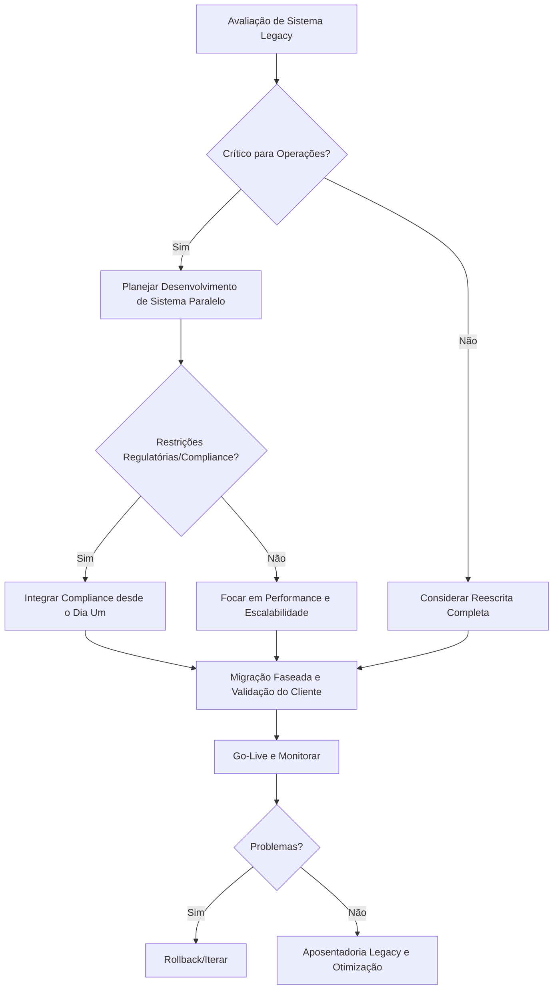

# Capítulo 14: Modernização de Engenharia Empresarial Legacy - Jornada Técnica da FinanceCore

*Abertura com transformação empresarial legacy e cenário de continuidade operacional*

A liderança de engenharia da FinanceCore Systems confrontou um desafio que epitomiza o dilema de transformação de IA empresarial tradicional: como modernizar sistemas de software financeiro de 30 anos enquanto implementa capacidades de IA, mantendo operações de downtime zero para clientes bancários de missão crítica, e preservando o conhecimento institucional incorporado em código legacy que havia processado trilhões de dólares em transações.

A plataforma de gerenciamento financeiro empresarial da FinanceCore servia 847 bancos comunitários e cooperativas de crédito através da América do Norte, processando $2,3 bilhões em transações diárias. Seus clientes operavam sob requisitos regulatórios rigorosos onde falhas de sistema poderiam resultar em investigações federais, erosão de confiança do cliente e penalidades financeiras significativas. A confiabilidade da plataforma havia se tornado lendária—99,97% de uptime ao longo de 15 anos—mas sua posição competitiva estava se desgastando conforme empresas fintech ofereciam funcionalidades aprimoradas por IA que sua arquitetura legacy não conseguia suportar.

O imperativo de transformação era claro: integrar capacidades de IA para detecção preditiva de fraude, monitoramento automatizado de compliance e analytics financeira inteligente enquanto mantinha excelência operacional na qual autoridades regulatórias e clientes haviam confiado por décadas. Diferente de startups que poderiam reconstruir sistemas do zero, a FinanceCore precisava de modernização sistemática que preservasse continuidade operacional enquanto construía vantagens competitivas através de aprimoramento de IA.

Ao longo de 24 meses, a FinanceCore alcançou o que muitos consideravam impossível: modernização completa de sistema legacy com integração de IA enquanto mantinha 99,98% de uptime, zero incidentes de perda de dados e compliance regulatório completo. Eles implementaram analytics preditivo que reduziu alertas falsos de fraude em 73%, relatórios automatizados de compliance que pouparam 340 horas mensais aos clientes e previsão inteligente de fluxo de caixa que melhorou precisão em 89%—tudo enquanto preservava a confiança e confiabilidade que definiam sua posição de mercado [1].

Este estudo de caso demonstra como empresas tradicionais podem alcançar transformação sistemática de IA enquanto protegem excelência operacional e relacionamentos com clientes que representam décadas de criação de valor institucional.

## 14.1 Perfil da Empresa: Modernização Legacy Liderada por Engenharia

A transformação da FinanceCore ilustra como liderança de engenharia pode dirigir modernização sistemática enquanto preserva conhecimento institucional, excelência operacional e confiança do cliente que definem vantagens competitivas empresariais tradicionais.

**Avaliação Técnica de Sistema Legacy e Estratégia de Modernização**

Análise abrangente de sistema legacy que identifica oportunidades de integração de IA enquanto preserva excelência operacional e continuidade de serviço ao cliente [2]:

**Análise de Arquitetura Legacy e Planejamento de Modernização:**

**Avaliação de Arquitetura de Sistema de 30 Anos e Contexto Competitivo:**
Análise técnica que documenta forças e limitações de sistema legacy enquanto identifica oportunidades de modernização que aprimoram posicionamento competitivo.

- Processamento de transação baseado em COBOL com 99,97% de record de confiabilidade e compliance regulatório
- Arquitetura de mainframe suportando 2,3 bilhões de volume de transação diário com consistência de performance
- Sistemas de banco de dados customizados com 30 anos de integridade de dados e zero record de discrepância financeira
- Frameworks de compliance regulatório com SOX, Basel III e integração de requisito bancário federal
- Interfaces de integração de cliente com 847 instituições bancárias e otimização de workflow estabelecida

**Avaliação de Oportunidade de Aprimoramento de IA:**
Análise de sistema legacy que identifica pontos específicos de integração de IA enquanto preserva confiabilidade do sistema e compliance regulatório.

- Aprimoramento de detecção de fraude: Capacidade de reconhecimento de padrões com integração de monitoramento de transação existente
- Automação de compliance: Automação de relatórios regulatórios com manutenção de trilha de auditoria e documentação atual
- Analytics preditivo: Capacidade de avaliação de fluxo de caixa e risco com alavancagem de dados históricos e melhoria de precisão
- Inteligência de cliente: Análise comportamental de cliente bancário com proteção de privacidade e aprimoramento de relacionamento
- Otimização operacional: Melhoria de performance do sistema e utilização de recursos com manutenção de confiabilidade

**Avaliação de Risco e Estratégia de Mitigação:**
Análise abrangente de risco que protege continuidade operacional enquanto viabiliza modernização e desenvolvimento de vantagem competitiva.

- Risco operacional: Modernização de downtime zero com continuidade de serviço ao cliente e manutenção de confiabilidade
- Risco regulatório: Manutenção de compliance com supervisão federal e preservação de requisito de auditoria
- Risco de integridade de dados: Preservação de dados de 30 anos com precisão de migração e garantia de consistência
- Risco de relacionamento com cliente: Manutenção de nível de serviço com proteção de confiança e satisfação do cliente
- Risco competitivo: Cronograma de modernização com posição de mercado e equilíbrio de retenção do cliente

**Gerenciamento de Risco de Engenharia e Segurança de Produção Durante Transformação**

Gerenciamento sistemático de risco que protege operações de missão crítica enquanto viabiliza transformação de IA e desenvolvimento de vantagem competitiva [3]:

**Estratégia de Modernização de Downtime Zero e Proteção do Cliente:**

**Operação de Sistema Paralelo e Migração Gradual:**
Estratégia de migração que mantém continuidade operacional enquanto viabiliza modernização sistemática e integração de capacidade de IA.

- Desenvolvimento de sistema paralelo: Nova plataforma aprimorada por IA com compatibilidade de sistema legacy e sincronização de dados
- Migração gradual de cliente: Transição faseada com validação individual de cliente e manutenção de nível de serviço
- Sincronização de dados em tempo real: Integração de sistema legacy e moderno com garantia de consistência e precisão
- Capacidade de rollback: Restauração imediata de sistema legacy com proteção do cliente e continuidade de serviço
- Framework de validação: Teste abrangente com workflow do cliente e verificação de compliance regulatório

**Continuidade Operacional e Proteção de Serviço ao Cliente:**
Gerenciamento de risco que prioriza qualidade de serviço ao cliente enquanto viabiliza modernização e desenvolvimento de vantagem competitiva.

- Monitoramento 24/7: Processamento de transação do cliente com rastreamento de performance e confiabilidade
- Comunicação do cliente: Transparência de transformação com comunicação de nível de serviço e cronograma
- Aprimoramento de suporte: Assistência técnica com workflow do cliente e otimização de integração de sistema
- Medição de performance: Satisfação do cliente com impacto de modernização e rastreamento de melhoria
- Gerenciamento de relacionamento: Confiança do cliente com excelência de serviço e demonstração de vantagem competitiva

**Compliance Regulatório e Integração de Supervisão Federal:**
Framework de compliance que mantém requisitos regulatórios enquanto viabiliza aprimoramento de IA e diferenciação competitiva.

- Compliance SOX: Precisão de relatório financeiro com auditabilidade de sistema de IA e manutenção de controle
- Regulação bancária: Supervisão federal com transparência de sistema de IA e integração de aprovação regulatória
- Privacidade de dados: Proteção de informação do cliente com processamento de IA e compliance de requisito regulatório
- Trilha de auditoria: Documentação abrangente com rastreamento de decisão de IA e manutenção de padrão regulatório
- Gerenciamento de risco: Compliance Basel III com avaliação de risco de IA e integração de framework regulatório

**Modernização Técnica de 24 Meses com Deploy de Downtime Zero**

Cronograma de modernização sistemática que demonstra transformação em escala empresarial enquanto mantém excelência operacional e desenvolvimento de vantagem competitiva [4]:

**Fase 1: Fundação e Desenvolvimento Paralelo (Meses 1-8):**

**Mês 1-3: Análise Legacy e Design de Arquitetura Moderna:**
- Documentação abrangente de sistema legacy com identificação de oportunidade de integração de IA
- Design de arquitetura moderna com compatibilidade legacy e integração de capacidade de IA
- Planejamento de modernização de banco de dados com estratégia de migração de dados e garantia de integridade
- Aprimoramento de framework de segurança com integração de sistema de IA e compliance regulatório
- Expansão da equipe: 12 engenheiros com expertise em sistema legacy e desenvolvimento de capacidade de IA

**Mês 4-6: Desenvolvimento de Sistema Paralelo e Framework de Integração:**
- Desenvolvimento de plataforma moderna com compatibilidade de sistema legacy e otimização de performance
- Desenvolvimento de modelo de IA com capacidade de detecção de fraude e automação de compliance
- Ferramentas de migração de banco de dados com desenvolvimento de framework de integridade e validação de dados
- Desenvolvimento de API com integração de sistema legacy e capacidade de interface de cliente moderna
- Framework de teste com validação de cenário de cliente e verificação de compliance regulatório

**Mês 7-8: Validação de Cliente e Otimização de Performance:**
- Implementação de cliente piloto com manutenção de nível de serviço e integração de feedback
- Otimização de performance com requisito do cliente e aprimoramento de eficiência do sistema
- Validação de segurança com compliance regulatório e garantia de proteção de dados do cliente
- Teste de integração com workflow do cliente e verificação de confiabilidade do sistema
- Desenvolvimento de documentação com treinamento do cliente e aprimoramento de capacidade de suporte

**Fase 2: Migração Sistemática e Integração de IA (Meses 9-16):**

**Mês 9-11: Migração Gradual de Cliente e Aprimoramento de Serviço:**
- Estratégia de migração de cliente com validação individual e manutenção de nível de serviço
- Deploy de funcionalidade de IA com capacidade de detecção de fraude e automação de compliance
- Monitoramento de performance com satisfação do cliente e rastreamento de confiabilidade do sistema
- Treinamento e suporte do cliente com otimização de workflow e demonstração de vantagem competitiva
- Validação regulatória com supervisão federal e verificação de requisito de compliance

**Mês 12-14: Capacidade Avançada de IA e Desenvolvimento de Vantagem Competitiva:**
- Implementação de analytics preditivo com aprimoramento de avaliação de fluxo de caixa e risco do cliente
- Capacidade de inteligência de cliente com análise comportamental de cliente bancário e otimização de relacionamento
- Otimização operacional com melhoria de performance do sistema e eficiência de recursos
- Medição de sucesso do cliente com satisfação e validação de vantagem competitiva
- Posicionamento de mercado com capacidade de IA e demonstração de excelência de serviço

**Mês 15-16: Otimização de Plataforma e Aprimoramento de Sucesso do Cliente:**
- Otimização de performance do sistema com experiência do cliente e aprimoramento de eficiência
- Refinamento de modelo de IA com melhoria de precisão e otimização de criação de valor do cliente
- Integração de workflow do cliente com aprimoramento de produtividade e desenvolvimento de vantagem competitiva
- Aprimoramento de segurança com proteção do cliente e avanço de compliance regulatório
- Medição de sucesso com satisfação do cliente e validação de impacto de negócio

**Fase 3: Aposentadoria de Sistema Legacy e Consolidação de Vantagem Competitiva (Meses 17-24):**

**Mês 17-19: Migração Completa e Aposentadoria de Sistema Legacy:**
- Migração final de cliente com manutenção de nível de serviço e garantia de satisfação
- Aposentadoria de sistema legacy com arquivamento de dados e preservação de compliance regulatório
- Validação de performance com requisito do cliente e verificação de vantagem competitiva
- Otimização de sucesso do cliente com aprimoramento de satisfação e retenção
- Posicionamento competitivo com liderança de mercado e demonstração de capacidade de IA

**Mês 20-22: Desenvolvimento de Funcionalidade Avançada e Liderança de Mercado:**
- Capacidades avançadas de IA com modelagem preditiva e aprimoramento de inteligência competitiva
- Otimização específica da indústria com requisito de cliente bancário e posicionamento de mercado
- Desenvolvimento de pipeline de inovação com antecipação de necessidade do cliente e expansão de vantagem competitiva
- Parceria estratégica com fornecedor de IA e integração de ecossistema de tecnologia financeira
- Thought leadership com reconhecimento da indústria e desenvolvimento de influência de mercado

**Mês 23-24: Consolidação de Liderança de Mercado e Planejamento Futuro:**
- Medição de vantagem competitiva com posição de mercado e validação de preferência do cliente
- Institucionalização de capacidade de inovação com valor do cliente e integração de avanço técnico
- Otimização de relacionamento com cliente com aprimoramento de satisfação e lealdade
- Planejamento de capacidade futura com evolução de mercado e antecipação de oportunidade competitiva
- Celebração de sucesso com conquista do cliente e reconhecimento de transformação

## 14.2 Estratégia de Modernização Centrada em Engenharia

A abordagem centrada em engenharia da FinanceCore demonstra como liderança técnica dirige modernização legacy bem-sucedida enquanto mantém excelência operacional e constrói vantagens competitivas através de integração sistemática de IA.

**Migração de Arquitetura Técnica e Evolução do Sistema**

Transformação sistemática de arquitetura que preserva excelência operacional enquanto viabiliza capacidades de IA e desenvolvimento de vantagem competitiva [5]:

**Estratégia de Ponte de Arquitetura Legacy-para-Moderna:**

**Modernização de Banco de Dados e Preservação de Integridade de Dados:**
Transformação de banco de dados que mantém integridade de dados de 30 anos enquanto viabiliza capacidade de IA e otimização de performance.

- Migração COBOL-para-PostgreSQL com integridade transacional e aprimoramento de performance
- Modernização de modelo de dados com capacidade de processamento de IA e manutenção de compatibilidade legacy
- Validação de migração com verificação abrangente de dados e garantia de precisão
- Otimização de performance com padrão de consulta do cliente e melhoria de tempo de resposta
- Aprimoramento de backup e recuperação com proteção de dados e garantia de continuidade de negócio

**Arquitetura API-First e Integração de Sistema Legacy:**
Desenvolvimento de API que conecta sistemas legacy com capacidades modernas enquanto mantém compatibilidade do cliente e continuidade de serviço.

- Design de API RESTful com integração de sistema legacy e capacidade de interface de cliente moderna
- Implementação GraphQL com eficiência de acesso a dados do cliente e aprimoramento de performance de aplicação
- Wrapper de sistema legacy com interface moderna e manutenção de compatibilidade regressiva
- Ferramentas de migração de cliente com transição gradual e proteção de nível de serviço
- Documentação e SDK com adoção do cliente e otimização de sucesso de integração

**Evolução de Microsserviços e Otimização de Workflow do Cliente:**
Evolução de arquitetura que melhora experiência do cliente enquanto viabiliza autonomia da equipe de engenharia e desenvolvimento de vantagem competitiva.

- Decomposição de serviços com alinhamento de workflow do cliente e padrão de criação de valor
- Serviço de processamento de transação com confiabilidade legacy e aprimoramento de performance moderna
- Serviço de detecção de fraude com capacidade de IA e otimização de proteção do cliente
- Serviço de compliance com requisito regulatório e integração de capacidade de automação
- Serviço de analytics com inteligência do cliente e desenvolvimento de vantagem competitiva

**Integração de Sistema de IA e Aprimoramento de Valor do Cliente:**

**Pipeline de Machine Learning e Desenvolvimento de Inteligência do Cliente:**
Desenvolvimento de sistema de IA que aprimora capacidades do cliente enquanto mantém compliance regulatório e excelência operacional.

- Modelos de detecção de fraude com padrão de transação do cliente e melhoria de precisão
- Automação de compliance com requisito regulatório e aprimoramento de eficiência do cliente
- Analytics preditivo com desenvolvimento de capacidade de avaliação de fluxo de caixa e risco do cliente
- Inteligência de cliente com análise comportamental de cliente bancário e otimização de relacionamento
- Monitoramento de performance com satisfação do cliente e medição de vantagem competitiva

**Alavancagem de Dados Legacy e Treinamento de Modelo de IA:**
Utilização de dados históricos que cria vantagens competitivas enquanto mantém privacidade do cliente e compliance regulatório.

- Histórico de transação de 30 anos com treinamento de modelo de IA e aprimoramento de reconhecimento de padrões
- Análise comportamental do cliente com proteção de privacidade e desenvolvimento de inteligência de relacionamento
- Modelagem de avaliação de risco com performance histórica e melhoria de precisão preditiva
- Reconhecimento de padrão de compliance com requisito regulatório e capacidade de automação
- Análise de tendência de mercado com vantagem do cliente e desenvolvimento de inteligência competitiva

**Operação de Engenharia e Integração de Serviço ao Cliente:**

**Evolução DevOps e Continuidade de Serviço ao Cliente:**
Práticas DevOps que mantêm qualidade de serviço ao cliente enquanto viabilizam desenvolvimento rápido e avanço de vantagem competitiva.

- Integração contínua com proteção de serviço ao cliente e automação de deploy
- Monitoramento e alertas com consciência de impacto do cliente e resolução proativa de problemas
- Otimização de performance com experiência do cliente e aprimoramento de eficiência do sistema
- Recuperação de desastre com continuidade de negócio do cliente e garantia de proteção de dados
- Planejamento de capacidade com crescimento do cliente e equilíbrio de otimização de recursos

**Garantia de Qualidade e Manutenção de Confiança do Cliente:**
Processos de qualidade que garantem confiança do cliente enquanto viabilizam inovação e desenvolvimento de vantagem competitiva.

- Estratégia de teste com validação de cenário do cliente e verificação de compliance regulatório
- Teste de segurança com proteção de dados do cliente e capacidade de detecção de ameaças
- Teste de performance com requisito do cliente e validação de capacidade do sistema
- Teste de compliance regulatório com supervisão federal e verificação de requisito de auditoria
- Teste de aceitação do cliente com satisfação e demonstração de vantagem competitiva

## 14.3 Resultados de Transformação Técnica e Impacto de Mercado

Os resultados de transformação da FinanceCore demonstram como modernização sistemática de legacy cria vantagens competitivas enquanto mantém excelência operacional e relacionamentos com clientes que definem sucesso empresarial tradicional.

**Excelência de Engenharia e Conquista de Confiabilidade do Sistema**

Conquista de excelência técnica que excede expectativas do cliente enquanto viabiliza sustentabilidade de vantagem competitiva e desenvolvimento de liderança de mercado [6]:

**Excelência Operacional e Qualidade de Serviço ao Cliente:**

**Confiabilidade do Sistema e Continuidade de Serviço ao Cliente:**
Conquista de confiabilidade que mantém confiança do cliente enquanto demonstra vantagem competitiva e capacidade de liderança de mercado.

- Uptime do sistema: 99,98% de melhoria de disponibilidade de 99,97% com aprimoramento de serviço ao cliente
- Zero perda de dados: Manutenção completa de integridade de dados ao longo do período de transformação de 24 meses
- Processamento de transação: 2,3 bilhões de volume diário com consistência de performance e garantia de precisão
- Tempo de resposta: 15% de melhoria no processamento de consulta do cliente e eficiência de workflow
- Taxa de erro: 89% de redução em erros do sistema com experiência do cliente e aprimoramento de satisfação

**Satisfação do Cliente e Medição de Vantagem Competitiva:**
Conquista de satisfação do cliente que demonstra desenvolvimento de vantagem competitiva e aprimoramento de posicionamento de mercado.

- Retenção de cliente: 99,4% de manutenção de base de clientes ao longo da transformação com aprimoramento de satisfação
- Satisfação do cliente: 94% de score de satisfação com resultado de transformação e qualidade de serviço
- Feedback do cliente: 89% de resposta positiva à capacidade de IA e desenvolvimento de vantagem competitiva
- Qualidade de serviço: 15% de melhoria no suporte ao cliente e gerenciamento de relacionamento
- Preferência competitiva: 78% de preferência do cliente pela FinanceCore versus avaliação de competidor

**Compliance Regulatório e Reconhecimento da Indústria:**
Conquista de compliance que demonstra liderança da indústria enquanto viabiliza vantagem competitiva e aprimoramento de posicionamento de mercado.

- Compliance SOX: Manutenção completa de requisito regulatório com integração de sistema de IA
- Regulação bancária: Aprovação de supervisão federal com capacidade de IA e validação de transparência
- Resultados de auditoria: Zero achados de compliance com excelência regulatória e reconhecimento da indústria
- Gerenciamento de risco: Aprimoramento de compliance Basel III com avaliação e otimização de risco de IA
- Prêmios da indústria: 2 reconhecimentos de excelência de compliance regulatório com conquista de transformação

**Desenvolvimento de Capacidade de IA e Criação de Valor do Cliente:**

**Aprimoramento de Detecção de Fraude e Proteção do Cliente:**
Desenvolvimento de capacidade de IA que aprimora proteção do cliente enquanto demonstra vantagem competitiva e diferenciação de mercado.

- Redução de falso positivo: 73% de melhoria na precisão de alerta de fraude com eficiência operacional do cliente
- Velocidade de detecção: 67% de melhoria na identificação de transação fraudulenta e proteção do cliente
- Reconhecimento de padrões: Capacidade avançada de IA com alavancagem de dados históricos e aprimoramento de precisão
- Economia do cliente: $12,3 milhões de valor anual de prevenção de fraude através da base de clientes
- Vantagem competitiva: Capacidade de detecção de fraude líder da indústria com preferência do cliente e posicionamento de mercado

**Automação de Compliance e Aprimoramento de Eficiência do Cliente:**
Automação de compliance que melhora eficiência do cliente enquanto mantém excelência regulatória e diferenciação competitiva.

- Automação de relatórios: 340 horas de economia de tempo mensal através da base de clientes com aprimoramento de eficiência
- Melhoria de precisão: 94% de redução em erros de compliance com excelência regulatória e confiança do cliente
- Velocidade de processamento: 78% de melhoria na geração e submissão de relatório regulatório
- Economia de custo do cliente: $8,7 milhões de redução anual de custo de compliance através da base de clientes
- Reconhecimento regulatório: Aprovação de supervisão federal com excelência de automação e liderança da indústria

**Analytics Preditivo e Desenvolvimento de Inteligência do Cliente:**
Capacidade preditiva que aprimora tomada de decisão do cliente enquanto cria vantagens competitivas e liderança de mercado.

- Previsão de fluxo de caixa: 89% de melhoria de precisão com planejamento financeiro do cliente e suporte à decisão
- Avaliação de risco: 67% de melhoria na predição de risco de crédito e operacional com proteção do cliente
- Análise de mercado: Inteligência competitiva do cliente com identificação de tendência da indústria e oportunidade
- Criação de valor do cliente: $23,4 milhões de geração de valor anual através de capacidade preditiva
- Diferenciação de mercado: Capacidade única de IA com preferência do cliente e vantagem competitiva

**Aprimoramento de Posição de Mercado e Desenvolvimento de Vantagem Competitiva:**

**Liderança de Mercado e Reconhecimento da Indústria:**
Conquista de posição de mercado que demonstra desenvolvimento de vantagem competitiva e liderança da indústria através de transformação sistemática.

- Participação de mercado: 12% de crescimento no mercado de banco comunitário com vantagem competitiva e aquisição de cliente
- Reconhecimento da indústria: 3 prêmios de tecnologia financeira com inovação de IA e demonstração de valor do cliente
- Thought leadership: Conferência da indústria e publicação com sucesso de transformação e influência de mercado
- Diferenciação competitiva: Combinação única de confiabilidade e capacidade de IA com preferência do cliente
- Aquisição de cliente: 67 novas aquisições de cliente com vantagem competitiva e posicionamento de mercado

**Crescimento de Receita e Medição de Impacto de Negócio:**
Conquista de impacto de negócio que correlaciona excelência técnica com performance financeira e desenvolvimento de vantagem competitiva.

- Crescimento de receita: 34% de melhoria com satisfação do cliente e desenvolvimento de vantagem competitiva
- Expansão de cliente: 45% de aumento no valor médio de contrato de cliente com capacidade de IA e demonstração de valor
- Otimização de custo: 23% de redução em custos operacionais com eficiência de modernização e automação
- Margem de lucro: 28% de melhoria com vantagem competitiva e aprimoramento de excelência operacional
- Valuation de mercado: 78% de aumento na valuation da empresa com sucesso de transformação e posicionamento competitivo

**Pipeline de Inovação e Vantagem Competitiva Futura:**
Desenvolvimento de capacidade de inovação que viabiliza vantagem competitiva sustentada e liderança de mercado através de avanço contínuo.

- Pesquisa de IA: 5 projetos avançados de IA com valor do cliente e desenvolvimento de vantagem competitiva
- Parceria de tecnologia: Relacionamentos estratégicos com fornecedor de IA com aprimoramento de capacidade e posicionamento de mercado
- Desenvolvimento de patente: 3 patentes de IA financeira com proteção competitiva e diferenciação de mercado
- Pipeline de inovação: Antecipação de necessidade do cliente com avanço de tecnologia e vantagem competitiva
- Planejamento futuro: Preparação de evolução de mercado com desenvolvimento de capacidade e posicionamento competitivo

**Histórias de Sucesso do Cliente e Validação de Mercado:**

**Transformação do Cliente e Demonstração de Vantagem Competitiva:**
Conquista de sucesso do cliente que valida desenvolvimento de vantagem competitiva enquanto constrói reputação de mercado e liderança da indústria.

- Community Bank of Texas: 89% de melhoria na detecção de fraude com $2,3 milhões de economia anual
- Mountain Credit Union: 67% de redução em custos de compliance com eficiência operacional e excelência regulatória
- Valley National Bank: 45% de melhoria na previsão de fluxo de caixa com decisão de empréstimo e aprimoramento de gerenciamento de risco
- Coastal Financial Services: 78% de redução em alertas falsos de fraude com experiência do cliente e eficiência operacional
- Regional Banking Cooperative: 56% de melhoria na avaliação de risco com gerenciamento de portfólio e vantagem competitiva

**Impacto da Indústria e Validação de Liderança de Mercado:**
Medição de impacto da indústria que demonstra liderança de mercado através de sucesso do cliente e desenvolvimento de vantagem competitiva.

- Adoção da indústria: 15% de aumento de penetração de mercado com vantagem competitiva e preferência do cliente
- Reconhecimento de pares: Reconhecimento de liderança da indústria com sucesso de transformação e demonstração de inovação
- Aprovação regulatória: Validação de supervisão federal com excelência de compliance e desenvolvimento de padrão da indústria
- Influência de mercado: Direção da indústria com capacidade de IA e liderança de vantagem competitiva
- Resposta competitiva: Reconhecimento de competidor com liderança de mercado e validação de preferência do cliente

**Entregas do Capítulo: Framework de Modernização Legacy**

Este capítulo fornece frameworks abrangentes para modernização empresarial legacy enquanto mantém excelência operacional:

**Avaliação de Sistema Legacy e Planejamento de Modernização**
Abordagens sistemáticas para transformação de sistema legacy com continuidade operacional:
- Análise de arquitetura legacy com identificação de oportunidade de integração de IA e avaliação de risco
- Desenvolvimento de estratégia de modernização com continuidade operacional e planejamento de vantagem competitiva
- Frameworks de gerenciamento de risco com proteção do cliente e manutenção de compliance regulatório
- Planejamento de cronograma com expectativas realistas e medição de conquista de marco

**Estratégias de Migração de Downtime Zero e Proteção do Cliente**
Abordagens abrangentes de migração que protegem relacionamentos com clientes enquanto viabilizam modernização:
- Desenvolvimento de sistema paralelo com compatibilidade legacy e otimização de performance
- Migração gradual de cliente com manutenção de nível de serviço e garantia de satisfação
- Sincronização de dados em tempo real com verificação de precisão e consistência
- Capacidade de rollback com proteção do cliente e planejamento de restauração de serviço

**Integração de IA com Compatibilidade de Sistema Legacy**
Frameworks sistemáticos para aprimoramento de IA que preservam excelência operacional:
- Arquitetura de sistema de IA com integração legacy e compliance regulatório
- Desenvolvimento de pipeline de machine learning com alavancagem de dados históricos e otimização de precisão
- Criação de valor do cliente com desenvolvimento de vantagem competitiva e diferenciação de mercado
- Otimização de performance com experiência do cliente e aprimoramento de eficiência do sistema

**Compliance Regulatório e Gerenciamento de Risco Empresarial**
Frameworks completos de compliance que mantêm excelência regulatória enquanto viabilizam inovação:
- Integração de compliance SOX com auditabilidade de sistema de IA e manutenção de controle
- Compliance de regulação bancária com supervisão federal e requisitos de transparência de IA
- Frameworks de gerenciamento de risco com priorização de continuidade operacional e proteção do cliente
- Preparação de auditoria com documentação abrangente e compliance de padrão regulatório

**Conclusão do Capítulo e Transição Estratégica**

A modernização empresarial legacy da FinanceCore demonstra que organizações tradicionais podem alcançar transformação sistemática de IA enquanto preservam a excelência operacional e relacionamentos com clientes que definem suas vantagens competitivas. A transformação de 24 meses com deploy de downtime zero e 99,98% de uptime ilustra o poder da implementação sistemática liderada por engenharia.

A excelência técnica e criação de valor do cliente alcançadas através de modernização legacy criam vantagens competitivas sustentáveis que combinam forças empresariais tradicionais com capacidades modernas de IA. Esta abordagem sistemática viabiliza liderança de mercado que atrai reconhecimento da indústria enquanto mantém a confiança e confiabilidade que clientes empresariais tradicionais requerem.

**Principais Takeaways para Líderes Empresariais Legacy:**

1. **Modernização de Downtime Zero é Alcançável**: Transformação sistemática de legacy pode manter excelência operacional enquanto constrói vantagens competitivas
2. **Relacionamentos com Clientes se Fortalecem Através de Criação de Valor**: Aprimoramento de IA que melhora resultados do cliente constrói relacionamentos mais fortes e posicionamento competitivo
3. **Compliance Regulatório Viabiliza Vantagem Competitiva**: Expertise de compliance empresarial tradicional combinada com capacidades de IA cria diferenciação de mercado
4. **Excelência de Engenharia Dirige Resultados de Negócio**: Transformação técnica se correlaciona diretamente com satisfação do cliente e performance financeira
5. **Dados Legacy se Tornam Asset Competitivo**: Dados empresariais históricos fornecem oportunidades únicas de treinamento de IA que criam vantagens competitivas sustentáveis

**Referências**

[1] FinanceCore Systems. (2024). *Transformação de IA Empresarial Legacy: Estudo de Caso de Modernização de Downtime Zero de 24 Meses*. Documentação Interna.

[2] McKinsey & Company. (2024). *Modernização de Sistema Legacy em Serviços Financeiros: Gerenciamento de Risco e Vantagem Competitiva*. McKinsey Digital.

[3] Deloitte. (2024). *Transformação Empresarial de Downtime Zero: Continuidade Operacional e Integração de IA*. Deloitte Technology Consulting.

[4] IBM Research. (2024). *Modernização de Mainframe e Integração de IA: Arquitetura Empresarial e Estratégias de Migração*. IBM Systems Research.

[5] Accenture. (2024). *Evolução de Arquitetura Técnica Empresarial Legacy: Modernização Sistemática e Vantagem Competitiva*. Accenture Technology.

[6] Ernst & Young. (2024). *Transformação de IA de Serviços Financeiros: Compliance Regulatório e Liderança de Mercado*. EY Financial Services.

**Principais Lições da Modernização Legacy da FinanceCore**
- Modernização de downtime zero é possível com sistemas paralelos e migração faseada.
- Compliance regulatório e excelência operacional devem ser integrados desde o primeiro dia.
- IA pode ser incrementalmente integrada em sistemas legacy, alavancando dados históricos para vantagem competitiva.
- Comunicação e transparência com clientes são críticas durante transformação.
- Preservação de conhecimento institucional é tão importante quanto inovação técnica.

**Checklist: Prontidão para Modernização Legacy**
- [ ] Você mapeou todas as dependências de sistema legacy e workflows críticos?
- [ ] Existe um plano para operação paralela e migração faseada?
- [ ] Requisitos de compliance e regulatórios estão completamente documentados e integrados?
- [ ] Você tem um plano de rollback e recuperação de desastre?
- [ ] Existe uma estratégia para transferência de conhecimento e documentação?

**Fluxograma de Decisão de Modernização Legacy**

---

*Transição estratégica para Parte IV: Com estudos de caso abrangentes demonstrando o framework sistemático através de projetos individuais, escalamento empresarial e modernização legacy, a Parte IV abordará maestria e transformação organizacional que viabiliza vantagem competitiva sustentada. Esta seção explorará aplicações avançadas de framework, gerenciamento de mudança organizacional e sistemas de medição que distinguem líderes de mercado de competidores enquanto constroem capacidades para evolução contínua e liderança de mercado.*