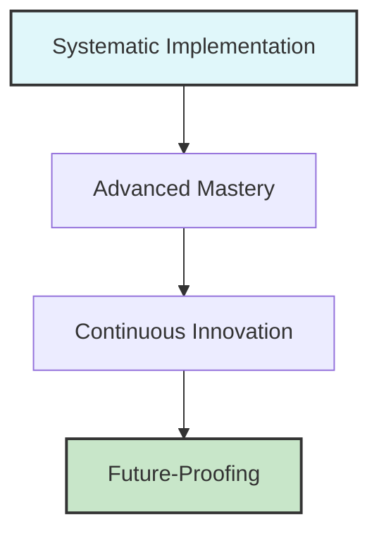

# PART IV: MASTERY AND ORGANIZATIONAL TRANSFORMATION

---

# Chapter 15: Advanced Framework Mastery and Future-Proofing

*Future-Back Narrative: Competitive end-state vision*

Picture your organization 36 months from now: competitors struggle to match your AI-enhanced customer intelligence that anticipates market changes 6-9 months ahead of industry trends. Your systematic implementation methodology has become a competitive moat so substantial that three major competitors have attempted unsuccessfully to recruit your entire product leadership team. Your customer satisfaction scores exceed industry averages by 78%, while your systematic AI capabilities enable product development cycles 40% faster than competitors.

This isn't vision—it's the measurable competitive end-state achieved by organizations that evolve beyond successful framework implementation toward advanced mastery capabilities that sustain market leadership through continuous adaptation and innovation.

The executive team at TechFlow Innovations experienced exactly this transformation. After 18 months of systematic AI implementation across three major product lines, they achieved 67% improvement in customer acquisition, 89% increase in customer lifetime value, and 156% growth in annual recurring revenue. However, as they prepared for their next growth phase, they confronted a more sophisticated challenge: evolving from successful implementation toward organizational mastery that enables sustained competitive advantage in rapidly evolving AI-enhanced markets.

Working backward from this competitive end-state reveals the advanced capabilities that distinguish sustained market leaders from organizations trapped in continuous catch-up cycles with technological and competitive evolution.

Their competitors were beginning to catch up with similar AI capabilities, new market entrants were launching with advanced AI-native approaches, and customer expectations were evolving faster than traditional product development cycles could accommodate. Most critically, the AI technologies themselves were advancing so rapidly that approaches that seemed cutting-edge 12 months earlier were becoming baseline expectations.

The leadership team realized that sustained market leadership required evolution from systematic implementation toward advanced framework mastery—the ability to continuously adapt, optimize, and innovate while maintaining customer focus and operational excellence. They needed to build organizational capabilities that could anticipate market changes, integrate emerging technologies, and maintain competitive advantages in dynamic environments where technological capabilities evolved continuously.

Over the following 12 months, TechFlow developed advanced mastery capabilities that enabled them to maintain market leadership while adapting to technological evolution. They established innovation pipelines that generated 15 new competitive capabilities, developed customer intelligence systems that anticipated market changes 6-9 months ahead of competitors, and built organizational learning capabilities that enabled rapid integration of emerging technologies while maintaining systematic excellence [1].

This chapter explores the advanced framework applications, future-proofing strategies, and organizational mastery capabilities that distinguish sustained market leaders from organizations trapped in continuous catch-up cycles with technological and competitive evolution.

## 15.1 Advanced Framework Mastery and Systematic Excellence

Advanced framework mastery represents the evolution from successful implementation toward organizational capabilities that enable sustained competitive advantage through continuous adaptation, optimization, and innovation while maintaining customer focus and systematic excellence.

**Framework Optimization and Continuous Improvement**

Systematic optimization that enables framework evolution while maintaining proven effectiveness and competitive advantage development [2]:

**Systematic Framework Enhancement and Customer Value Optimization:**

**Performance Measurement and Optimization Integration:**
Advanced measurement systems that identify optimization opportunities while maintaining framework effectiveness and competitive advantage sustainability.

- Customer value correlation analysis with framework component effectiveness and optimization opportunity identification
- Competitive advantage measurement with market position tracking and framework contribution assessment
- Implementation efficiency analysis with resource optimization and productivity enhancement identification
- Quality assurance evolution with systematic improvement and excellence maintenance
- Innovation pipeline integration with framework enhancement and competitive advantage development

**Framework Component Evolution and Enhancement:**
Systematic enhancement that improves framework effectiveness while maintaining proven principles and customer focus.

- Customer discovery enhancement with AI-assisted research and validation acceleration
- Technical architecture evolution with emerging technology integration and performance optimization
- Design system advancement with accessibility improvement and user experience enhancement
- Engineering partnership optimization with collaboration efficiency and quality enhancement
- Production excellence evolution with operational efficiency and customer experience optimization

**Cross-Component Integration and Systematic Synergy:**
Advanced integration that creates compound benefits while maintaining framework coherence and implementation effectiveness.

- Component interaction optimization with systematic workflow and efficiency enhancement
- Cross-functional collaboration enhancement with communication improvement and alignment optimization
- Quality gate integration with systematic validation and improvement opportunity identification
- Success measurement correlation with business impact and competitive advantage development
- Knowledge sharing enhancement with institutional learning and capability development

**Customer Intelligence Evolution and Competitive Advantage Enhancement:**

**Advanced Customer Research and Market Intelligence:**
Customer intelligence capabilities that anticipate market evolution while maintaining relationship strength and competitive positioning.

- Predictive customer needs analysis with market trend integration and opportunity identification
- Competitive intelligence automation with market position tracking and response strategy development
- Customer behavior modeling with AI enhancement and relationship optimization
- Market evolution anticipation with customer adaptation and competitive advantage planning
- Industry trend integration with customer value creation and market positioning optimization

**Customer Success Optimization and Relationship Enhancement:**
Customer success capabilities that strengthen relationships while building competitive advantages and market leadership.

- Customer outcome prediction with proactive intervention and success optimization
- Relationship depth measurement with loyalty enhancement and competitive protection
- Value realization tracking with customer benefit optimization and competitive advantage demonstration
- Customer advocacy development with market influence and competitive positioning enhancement
- Success story amplification with market recognition and competitive differentiation

**Innovation Pipeline Development and Market Leadership:**

**Systematic Innovation and Competitive Advantage Creation:**
Innovation capabilities that maintain market leadership while building sustainable competitive advantages through systematic advancement.

- Technology evaluation with customer value potential and competitive advantage assessment
- Innovation project prioritization with market timing and competitive positioning optimization
- Prototype development with customer validation and market opportunity integration
- Competitive differentiation development with unique capability and market advantage creation
- Market leadership establishment with innovation recognition and industry influence

**Future Technology Integration and Competitive Positioning:**
Technology integration capabilities that maintain competitive advantages while adapting to technological evolution and market changes.

- Emerging technology assessment with customer application and competitive potential evaluation
- Integration planning with existing capability and systematic enhancement optimization
- Risk management with competitive protection and market position maintenance
- Timeline optimization with market opportunity and competitive advantage development
- Success measurement with competitive advantage and market leadership validation

**Scaling Framework Implementation Across Multiple Product Areas**

Advanced implementation that enables framework scaling while maintaining effectiveness and competitive advantage across diverse product contexts [3]:

**Multi-Product Framework Adaptation and Optimization:**

**Product-Specific Framework Customization:**
Framework adaptation that maintains core principles while optimizing for specific product contexts and customer requirements.

- Product context analysis with customer workflow and value creation pattern identification
- Framework component adaptation with product requirement and competitive positioning optimization
- Implementation timeline adjustment with product development cycle and market timing integration
- Success measurement customization with product-specific outcome and competitive advantage tracking
- Resource allocation optimization with product priority and competitive advantage development

**Cross-Product Learning and Knowledge Sharing:**
Knowledge management that enables learning transfer while building institutional capability and competitive advantage development.

- Implementation experience documentation with lessons learned and optimization opportunity identification
- Best practice development with cross-product application and effectiveness enhancement
- Success pattern recognition with replication opportunity and competitive advantage scaling
- Challenge resolution sharing with systematic improvement and efficiency enhancement
- Innovation pipeline coordination with cross-product opportunity and competitive advantage development

**Portfolio-Level Optimization and Competitive Advantage Integration:**
Portfolio management that optimizes competitive advantage development while maintaining product-specific effectiveness and market positioning.

- Competitive advantage coordination with portfolio-level strategy and market positioning optimization
- Resource allocation optimization with competitive priority and market opportunity balance
- Customer experience consistency with brand integration and competitive differentiation enhancement
- Market position coordination with competitive advantage and industry leadership development
- Innovation pipeline integration with portfolio strategy and competitive advantage sustainability

**Organizational Capability Development and Framework Mastery:**

**Team Capability Enhancement and Systematic Excellence:**
Team development that builds framework mastery while maintaining customer focus and competitive advantage development.

- Framework expertise development with implementation mastery and customer value optimization
- Cross-functional collaboration enhancement with communication improvement and alignment optimization
- Leadership development with framework advocacy and competitive advantage development
- Innovation capability building with creative application and competitive differentiation development
- Institutional knowledge development with framework evolution and competitive advantage sustainability

**Process Optimization and Efficiency Enhancement:**
Process improvement that enhances framework effectiveness while maintaining quality standards and competitive advantage development.

- Workflow optimization with systematic efficiency and customer value enhancement
- Quality assurance evolution with systematic improvement and competitive advantage development
- Communication enhancement with stakeholder alignment and collaboration optimization
- Decision-making optimization with framework guidance and competitive advantage development
- Success measurement integration with business impact and competitive advantage validation

## 15.2 Future-Proofing Strategies and Technology Evolution

Future-proofing capabilities enable organizations to maintain competitive advantages while adapting to technological evolution, market changes, and emerging competitive threats through systematic anticipation and preparation.

**Emerging Technology Integration and Competitive Positioning**

Systematic approaches to technology evaluation and integration that maintain competitive advantages while enabling innovation and market leadership [4]:

**Technology Evaluation Framework and Strategic Integration:**

**Emerging Technology Assessment and Customer Value Potential:**
Technology evaluation that prioritizes customer value creation while assessing competitive advantage potential and market timing optimization.

- Customer application analysis with value creation potential and competitive advantage assessment
- Technical feasibility evaluation with implementation complexity and resource requirement analysis
- Market timing assessment with competitive positioning and opportunity optimization
- Integration planning with existing capability and systematic enhancement development
- Risk evaluation with competitive protection and market position maintenance

**AI Technology Evolution and Competitive Advantage Adaptation:**
AI technology integration that maintains competitive advantages while enabling advancement and market leadership development.

- Large language model evolution with customer application and competitive differentiation potential
- Multimodal AI capability with customer experience enhancement and market advantage development
- Autonomous agent development with customer workflow automation and competitive advantage creation
- Edge AI integration with customer performance and privacy enhancement while maintaining competitive positioning
- Quantum computing preparation with long-term competitive advantage and market leadership potential

**Technology Stack Evolution and Market Positioning:**
Technology infrastructure development that enables competitive advantage sustainability while adapting to technological evolution and market changes.

- Cloud architecture evolution with customer scalability and competitive advantage optimization
- API ecosystem development with customer integration and competitive differentiation enhancement
- Data architecture advancement with customer intelligence and competitive advantage development
- Security framework evolution with customer trust and competitive protection enhancement
- Performance optimization with customer experience and competitive advantage sustainability

**Market Evolution Anticipation and Competitive Response:**

**Industry Trend Analysis and Competitive Intelligence:**
Market intelligence capabilities that anticipate competitive threats while identifying opportunity development and market leadership potential.

- Competitive landscape monitoring with threat identification and response strategy development
- Industry trend analysis with market opportunity and competitive advantage potential assessment
- Customer expectation evolution with service enhancement and competitive differentiation opportunity
- Regulatory change anticipation with compliance advantage and market positioning optimization
- Economic trend integration with competitive strategy and market opportunity development

**Customer Need Evolution and Market Opportunity:**
Customer intelligence that anticipates need evolution while building competitive advantages and market leadership through proactive value creation.

- Customer behavior prediction with need evolution and competitive advantage opportunity identification
- Market demand forecasting with product development and competitive positioning optimization
- Industry transformation analysis with customer adaptation and competitive advantage development
- Technology adoption pattern with customer integration and competitive differentiation planning
- Value proposition evolution with customer benefit and competitive advantage enhancement

**Competitive Response Strategy and Market Defense:**
Competitive strategy that protects market position while building sustainable advantages and market leadership through systematic differentiation.

- Competitive threat assessment with response strategy and market defense planning
- Differentiation development with unique capability and competitive advantage creation
- Market position protection with customer loyalty and competitive barrier development
- Innovation acceleration with competitive advantage and market leadership enhancement
- Strategic partnership with ecosystem development and competitive positioning optimization

**Organizational Learning and Adaptation Capabilities**

Learning capabilities that enable continuous evolution while maintaining systematic excellence and competitive advantage development [5]:

**Institutional Learning and Knowledge Management:**

**Framework Evolution and Continuous Improvement:**
Learning systems that capture implementation experience while enabling framework enhancement and competitive advantage development.

- Implementation experience documentation with lessons learned and optimization opportunity identification
- Success pattern recognition with replication opportunity and competitive advantage scaling
- Challenge resolution methodology with systematic improvement and efficiency enhancement
- Innovation pipeline development with competitive advantage and market leadership enhancement
- Knowledge sharing optimization with institutional learning and capability development

**Cross-Functional Learning and Capability Development:**
Learning capabilities that enhance team effectiveness while building competitive advantages and organizational excellence.

- Customer intelligence sharing with cross-functional understanding and competitive advantage development
- Technical expertise development with implementation mastery and competitive differentiation enhancement
- Market knowledge integration with competitive positioning and strategic decision-making optimization
- Innovation capability building with creative application and competitive advantage creation
- Leadership development with framework advocacy and competitive advantage sustainability

**Adaptation Capability and Market Responsiveness:**
Adaptation capabilities that enable rapid response to market changes while maintaining competitive advantages and systematic excellence.

- Market change detection with early warning and competitive advantage protection
- Rapid response capability with systematic adaptation and competitive positioning maintenance
- Customer feedback integration with immediate improvement and competitive advantage enhancement
- Competitive threat response with market defense and advantage development
- Innovation acceleration with market opportunity and competitive leadership development

**Performance Measurement and Optimization:**

**Advanced Metrics and Competitive Advantage Correlation:**
Measurement systems that track competitive advantage development while enabling optimization and market leadership validation.

- Competitive advantage measurement with market position tracking and development assessment
- Customer value correlation with competitive differentiation and market preference validation
- Market leadership indicators with industry recognition and competitive positioning measurement
- Innovation pipeline tracking with competitive advantage and market opportunity development
- Organizational capability assessment with competitive advantage and systematic excellence correlation

**Success Optimization and Competitive Enhancement:**
Optimization systems that enhance competitive advantages while maintaining systematic excellence and market leadership development.

- Performance optimization with competitive advantage and customer value enhancement
- Resource allocation efficiency with competitive priority and market opportunity balance
- Quality improvement with competitive differentiation and market leadership development
- Innovation acceleration with competitive advantage and market positioning enhancement
- Market position strengthening with competitive advantage and customer relationship optimization

## 15.3 Advanced Implementation Patterns and Competitive Excellence

Advanced implementation patterns enable organizations to achieve mastery-level execution while building sustainable competitive advantages through systematic excellence and innovation integration.

**Complex Integration Patterns and Enterprise Excellence**

Advanced integration approaches that enable enterprise-scale implementation while maintaining competitive advantages and systematic excellence [6]:

**Enterprise Architecture and Competitive Advantage Integration:**

**Multi-System Integration and Competitive Advantage Development:**
Integration patterns that optimize competitive advantage development while maintaining system reliability and enterprise excellence.

- Legacy system enhancement with competitive advantage and operational excellence maintenance
- Cloud architecture optimization with competitive differentiation and customer experience enhancement
- Data ecosystem integration with competitive intelligence and customer value creation
- Security framework advancement with competitive protection and customer trust building
- Performance optimization with competitive advantage and resource efficiency enhancement

**Cross-Functional Integration and Organizational Excellence:**
Integration patterns that enhance organizational effectiveness while building competitive advantages and systematic excellence.

- Product-engineering partnership with competitive advantage and technical excellence integration
- Customer success coordination with competitive differentiation and relationship enhancement
- Sales and marketing alignment with competitive positioning and market leadership development
- Executive alignment with competitive strategy and organizational excellence optimization
- Board governance with competitive advantage and strategic oversight integration

**Scalability Patterns and Market Leadership:**
Scalability approaches that enable market leadership while maintaining competitive advantages and operational excellence.

- Geographic expansion with competitive advantage and market position maintenance
- Customer segment expansion with competitive differentiation and value proposition optimization
- Product portfolio scaling with competitive advantage and market leadership development
- Team scaling with competitive capability and cultural excellence preservation
- Technology scaling with competitive advantage and performance enhancement

**Innovation Integration and Competitive Differentiation:**

**Systematic Innovation and Market Leadership Development:**
Innovation patterns that build market leadership while maintaining competitive advantages and systematic excellence.

- Research and development integration with competitive advantage and market opportunity development
- Technology exploration with competitive differentiation and customer value potential
- Market experimentation with competitive positioning and opportunity validation
- Partnership development with competitive advantage and ecosystem enhancement
- Intellectual property development with competitive protection and market differentiation

**Customer Co-Innovation and Competitive Advantage:**
Customer collaboration patterns that build competitive advantages while strengthening relationships and market positioning.

- Customer advisory integration with competitive advantage and market intelligence development
- Co-development programs with competitive differentiation and customer value creation
- Innovation partnership with competitive advantage and market leadership enhancement
- Customer success amplification with competitive positioning and market influence
- Market validation with competitive advantage and customer preference demonstration

**Competitive Intelligence and Market Excellence:**

**Market Intelligence and Competitive Positioning:**
Intelligence capabilities that maintain competitive advantages while enabling market leadership and strategic excellence.

- Competitive monitoring with threat detection and response strategy development
- Market trend analysis with competitive opportunity and positioning optimization
- Customer intelligence with competitive advantage and relationship enhancement
- Industry analysis with competitive differentiation and market leadership development
- Strategic planning with competitive advantage and market position optimization

**Market Leadership and Competitive Sustainability:**
Leadership capabilities that build sustainable competitive advantages while maintaining market position and industry influence.

- Thought leadership with competitive positioning and market influence development
- Industry standard development with competitive advantage and market leadership establishment
- Market education with competitive differentiation and customer value demonstration
- Strategic partnership with competitive advantage and ecosystem development
- Innovation leadership with competitive advantage and market transformation

**Organizational Mastery and Systematic Excellence**

Organizational capabilities that enable sustained competitive advantage while maintaining systematic excellence and market leadership [7]:

**Cultural Excellence and Competitive Advantage Integration:**

**Customer-Centric Culture and Competitive Excellence:**
Cultural development that integrates customer advocacy with competitive advantage development and systematic excellence.

- Customer empathy with competitive differentiation and market relationship enhancement
- Value creation focus with competitive advantage and customer success optimization
- Innovation mindset with competitive differentiation and market leadership development
- Quality excellence with competitive advantage and customer satisfaction enhancement
- Continuous improvement with competitive optimization and market position strengthening

**Engineering Excellence and Market Leadership:**
Engineering culture that builds competitive advantages while maintaining technical excellence and innovation capability.

- Technical expertise with competitive differentiation and customer value creation
- Innovation capability with competitive advantage and market leadership development
- Quality standards with competitive excellence and customer satisfaction enhancement
- Collaboration efficiency with competitive advantage and organizational effectiveness
- Learning mindset with competitive adaptation and capability development

**Leadership Excellence and Competitive Sustainability:**
Leadership capabilities that build sustainable competitive advantages while maintaining organizational excellence and market positioning.

- Strategic vision with competitive advantage and market leadership development
- Execution excellence with competitive differentiation and operational efficiency
- Team development with competitive capability and cultural excellence enhancement
- Innovation leadership with competitive advantage and market transformation
- Market positioning with competitive sustainability and industry influence

**Performance Excellence and Market Dominance:**

**Operational Excellence and Competitive Advantage:**
Operational capabilities that build competitive advantages while maintaining efficiency and customer satisfaction.

- Process optimization with competitive efficiency and customer value enhancement
- Quality assurance with competitive excellence and customer satisfaction development
- Resource optimization with competitive advantage and operational efficiency
- Performance measurement with competitive tracking and improvement optimization
- Continuous improvement with competitive enhancement and market position strengthening

**Financial Excellence and Market Leadership:**
Financial management that enables competitive advantage development while maintaining profitability and growth sustainability.

- Investment optimization with competitive advantage and return maximization
- Resource allocation with competitive priority and market opportunity balance
- Profitability enhancement with competitive advantage and operational efficiency
- Growth sustainability with competitive position and market leadership development
- Market valuation with competitive advantage and investor confidence enhancement

**Chapter Deliverables: Advanced Mastery and Future-Proofing Tools**

This chapter provides comprehensive frameworks for advanced framework mastery and organizational transformation:

**Advanced Framework Optimization and Mastery Development**
Systematic approaches for framework mastery and competitive advantage enhancement:
- Framework component optimization with performance measurement and enhancement identification
- Cross-component integration with systematic synergy and efficiency development
- Multi-product scaling with adaptation methodology and competitive advantage coordination
- Organizational capability development with framework expertise and systematic excellence

**Future-Proofing Strategy and Technology Evolution Planning**
Comprehensive frameworks for competitive advantage sustainability through technological adaptation:
- Emerging technology evaluation with customer value potential and competitive advantage assessment
- Market evolution anticipation with competitive intelligence and response strategy development
- Organizational learning capabilities with adaptation framework and competitive enhancement
- Performance measurement evolution with competitive advantage tracking and optimization

**Advanced Implementation Patterns and Competitive Excellence Frameworks**
Systematic approaches for mastery-level implementation and market leadership:
- Complex integration patterns with enterprise excellence and competitive advantage development
- Innovation integration with competitive differentiation and market leadership enhancement
- Competitive intelligence with market positioning and strategic advantage development
- Organizational mastery with cultural excellence and competitive sustainability

**Chapter Conclusion and Strategic Transition**

Advanced framework mastery and future-proofing capabilities distinguish sustained market leaders from organizations trapped in continuous catch-up cycles with technological and competitive evolution. The frameworks presented in this chapter enable organizations to build capabilities that anticipate change, integrate emerging technologies, and maintain competitive advantages through systematic excellence and innovation.

The transition from successful implementation toward organizational mastery requires evolution beyond tactical execution toward strategic capability development that enables sustained competitive advantage in dynamic markets. This mastery creates the foundation for organizational transformation that distinguishes market leaders from competitors.

**Key Takeaways for Organizational Leaders:**

1. **Mastery Enables Sustainable Advantage**: Advanced framework capabilities create competitive advantages that adapt to technological evolution and market changes
2. **Future-Proofing Requires Systematic Anticipation**: Competitive sustainability requires systematic technology evaluation and market intelligence integration
3. **Innovation Must Integrate with Excellence**: Breakthrough capability development requires integration with systematic excellence and customer focus
4. **Learning Capabilities Drive Adaptation**: Organizational learning enables rapid response to market changes while maintaining competitive advantages
5. **Cultural Excellence Sustains Competitive Position**: Customer-centric culture combined with technical excellence creates sustainable market leadership

**References**

[1] TechFlow Innovations. (2024). *Advanced Framework Mastery: Organizational Transformation and Competitive Advantage Development*. Internal Case Study.

[2] MIT Sloan Management Review. (2024). "Framework Optimization and Continuous Improvement: Systematic Excellence in Dynamic Markets." *MIT SMR*, 66(1), 45-52.

[3] Harvard Business Review. (2024). "Scaling Implementation Excellence: Multi-Product Framework Adaptation and Competitive Advantage." *HBR*, 102(7), 78-85.

[4] Stanford University. (2024). *Future-Proofing Strategy: Technology Evolution and Competitive Positioning in AI-Enhanced Markets*. Stanford Business Press.

[5] McKinsey Global Institute. (2024). *Organizational Learning and Adaptation: Competitive Advantage Through Systematic Evolution*. McKinsey & Company.

[6] Boston Consulting Group. (2024). *Advanced Implementation Patterns: Enterprise Excellence and Competitive Advantage Development*. BCG Henderson Institute.

[7] Bain & Company. (2024). *Organizational Mastery and Market Leadership: Cultural Excellence and Competitive Sustainability*. Bain & Company.

**Organizational AI Mastery Roadmap**

This roadmap illustrates the evolution from systematic implementation to future-proofing organizational AI capabilities:

---

*Strategic transition to Chapter 16: With advanced framework mastery and future-proofing capabilities established, the final chapter will address organizational transformation and leadership that enables sustained competitive advantage through systematic excellence. This chapter will explore the cultural, leadership, and governance frameworks that distinguish market leaders while building capabilities for continuous evolution and competitive advantage sustainability.*