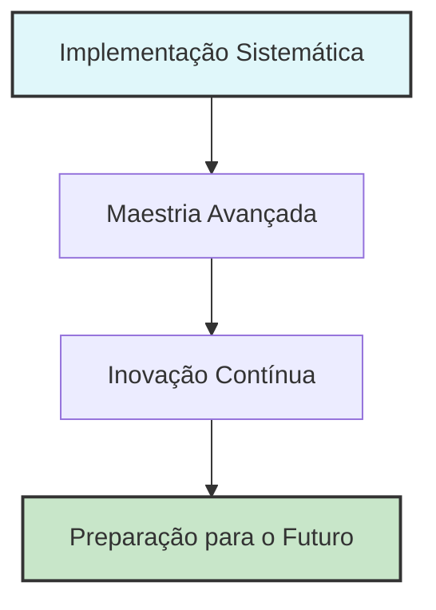

# PARTE IV: MAESTRIA E TRANSFORMAÇÃO ORGANIZACIONAL

---

# Capítulo 15: Maestria Avançada de Framework e Preparação para o Futuro

*Narrativa Futuro-Retroativo: Visão competitiva de estado final*

Imagine sua organização 36 meses a partir de agora: competidores lutam para igualar sua inteligência de cliente aprimorada por IA que antecipa mudanças de mercado 6-9 meses à frente das tendências da indústria. Sua metodologia de implementação sistemática se tornou um fosso competitivo tão substancial que três grandes competidores tentaram sem sucesso recrutar toda sua equipe de liderança de produto. Seus scores de satisfação do cliente excedem médias da indústria em 78%, enquanto suas capacidades sistemáticas de IA viabilizam ciclos de desenvolvimento de produto 40% mais rápidos que competidores.

Isto não é visão—é o estado final competitivo mensurável alcançado por organizações que evoluem além de implementação bem-sucedida de framework rumo a capacidades avançadas de maestria que sustentam liderança de mercado através de adaptação contínua e inovação.

A equipe executiva da TechFlow Innovations experimentou exatamente esta transformação. Após 18 meses de implementação sistemática de IA através de três grandes linhas de produto, eles alcançaram 67% de melhoria na aquisição de clientes, 89% de aumento no valor vitalício do cliente e 156% de crescimento na receita recorrente anual. No entanto, conforme se preparavam para sua próxima fase de crescimento, confrontaram um desafio mais sofisticado: evoluir de implementação bem-sucedida rumo à maestria organizacional que viabiliza vantagem competitiva sustentada em mercados aprimorados por IA que evoluem rapidamente.

Trabalhando retroativamente a partir deste estado final competitivo revela as capacidades avançadas que distinguem líderes de mercado sustentados de organizações presas em ciclos contínuos de recuperação com evolução tecnológica e competitiva.

Seus competidores estavam começando a alcançar capacidades similares de IA, novos entrantes de mercado estavam lançando com abordagens avançadas nativas de IA, e expectativas do cliente estavam evoluindo mais rápido do que ciclos tradicionais de desenvolvimento de produto conseguiam acomodar. Mais criticamente, as tecnologias de IA em si estavam avançando tão rapidamente que abordagens que pareciam vanguarda 12 meses antes estavam se tornando expectativas baseline.

A equipe de liderança percebeu que liderança sustentada de mercado requeria evolução de implementação sistemática rumo à maestria avançada de framework—a habilidade de continuamente adaptar, otimizar e inovar enquanto mantém foco no cliente e excelência operacional. Eles precisavam construir capacidades organizacionais que pudessem antecipar mudanças de mercado, integrar tecnologias emergentes e manter vantagens competitivas em ambientes dinâmicos onde capacidades tecnológicas evoluíam continuamente.

Ao longo dos 12 meses seguintes, a TechFlow desenvolveu capacidades avançadas de maestria que as viabilizaram manter liderança de mercado enquanto se adaptavam à evolução tecnológica. Eles estabeleceram pipelines de inovação que geraram 15 novas capacidades competitivas, desenvolveram sistemas de inteligência de cliente que antecipavam mudanças de mercado 6-9 meses à frente de competidores, e construíram capacidades de aprendizado organizacional que viabilizaram integração rápida de tecnologias emergentes enquanto mantinham excelência sistemática [1].

Este capítulo explora as aplicações avançadas de framework, estratégias de preparação para o futuro e capacidades de maestria organizacional que distinguem líderes de mercado sustentados de organizações presas em ciclos contínuos de recuperação com evolução tecnológica e competitiva.

## 15.1 Maestria Avançada de Framework e Excelência Sistemática

Maestria avançada de framework representa a evolução de implementação bem-sucedida rumo a capacidades organizacionais que viabilizam vantagem competitiva sustentada através de adaptação contínua, otimização e inovação enquanto mantém foco no cliente e excelência sistemática.

**Otimização de Framework e Melhoria Contínua**

Otimização sistemática que viabiliza evolução de framework enquanto mantém efetividade comprovada e desenvolvimento de vantagem competitiva [2]:

**Aprimoramento Sistemático de Framework e Otimização de Valor do Cliente:**

**Medição de Performance e Integração de Otimização:**
Sistemas avançados de medição que identificam oportunidades de otimização enquanto mantêm efetividade de framework e sustentabilidade de vantagem competitiva.

- Análise de correlação de valor do cliente com efetividade de componente de framework e identificação de oportunidade de otimização
- Medição de vantagem competitiva com rastreamento de posição de mercado e avaliação de contribuição de framework
- Análise de eficiência de implementação com otimização de recursos e identificação de aprimoramento de produtividade
- Evolução de garantia de qualidade com melhoria sistemática e manutenção de excelência
- Integração de pipeline de inovação com aprimoramento de framework e desenvolvimento de vantagem competitiva

**Evolução e Aprimoramento de Componente de Framework:**
Aprimoramento sistemático que melhora efetividade de framework enquanto mantém princípios comprovados e foco no cliente.

- Aprimoramento de descoberta do cliente com pesquisa assistida por IA e aceleração de validação
- Evolução de arquitetura técnica com integração de tecnologia emergente e otimização de performance
- Avanço de sistema de design com melhoria de acessibilidade e aprimoramento de experiência do usuário
- Otimização de parceria de engenharia com eficiência de colaboração e aprimoramento de qualidade
- Evolução de excelência de produção com eficiência operacional e otimização de experiência do cliente

**Integração Cross-Componente e Sinergia Sistemática:**
Integração avançada que cria benefícios compostos enquanto mantém coerência de framework e efetividade de implementação.

- Otimização de interação de componentes com workflow sistemático e aprimoramento de eficiência
- Aprimoramento de colaboração cross-funcional com melhoria de comunicação e otimização de alinhamento
- Integração de quality gates com validação sistemática e identificação de oportunidade de melhoria
- Correlação de medição de sucesso com impacto de negócio e desenvolvimento de vantagem competitiva
- Aprimoramento de compartilhamento de conhecimento com aprendizado institucional e desenvolvimento de capacidade

**Evolução de Inteligência do Cliente e Aprimoramento de Vantagem Competitiva:**

**Pesquisa Avançada do Cliente e Inteligência de Mercado:**
Capacidades de inteligência do cliente que antecipam evolução de mercado enquanto mantêm força de relacionamento e posicionamento competitivo.

- Análise preditiva de necessidades do cliente com integração de tendência de mercado e identificação de oportunidade
- Automação de inteligência competitiva com rastreamento de posição de mercado e desenvolvimento de estratégia de resposta
- Modelagem de comportamento do cliente com aprimoramento de IA e otimização de relacionamento
- Antecipação de evolução de mercado com adaptação do cliente e planejamento de vantagem competitiva
- Integração de tendência da indústria com criação de valor do cliente e otimização de posicionamento de mercado

**Otimização de Sucesso do Cliente e Aprimoramento de Relacionamento:**
Capacidades de sucesso do cliente que fortalecem relacionamentos enquanto constroem vantagens competitivas e liderança de mercado.

- Predição de resultado do cliente com intervenção proativa e otimização de sucesso
- Medição de profundidade de relacionamento com aprimoramento de lealdade e proteção competitiva
- Rastreamento de realização de valor com otimização de benefício do cliente e demonstração de vantagem competitiva
- Desenvolvimento de advocacy do cliente com influência de mercado e aprimoramento de posicionamento competitivo
- Amplificação de história de sucesso com reconhecimento de mercado e diferenciação competitiva

**Desenvolvimento de Pipeline de Inovação e Liderança de Mercado:**

**Inovação Sistemática e Criação de Vantagem Competitiva:**
Capacidades de inovação que mantêm liderança de mercado enquanto constroem vantagens competitivas sustentáveis através de avanço sistemático.

- Avaliação de tecnologia com potencial de valor do cliente e avaliação de vantagem competitiva
- Priorização de projeto de inovação com timing de mercado e otimização de posicionamento competitivo
- Desenvolvimento de protótipo com validação do cliente e integração de oportunidade de mercado
- Desenvolvimento de diferenciação competitiva com capacidade única e criação de vantagem de mercado
- Estabelecimento de liderança de mercado com reconhecimento de inovação e influência da indústria

**Integração de Tecnologia Futura e Posicionamento Competitivo:**
Capacidades de integração de tecnologia que mantêm vantagens competitivas enquanto se adaptam à evolução tecnológica e mudanças de mercado.

- Avaliação de tecnologia emergente com aplicação do cliente e avaliação de potencial competitivo
- Planejamento de integração com capacidade existente e otimização de aprimoramento sistemático
- Gerenciamento de risco com proteção competitiva e manutenção de posição de mercado
- Otimização de cronograma com oportunidade de mercado e desenvolvimento de vantagem competitiva
- Medição de sucesso com vantagem competitiva e validação de liderança de mercado

**Escalamento de Implementação de Framework Através de Múltiplas Áreas de Produto**

Implementação avançada que viabiliza escalamento de framework enquanto mantém efetividade e vantagem competitiva através de contextos de produto diversos [3]:

**Adaptação e Otimização de Framework Multi-Produto:**

**Customização de Framework Específica de Produto:**
Adaptação de framework que mantém princípios core enquanto otimiza para contextos específicos de produto e requisitos do cliente.

- Análise de contexto de produto com workflow do cliente e identificação de padrão de criação de valor
- Adaptação de componente de framework com requisito de produto e otimização de posicionamento competitivo
- Ajuste de cronograma de implementação com ciclo de desenvolvimento de produto e integração de timing de mercado
- Customização de medição de sucesso com resultado específico de produto e rastreamento de vantagem competitiva
- Otimização de alocação de recursos com prioridade de produto e desenvolvimento de vantagem competitiva

**Aprendizado Cross-Produto e Compartilhamento de Conhecimento:**
Gerenciamento de conhecimento que viabiliza transferência de aprendizado enquanto constrói capacidade institucional e desenvolvimento de vantagem competitiva.

- Documentação de experiência de implementação com lições aprendidas e identificação de oportunidade de otimização
- Desenvolvimento de melhores práticas com aplicação cross-produto e aprimoramento de efetividade
- Reconhecimento de padrão de sucesso com oportunidade de replicação e escalamento de vantagem competitiva
- Compartilhamento de resolução de desafios com melhoria sistemática e aprimoramento de eficiência
- Coordenação de pipeline de inovação com oportunidade cross-produto e desenvolvimento de vantagem competitiva

**Otimização de Nível de Portfólio e Integração de Vantagem Competitiva:**
Gerenciamento de portfólio que otimiza desenvolvimento de vantagem competitiva enquanto mantém efetividade específica de produto e posicionamento de mercado.

- Coordenação de vantagem competitiva com estratégia de nível de portfólio e otimização de posicionamento de mercado
- Otimização de alocação de recursos com prioridade competitiva e equilíbrio de oportunidade de mercado
- Consistência de experiência do cliente com integração de marca e aprimoramento de diferenciação competitiva
- Coordenação de posição de mercado com vantagem competitiva e desenvolvimento de liderança da indústria
- Integração de pipeline de inovação com estratégia de portfólio e sustentabilidade de vantagem competitiva

**Desenvolvimento de Capacidade Organizacional e Maestria de Framework:**

**Aprimoramento de Capacidade da Equipe e Excelência Sistemática:**
Desenvolvimento da equipe que constrói maestria de framework enquanto mantém foco no cliente e desenvolvimento de vantagem competitiva.

- Desenvolvimento de expertise de framework com maestria de implementação e otimização de valor do cliente
- Aprimoramento de colaboração cross-funcional com melhoria de comunicação e otimização de alinhamento
- Desenvolvimento de liderança com advocacy de framework e desenvolvimento de vantagem competitiva
- Construção de capacidade de inovação com aplicação criativa e desenvolvimento de diferenciação competitiva
- Desenvolvimento de conhecimento institucional com evolução de framework e sustentabilidade de vantagem competitiva

**Otimização de Processo e Aprimoramento de Eficiência:**
Melhoria de processo que aprimora efetividade de framework enquanto mantém padrões de qualidade e desenvolvimento de vantagem competitiva.

- Otimização de workflow com eficiência sistemática e aprimoramento de valor do cliente
- Evolução de garantia de qualidade com melhoria sistemática e desenvolvimento de vantagem competitiva
- Aprimoramento de comunicação com alinhamento de stakeholder e otimização de colaboração
- Otimização de tomada de decisão com orientação de framework e desenvolvimento de vantagem competitiva
- Integração de medição de sucesso com impacto de negócio e validação de vantagem competitiva

## 15.2 Estratégias de Preparação para o Futuro e Evolução Tecnológica

Capacidades de preparação para o futuro viabilizam organizações manterem vantagens competitivas enquanto se adaptam à evolução tecnológica, mudanças de mercado e ameaças competitivas emergentes através de antecipação e preparação sistemáticas.

**Integração de Tecnologia Emergente e Posicionamento Competitivo**

Abordagens sistemáticas para avaliação e integração de tecnologia que mantêm vantagens competitivas enquanto viabilizam inovação e liderança de mercado [4]:

**Framework de Avaliação de Tecnologia e Integração Estratégica:**

**Avaliação de Tecnologia Emergente e Potencial de Valor do Cliente:**
Avaliação de tecnologia que prioriza criação de valor do cliente enquanto avalia potencial de vantagem competitiva e otimização de timing de mercado.

- Análise de aplicação do cliente com potencial de criação de valor e avaliação de vantagem competitiva
- Avaliação de viabilidade técnica com complexidade de implementação e análise de requisito de recursos
- Avaliação de timing de mercado com posicionamento competitivo e otimização de oportunidade
- Planejamento de integração com capacidade existente e desenvolvimento de aprimoramento sistemático
- Avaliação de risco com proteção competitiva e manutenção de posição de mercado

**Evolução de Tecnologia de IA e Adaptação de Vantagem Competitiva:**
Integração de tecnologia de IA que mantém vantagens competitivas enquanto viabiliza avanço e desenvolvimento de liderança de mercado.

- Evolução de modelo de linguagem grande com aplicação do cliente e potencial de diferenciação competitiva
- Capacidade de IA multimodal com aprimoramento de experiência do cliente e desenvolvimento de vantagem de mercado
- Desenvolvimento de agente autônomo com automação de workflow do cliente e criação de vantagem competitiva
- Integração de IA de borda com aprimoramento de performance e privacidade do cliente enquanto mantém posicionamento competitivo
- Preparação de computação quântica com vantagem competitiva de longo prazo e potencial de liderança de mercado

**Evolução de Stack de Tecnologia e Posicionamento de Mercado:**
Desenvolvimento de infraestrutura de tecnologia que viabiliza sustentabilidade de vantagem competitiva enquanto se adapta à evolução tecnológica e mudanças de mercado.

- Evolução de arquitetura de nuvem com escalabilidade do cliente e otimização de vantagem competitiva
- Desenvolvimento de ecossistema de API com integração do cliente e aprimoramento de diferenciação competitiva
- Avanço de arquitetura de dados com inteligência do cliente e desenvolvimento de vantagem competitiva
- Evolução de framework de segurança com confiança do cliente e aprimoramento de proteção competitiva
- Otimização de performance com experiência do cliente e sustentabilidade de vantagem competitiva

**Antecipação de Evolução de Mercado e Resposta Competitiva:**

**Análise de Tendência da Indústria e Inteligência Competitiva:**
Capacidades de inteligência de mercado que antecipam ameaças competitivas enquanto identificam desenvolvimento de oportunidade e potencial de liderança de mercado.

- Monitoramento de paisagem competitiva com identificação de ameaça e desenvolvimento de estratégia de resposta
- Análise de tendência da indústria com oportunidade de mercado e avaliação de potencial de vantagem competitiva
- Evolução de expectativa do cliente com oportunidade de aprimoramento de serviço e diferenciação competitiva
- Antecipação de mudança regulatória com vantagem de compliance e otimização de posicionamento de mercado
- Integração de tendência econômica com estratégia competitiva e desenvolvimento de oportunidade de mercado

**Evolução de Necessidade do Cliente e Oportunidade de Mercado:**
Inteligência do cliente que antecipa evolução de necessidade enquanto constrói vantagens competitivas e liderança de mercado através de criação proativa de valor.

- Predição de comportamento do cliente com evolução de necessidade e identificação de oportunidade de vantagem competitiva
- Previsão de demanda de mercado com desenvolvimento de produto e otimização de posicionamento competitivo
- Análise de transformação da indústria com adaptação do cliente e desenvolvimento de vantagem competitiva
- Padrão de adoção de tecnologia com integração do cliente e planejamento de diferenciação competitiva
- Evolução de proposta de valor com benefício do cliente e aprimoramento de vantagem competitiva

**Estratégia de Resposta Competitiva e Defesa de Mercado:**
Estratégia competitiva que protege posição de mercado enquanto constrói vantagens sustentáveis e liderança de mercado através de diferenciação sistemática.

- Avaliação de ameaça competitiva com estratégia de resposta e planejamento de defesa de mercado
- Desenvolvimento de diferenciação com capacidade única e criação de vantagem competitiva
- Proteção de posição de mercado com lealdade do cliente e desenvolvimento de barreira competitiva
- Aceleração de inovação com vantagem competitiva e aprimoramento de liderança de mercado
- Parceria estratégica com desenvolvimento de ecossistema e otimização de posicionamento competitivo

**Capacidades de Aprendizado e Adaptação Organizacional**

Capacidades de aprendizado que viabilizam evolução contínua enquanto mantêm excelência sistemática e desenvolvimento de vantagem competitiva [5]:

**Aprendizado Institucional e Gerenciamento de Conhecimento:**

**Evolução de Framework e Melhoria Contínua:**
Sistemas de aprendizado que capturam experiência de implementação enquanto viabilizam aprimoramento de framework e desenvolvimento de vantagem competitiva.

- Documentação de experiência de implementação com lições aprendidas e identificação de oportunidade de otimização
- Reconhecimento de padrão de sucesso com oportunidade de replicação e escalamento de vantagem competitiva
- Metodologia de resolução de desafios com melhoria sistemática e aprimoramento de eficiência
- Desenvolvimento de pipeline de inovação com vantagem competitiva e aprimoramento de liderança de mercado
- Otimização de compartilhamento de conhecimento com aprendizado institucional e desenvolvimento de capacidade

**Aprendizado Cross-Funcional e Desenvolvimento de Capacidade:**
Capacidades de aprendizado que aprimoram efetividade da equipe enquanto constroem vantagens competitivas e excelência organizacional.

- Compartilhamento de inteligência do cliente com entendimento cross-funcional e desenvolvimento de vantagem competitiva
- Desenvolvimento de expertise técnica com maestria de implementação e aprimoramento de diferenciação competitiva
- Integração de conhecimento de mercado com posicionamento competitivo e otimização de tomada de decisão estratégica
- Construção de capacidade de inovação com aplicação criativa e criação de vantagem competitiva
- Desenvolvimento de liderança com advocacy de framework e sustentabilidade de vantagem competitiva

**Capacidade de Adaptação e Responsividade de Mercado:**
Capacidades de adaptação que viabilizam resposta rápida a mudanças de mercado enquanto mantêm vantagens competitivas e excelência sistemática.

- Detecção de mudança de mercado com alerta precoce e proteção de vantagem competitiva
- Capacidade de resposta rápida com adaptação sistemática e manutenção de posicionamento competitivo
- Integração de feedback do cliente com melhoria imediata e aprimoramento de vantagem competitiva
- Resposta a ameaça competitiva com defesa de mercado e desenvolvimento de vantagem
- Aceleração de inovação com oportunidade de mercado e desenvolvimento de liderança competitiva

**Medição de Performance e Otimização:**

**Métricas Avançadas e Correlação de Vantagem Competitiva:**
Sistemas de medição que rastreiam desenvolvimento de vantagem competitiva enquanto viabilizam otimização e validação de liderança de mercado.

- Medição de vantagem competitiva com rastreamento de posição de mercado e avaliação de desenvolvimento
- Correlação de valor do cliente com diferenciação competitiva e validação de preferência de mercado
- Indicadores de liderança de mercado com reconhecimento da indústria e medição de posicionamento competitivo
- Rastreamento de pipeline de inovação com vantagem competitiva e desenvolvimento de oportunidade de mercado
- Avaliação de capacidade organizacional com vantagem competitiva e correlação de excelência sistemática

**Otimização de Sucesso e Aprimoramento Competitivo:**
Sistemas de otimização que aprimoram vantagens competitivas enquanto mantêm excelência sistemática e desenvolvimento de liderança de mercado.

- Otimização de performance com vantagem competitiva e aprimoramento de valor do cliente
- Eficiência de alocação de recursos com prioridade competitiva e equilíbrio de oportunidade de mercado
- Melhoria de qualidade com diferenciação competitiva e desenvolvimento de liderança de mercado
- Aceleração de inovação com vantagem competitiva e aprimoramento de posicionamento de mercado
- Fortalecimento de posição de mercado com vantagem competitiva e otimização de relacionamento com cliente

## 15.3 Padrões Avançados de Implementação e Excelência Competitiva

Padrões avançados de implementação viabilizam organizações alcançarem execução de nível de maestria enquanto constroem vantagens competitivas sustentáveis através de excelência sistemática e integração de inovação.

**Padrões de Integração Complexa e Excelência Empresarial**

Abordagens avançadas de integração que viabilizam implementação em escala empresarial enquanto mantêm vantagens competitivas e excelência sistemática [6]:

**Arquitetura Empresarial e Integração de Vantagem Competitiva:**

**Integração Multi-Sistema e Desenvolvimento de Vantagem Competitiva:**
Padrões de integração que otimizam desenvolvimento de vantagem competitiva enquanto mantêm confiabilidade do sistema e excelência empresarial.

- Aprimoramento de sistema legacy com vantagem competitiva e manutenção de excelência operacional
- Otimização de arquitetura de nuvem com diferenciação competitiva e aprimoramento de experiência do cliente
- Integração de ecossistema de dados com inteligência competitiva e criação de valor do cliente
- Avanço de framework de segurança com proteção competitiva e construção de confiança do cliente
- Otimização de performance com vantagem competitiva e aprimoramento de eficiência de recursos

**Integração Cross-Funcional e Excelência Organizacional:**
Padrões de integração que aprimoram efetividade organizacional enquanto constroem vantagens competitivas e excelência sistemática.

- Parceria produto-engenharia com vantagem competitiva e integração de excelência técnica
- Coordenação de sucesso do cliente com diferenciação competitiva e aprimoramento de relacionamento
- Alinhamento de vendas e marketing com posicionamento competitivo e desenvolvimento de liderança de mercado
- Alinhamento executivo com estratégia competitiva e otimização de excelência organizacional
- Governança do conselho com vantagem competitiva e integração de supervisão estratégica

**Padrões de Escalabilidade e Liderança de Mercado:**
Abordagens de escalabilidade que viabilizam liderança de mercado enquanto mantêm vantagens competitivas e excelência operacional.

- Expansão geográfica com vantagem competitiva e manutenção de posição de mercado
- Expansão de segmento de cliente com diferenciação competitiva e otimização de proposta de valor
- Escalamento de portfólio de produto com vantagem competitiva e desenvolvimento de liderança de mercado
- Escalamento de equipe com capacidade competitiva e preservação de excelência cultural
- Escalamento de tecnologia com vantagem competitiva e aprimoramento de performance

**Integração de Inovação e Diferenciação Competitiva:**

**Inovação Sistemática e Desenvolvimento de Liderança de Mercado:**
Padrões de inovação que constroem liderança de mercado enquanto mantêm vantagens competitivas e excelência sistemática.

- Integração de pesquisa e desenvolvimento com vantagem competitiva e desenvolvimento de oportunidade de mercado
- Exploração de tecnologia com diferenciação competitiva e potencial de valor do cliente
- Experimentação de mercado com posicionamento competitivo e validação de oportunidade
- Desenvolvimento de parceria com vantagem competitiva e aprimoramento de ecossistema
- Desenvolvimento de propriedade intelectual com proteção competitiva e diferenciação de mercado

**Co-Inovação do Cliente e Vantagem Competitiva:**
Padrões de colaboração do cliente que constroem vantagens competitivas enquanto fortalecem relacionamentos e posicionamento de mercado.

- Integração de conselho do cliente com vantagem competitiva e desenvolvimento de inteligência de mercado
- Programas de co-desenvolvimento com diferenciação competitiva e criação de valor do cliente
- Parceria de inovação com vantagem competitiva e aprimoramento de liderança de mercado
- Amplificação de sucesso do cliente com posicionamento competitivo e influência de mercado
- Validação de mercado com vantagem competitiva e demonstração de preferência do cliente

**Inteligência Competitiva e Excelência de Mercado:**

**Inteligência de Mercado e Posicionamento Competitivo:**
Capacidades de inteligência que mantêm vantagens competitivas enquanto viabilizam liderança de mercado e excelência estratégica.

- Monitoramento competitivo com detecção de ameaça e desenvolvimento de estratégia de resposta
- Análise de tendência de mercado com oportunidade competitiva e otimização de posicionamento
- Inteligência do cliente com vantagem competitiva e aprimoramento de relacionamento
- Análise da indústria com diferenciação competitiva e desenvolvimento de liderança de mercado
- Planejamento estratégico com vantagem competitiva e otimização de posição de mercado

**Liderança de Mercado e Sustentabilidade Competitiva:**
Capacidades de liderança que constroem vantagens competitivas sustentáveis enquanto mantêm posição de mercado e influência da indústria.

- Thought leadership com posicionamento competitivo e desenvolvimento de influência de mercado
- Desenvolvimento de padrão da indústria com vantagem competitiva e estabelecimento de liderança de mercado
- Educação de mercado com diferenciação competitiva e demonstração de valor do cliente
- Parceria estratégica com vantagem competitiva e desenvolvimento de ecossistema
- Liderança de inovação com vantagem competitiva e transformação de mercado

**Maestria Organizacional e Excelência Sistemática**

Capacidades organizacionais que viabilizam vantagem competitiva sustentada enquanto mantêm excelência sistemática e liderança de mercado [7]:

**Excelência Cultural e Integração de Vantagem Competitiva:**

**Cultura Centrada no Cliente e Excelência Competitiva:**
Desenvolvimento cultural que integra advocacy do cliente com desenvolvimento de vantagem competitiva e excelência sistemática.

- Empatia do cliente com diferenciação competitiva e aprimoramento de relacionamento de mercado
- Foco em criação de valor com vantagem competitiva e otimização de sucesso do cliente
- Mindset de inovação com diferenciação competitiva e desenvolvimento de liderança de mercado
- Excelência de qualidade com vantagem competitiva e aprimoramento de satisfação do cliente
- Melhoria contínua com otimização competitiva e fortalecimento de posição de mercado

**Excelência de Engenharia e Liderança de Mercado:**
Cultura de engenharia que constrói vantagens competitivas enquanto mantém excelência técnica e capacidade de inovação.

- Expertise técnica com diferenciação competitiva e criação de valor do cliente
- Capacidade de inovação com vantagem competitiva e desenvolvimento de liderança de mercado
- Padrões de qualidade com excelência competitiva e aprimoramento de satisfação do cliente
- Eficiência de colaboração com vantagem competitiva e efetividade organizacional
- Mindset de aprendizado com adaptação competitiva e desenvolvimento de capacidade

**Excelência de Liderança e Sustentabilidade Competitiva:**
Capacidades de liderança que constroem vantagens competitivas sustentáveis enquanto mantêm excelência organizacional e posicionamento de mercado.

- Visão estratégica com vantagem competitiva e desenvolvimento de liderança de mercado
- Excelência de execução com diferenciação competitiva e eficiência operacional
- Desenvolvimento de equipe com capacidade competitiva e aprimoramento de excelência cultural
- Liderança de inovação com vantagem competitiva e transformação de mercado
- Posicionamento de mercado com sustentabilidade competitiva e influência da indústria

**Excelência de Performance e Dominância de Mercado:**

**Excelência Operacional e Vantagem Competitiva:**
Capacidades operacionais que constroem vantagens competitivas enquanto mantêm eficiência e satisfação do cliente.

- Otimização de processo com eficiência competitiva e aprimoramento de valor do cliente
- Garantia de qualidade com excelência competitiva e desenvolvimento de satisfação do cliente
- Otimização de recursos com vantagem competitiva e eficiência operacional
- Medição de performance com rastreamento competitivo e otimização de melhoria
- Melhoria contínua com aprimoramento competitivo e fortalecimento de posição de mercado

**Excelência Financeira e Liderança de Mercado:**
Gerenciamento financeiro que viabiliza desenvolvimento de vantagem competitiva enquanto mantém lucratividade e sustentabilidade de crescimento.

- Otimização de investimento com vantagem competitiva e maximização de retorno
- Alocação de recursos com prioridade competitiva e equilíbrio de oportunidade de mercado
- Aprimoramento de lucratividade com vantagem competitiva e eficiência operacional
- Sustentabilidade de crescimento com posição competitiva e desenvolvimento de liderança de mercado
- Valuation de mercado com vantagem competitiva e aprimoramento de confiança do investidor

**Entregas do Capítulo: Ferramentas Avançadas de Maestria e Preparação para o Futuro**

Este capítulo fornece frameworks abrangentes para maestria avançada de framework e transformação organizacional:

**Desenvolvimento de Otimização e Maestria Avançada de Framework**
Abordagens sistemáticas para maestria de framework e aprimoramento de vantagem competitiva:
- Otimização de componente de framework com medição de performance e identificação de aprimoramento
- Integração cross-componente com sinergia sistemática e desenvolvimento de eficiência
- Escalamento multi-produto com metodologia de adaptação e coordenação de vantagem competitiva
- Desenvolvimento de capacidade organizacional com expertise de framework e excelência sistemática

**Estratégia de Preparação para o Futuro e Planejamento de Evolução Tecnológica**
Frameworks abrangentes para sustentabilidade de vantagem competitiva através de adaptação tecnológica:
- Avaliação de tecnologia emergente com potencial de valor do cliente e avaliação de vantagem competitiva
- Antecipação de evolução de mercado com inteligência competitiva e desenvolvimento de estratégia de resposta
- Capacidades de aprendizado organizacional com framework de adaptação e aprimoramento competitivo
- Evolução de medição de performance com rastreamento de vantagem competitiva e otimização

**Padrões Avançados de Implementação e Frameworks de Excelência Competitiva**
Abordagens sistemáticas para implementação de nível de maestria e liderança de mercado:
- Padrões de integração complexa com excelência empresarial e desenvolvimento de vantagem competitiva
- Integração de inovação com diferenciação competitiva e aprimoramento de liderança de mercado
- Inteligência competitiva com posicionamento de mercado e desenvolvimento de vantagem estratégica
- Maestria organizacional com excelência cultural e sustentabilidade competitiva

**Conclusão do Capítulo e Transição Estratégica**

Maestria avançada de framework e capacidades de preparação para o futuro distinguem líderes de mercado sustentados de organizações presas em ciclos contínuos de recuperação com evolução tecnológica e competitiva. Os frameworks apresentados neste capítulo viabilizam organizações construírem capacidades que antecipam mudança, integram tecnologias emergentes e mantêm vantagens competitivas através de excelência sistemática e inovação.

A transição de implementação bem-sucedida rumo à maestria organizacional requer evolução além de execução tática rumo ao desenvolvimento de capacidade estratégica que viabiliza vantagem competitiva sustentada em mercados dinâmicos. Esta maestria cria a fundação para transformação organizacional que distingue líderes de mercado de competidores.

**Principais Takeaways para Líderes Organizacionais:**

1. **Maestria Viabiliza Vantagem Sustentável**: Capacidades avançadas de framework criam vantagens competitivas que se adaptam à evolução tecnológica e mudanças de mercado
2. **Preparação para o Futuro Requer Antecipação Sistemática**: Sustentabilidade competitiva requer avaliação sistemática de tecnologia e integração de inteligência de mercado
3. **Inovação Deve Integrar com Excelência**: Desenvolvimento de capacidade breakthrough requer integração com excelência sistemática e foco no cliente
4. **Capacidades de Aprendizado Dirigem Adaptação**: Aprendizado organizacional viabiliza resposta rápida a mudanças de mercado enquanto mantém vantagens competitivas
5. **Excelência Cultural Sustenta Posição Competitiva**: Cultura centrada no cliente combinada com excelência técnica cria liderança de mercado sustentável

**Referências**

[1] TechFlow Innovations. (2024). *Maestria Avançada de Framework: Transformação Organizacional e Desenvolvimento de Vantagem Competitiva*. Estudo de Caso Interno.

[2] MIT Sloan Management Review. (2024). "Otimização de Framework e Melhoria Contínua: Excelência Sistemática em Mercados Dinâmicos." *MIT SMR*, 66(1), 45-52.

[3] Harvard Business Review. (2024). "Escalamento de Excelência de Implementação: Adaptação de Framework Multi-Produto e Vantagem Competitiva." *HBR*, 102(7), 78-85.

[4] Stanford University. (2024). *Estratégia de Preparação para o Futuro: Evolução Tecnológica e Posicionamento Competitivo em Mercados Aprimorados por IA*. Stanford Business Press.

[5] McKinsey Global Institute. (2024). *Aprendizado e Adaptação Organizacional: Vantagem Competitiva Através de Evolução Sistemática*. McKinsey & Company.

[6] Boston Consulting Group. (2024). *Padrões Avançados de Implementação: Excelência Empresarial e Desenvolvimento de Vantagem Competitiva*. BCG Henderson Institute.

[7] Bain & Company. (2024). *Maestria Organizacional e Liderança de Mercado: Excelência Cultural e Sustentabilidade Competitiva*. Bain & Company.

**Roadmap de Maestria Organizacional de IA**

Este roadmap ilustra a evolução de implementação sistemática para capacidades organizacionais de IA preparadas para o futuro:

---

*Transição estratégica para Capítulo 16: Com capacidades avançadas de maestria de framework e preparação para o futuro estabelecidas, o capítulo final abordará transformação organizacional e liderança que viabiliza vantagem competitiva sustentada através de excelência sistemática. Este capítulo explorará os frameworks culturais, de liderança e governança que distinguem líderes de mercado enquanto constroem capacidades para evolução contínua e sustentabilidade de vantagem competitiva.*