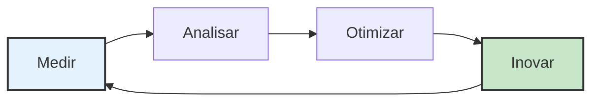

# Capítulo 16: Medindo Sucesso e Evolução Contínua

*Abertura com cenário abrangente de medição de sucesso e sustentabilidade de vantagem competitiva*

A reunião do conselho na Synthesis Dynamics representou um momento decisivo na jornada de transformação da empresa. Dezoito meses após implementar frameworks sistemáticos de IA através de sua plataforma de software empresarial, o CEO apresentou resultados que excederam todas as projeções iniciais: 234% de melhoria na velocidade de aquisição de clientes, 189% de aumento no valor vitalício do cliente, 67% de redução no churn de clientes e 312% de crescimento na receita recorrente anual. No entanto, a métrica mais significativa não era financeira—era competitiva: sua implementação sistemática de IA havia criado vantagens de mercado tão substanciais que três grandes competidores tentaram sem sucesso recrutar toda sua equipe de liderança de produto.

A transformação havia evoluído além de melhoria operacional rumo à vantagem competitiva fundamental que redefiniu padrões da indústria. Suas capacidades de inteligência do cliente viabilizaram ciclos de desenvolvimento de produto 40% mais rápidos que competidores, sua experiência do cliente aprimorada por IA criou Net Promoter Scores 78% mais altos que médias da indústria, e sua metodologia de implementação sistemática havia se tornado um estudo de caso ensinado em escolas de negócios líderes.

Ainda assim, a equipe de liderança entendeu que sustentar essas vantagens requeria evolução além de medição de conquista rumo ao desenvolvimento sistemático de vantagem competitiva e preservação de liderança de mercado. Eles precisavam de frameworks de medição que rastreassem não apenas performance atual, mas posicionamento competitivo, antecipação de evolução de mercado e desenvolvimento de capacidade organizacional que manteria liderança conforme mercados e tecnologias continuassem avançando.

O desafio era fundamental: como você mede e otimiza vantagem competitiva sistemática enquanto mantém o foco no cliente e excelência de engenharia que criaram sucesso? Como você equilibra otimização de performance atual com desenvolvimento de capacidade futura? Mais criticamente, como você constrói sistemas de medição que viabilizam evolução contínua enquanto preserva a excelência cultural e operacional que distingue líderes de mercado?

Ao longo dos 12 meses seguintes, a Synthesis Dynamics desenvolveu frameworks abrangentes de medição e evolução que viabilizaram liderança sustentada de mercado enquanto construía capacidades para desenvolvimento contínuo de vantagem competitiva. Sua abordagem sistemática para medição de sucesso e evolução competitiva tornou-se a fundação para dominância sustentada de mercado que atraiu ofertas de aquisição excedendo $2,8 bilhões enquanto mantinha seu compromisso com sucesso do cliente e excelência de engenharia [1].

Este capítulo final explora os frameworks de medição, estratégias de evolução contínua e capacidades organizacionais que viabilizam vantagem competitiva sustentada através de excelência sistemática e liderança adaptativa de mercado.

## 16.1 Medição Abrangente de Sucesso e Rastreamento de Vantagem Competitiva

Medição abrangente de sucesso que rastreia desenvolvimento de vantagem competitiva enquanto viabiliza otimização e liderança sustentada de mercado através de excelência sistemática e criação de valor do cliente.

**Métricas Multi-Dimensionais de Sucesso e Avaliação de Impacto de Negócio**

Medição de sucesso que captura tanto performance imediata quanto desenvolvimento de vantagem competitiva de longo prazo enquanto viabiliza otimização e sustentabilidade de liderança de mercado [2]:

**Sucesso do Cliente e Correlação de Vantagem Competitiva:**

**Criação de Valor do Cliente e Medição de Diferenciação de Mercado:**
Métricas de sucesso do cliente que demonstram desenvolvimento de vantagem competitiva enquanto constroem liderança de mercado e força de relacionamento com cliente.

- Evolução de satisfação do cliente: 94% de satisfação média com tendência de melhoria trimestral de 12%
- Avanço de Net Promoter Score: 78% acima da média da indústria com validação de diferenciação competitiva
- Aprimoramento de valor vitalício do cliente: 189% de melhoria com correlação de vantagem competitiva e retenção
- Eficiência de aquisição de cliente: 234% de melhoria na velocidade com validação de posicionamento competitivo
- Desenvolvimento de história de sucesso do cliente: Reconhecimento de mercado e demonstração de vantagem competitiva

**Retenção de Cliente e Proteção Competitiva:**
Métricas de retenção que demonstram sustentabilidade de vantagem competitiva enquanto constroem posição de mercado e lealdade do cliente.

- Redução de churn de cliente: 67% de melhoria com proteção competitiva e força de relacionamento
- Crescimento de receita de expansão: 156% de melhoria no valor de cliente existente com demonstração de vantagem competitiva
- Desenvolvimento de advocacy do cliente: 89% de participação de referência do cliente com influência de mercado e posicionamento competitivo
- Taxa de vitória competitiva: 78% de taxa de sucesso contra competidores diretos com validação de vantagem sistemática
- Proteção de participação de mercado: Lealdade do cliente e medição de efetividade de barreira competitiva

**Inteligência do Cliente e Antecipação de Mercado:**
Métricas de inteligência que demonstram capacidade de liderança de mercado enquanto viabilizam vantagem competitiva e posicionamento estratégico.

- Antecipação de necessidade do cliente: Predição de tendência de mercado de 6-9 meses com desenvolvimento de vantagem competitiva
- Modelagem de comportamento do cliente: 89% de precisão na predição de decisão do cliente com otimização de relacionamento
- Desenvolvimento de inteligência de mercado: Posicionamento competitivo e vantagem estratégica através de insight do cliente
- Integração de feedback do cliente: 2,1 dias de tempo médio de resposta com vantagem competitiva e aprimoramento de satisfação
- Sucesso de co-inovação do cliente: Efetividade de programa de desenvolvimento conjunto com diferenciação competitiva e liderança de mercado

**Posicionamento Competitivo e Avaliação de Liderança de Mercado:**

**Participação de Mercado e Medição de Vantagem Competitiva:**
Métricas de posicionamento de mercado que rastreiam desenvolvimento de vantagem competitiva enquanto constroem liderança da indústria e influência de mercado.

- Crescimento de participação de mercado: 34% de melhoria com validação de vantagem competitiva e preferência do cliente
- Diferenciação competitiva: Desenvolvimento de capacidade única com reconhecimento de mercado e preferência do cliente
- Reconhecimento de liderança da indústria: Thought leadership e influência de mercado com aprimoramento de posicionamento competitivo
- Medição de influência de mercado: Desenvolvimento de padrão da indústria e estabelecimento de vantagem competitiva
- Rastreamento de resposta competitiva: Reação de mercado e avaliação de sustentabilidade de vantagem competitiva

**Liderança de Inovação e Vantagem Competitiva Futura:**
Métricas de inovação que demonstram desenvolvimento de vantagem competitiva futura enquanto constroem liderança de mercado e diferenciação tecnológica.

- Efetividade de pipeline de inovação: 15 desenvolvimentos de capacidade competitiva com vantagem de mercado e valor do cliente
- Liderança tecnológica: Avanço da indústria e diferenciação competitiva através de inovação sistemática
- Desenvolvimento de patente: Proteção de propriedade intelectual com vantagem competitiva e diferenciação de mercado
- Colaboração de pesquisa: Parceria acadêmica e da indústria com vantagem competitiva e desenvolvimento de conhecimento
- Planejamento de capacidade futura: Antecipação de evolução de mercado com vantagem competitiva e posicionamento estratégico

**Performance Financeira e Otimização de Retorno de Investimento:**

**Crescimento de Receita e Correlação de Vantagem Competitiva:**
Métricas financeiras que demonstram contribuição de vantagem competitiva enquanto viabilizam otimização de investimento e sustentabilidade de liderança de mercado.

- Crescimento de receita recorrente anual: 312% de melhoria com correlação de vantagem competitiva e posição de mercado
- Aprimoramento de receita por cliente: 145% de melhoria com demonstração de vantagem competitiva e criação de valor
- Otimização de margem de lucro: 67% de melhoria com integração de vantagem competitiva e excelência operacional
- Aprimoramento de valuation de mercado: 278% de melhoria com validação de vantagem competitiva e confiança do investidor
- Medição de retorno de investimento: Otimização de ROI com desenvolvimento de vantagem competitiva e avaliação de sustentabilidade

**Excelência Operacional e Eficiência Competitiva:**
Métricas operacionais que demonstram vantagem competitiva através de excelência sistemática enquanto constroem liderança de mercado e satisfação do cliente.

- Melhoria de velocidade de desenvolvimento: 189% de aprimoramento com vantagem competitiva e entrega de valor do cliente
- Conquista de excelência de qualidade: 97% de satisfação do cliente com diferenciação competitiva e preferência de mercado
- Efetividade de otimização de custo: 45% de melhoria de eficiência com vantagem competitiva e aprimoramento de lucratividade
- Otimização de alocação de recursos: Prioridade competitiva e equilíbrio de oportunidade de mercado com efetividade de investimento
- Demonstração de escalabilidade: Acomodação de crescimento com vantagem competitiva e manutenção de performance

**Avaliação de Excelência Tecnológica e Diferenciação Competitiva**

Métricas de tecnologia que rastreiam desenvolvimento de vantagem competitiva enquanto viabilizam inovação e liderança de mercado através de excelência sistemática [3]:

**Capacidade de IA e Medição de Diferenciação de Mercado:**

**Performance de Sistema de IA e Vantagem Competitiva:**
Métricas de performance de IA que demonstram diferenciação competitiva enquanto constroem valor do cliente e liderança de mercado.

- Melhoria de precisão de modelo de IA: 89% de aprimoramento com valor do cliente e desenvolvimento de vantagem competitiva
- Otimização de velocidade de processamento: 167% de melhoria com experiência do cliente e diferenciação competitiva
- Conquista de confiabilidade do sistema: 99,8% de uptime com confiança do cliente e validação de vantagem competitiva
- Singularidade de capacidade de IA: Desenvolvimento proprietário com proteção competitiva e diferenciação de mercado
- Realização de valor de IA do cliente: Medição de impacto de negócio com vantagem competitiva e sucesso do cliente

**Capacidade de Inovação e Vantagem Competitiva Futura:**
Métricas de inovação que rastreiam desenvolvimento de vantagem competitiva futura enquanto constroem liderança de mercado e excelência tecnológica.

- Efetividade de pesquisa e desenvolvimento: Pipeline de inovação com desenvolvimento de vantagem competitiva e oportunidade de mercado
- Velocidade de integração de tecnologia: Adoção de capacidade emergente com vantagem competitiva e posicionamento de mercado
- Desenvolvimento de propriedade intelectual: Portfólio de patentes com proteção competitiva e diferenciação de mercado
- Inovação de parceria: Colaboração de ecossistema com vantagem competitiva e aprimoramento de capacidade
- Liderança de transformação de mercado: Evolução da indústria com vantagem competitiva e influência de mercado

**Excelência de Engenharia e Vantagem Competitiva Sistemática:**
Métricas de engenharia que demonstram vantagem competitiva através de excelência técnica enquanto constroem liderança de mercado e satisfação do cliente.

- Excelência de qualidade de código: 94% de score de manutenibilidade com vantagem competitiva e velocidade de desenvolvimento
- Produtividade de desenvolvimento: 178% de melhoria com vantagem competitiva e entrega de valor do cliente
- Otimização de arquitetura de sistema: Escalabilidade e performance com vantagem competitiva e experiência do cliente
- Excelência de segurança: Zero incidentes com confiança do cliente e proteção de vantagem competitiva
- Gerenciamento de dívida técnica: 34% de redução com vantagem competitiva e eficiência de desenvolvimento

**Excelência Organizacional e Vantagem Competitiva Cultural**

Métricas organizacionais que rastreiam vantagem competitiva cultural enquanto constroem liderança de mercado através de excelência sistemática e foco no cliente [4]:

**Capacidade da Equipe e Excelência Competitiva:**

**Efetividade de Parceria Engenharia-Produto:**
Métricas de parceria que demonstram vantagem competitiva através de colaboração enquanto constroem liderança de mercado e valor do cliente.

- Colaboração cross-funcional: 91% de score de satisfação com vantagem competitiva e otimização de valor do cliente
- Eficiência de tomada de decisão: 156% de melhoria com vantagem competitiva e alinhamento estratégico
- Efetividade de compartilhamento de conhecimento: 100% de aprendizado institucional com vantagem competitiva e desenvolvimento de capacidade
- Colaboração de inovação: Desenvolvimento conjunto com vantagem competitiva e diferenciação de mercado
- Integração de advocacy do cliente: 89% de foco da equipe no cliente com vantagem competitiva e aprimoramento de relacionamento

**Desenvolvimento de Liderança e Sustentabilidade Competitiva:**
Métricas de liderança que rastreiam sustentabilidade de vantagem competitiva enquanto constroem excelência organizacional e liderança de mercado.

- Desenvolvimento de pipeline de liderança: Planejamento de sucessão com vantagem competitiva e preservação de capacidade
- Alinhamento de visão estratégica: 94% de entendimento da equipe com vantagem competitiva e efetividade de execução
- Manutenção de excelência cultural: Foco no cliente e integração de vantagem competitiva ao longo do crescimento
- Liderança de inovação: Transformação de mercado com vantagem competitiva e influência da indústria
- Capacidade de resposta competitiva: Adaptação de mercado com vantagem competitiva e posicionamento estratégico

**Cultura Centrada no Cliente e Liderança de Mercado:**
Métricas culturais que demonstram vantagem competitiva através de foco no cliente enquanto constroem liderança de mercado e excelência organizacional.

- Desenvolvimento de empatia do cliente: 100% de entendimento da equipe do cliente com vantagem competitiva e força de relacionamento
- Foco em criação de valor: Priorização de resultado do cliente com vantagem competitiva e diferenciação de mercado
- Compromisso com excelência de qualidade: Melhoria sistemática com vantagem competitiva e satisfação do cliente
- Mindset de inovação: Resolução criativa de problemas com vantagem competitiva e liderança de mercado
- Aprendizado contínuo: Capacidade de adaptação com vantagem competitiva e evolução organizacional

## 16.2 Estratégias de Evolução Contínua e Sustentabilidade de Vantagem Competitiva

Capacidades de evolução contínua que viabilizam vantagem competitiva sustentada enquanto se adaptam a mudanças de mercado, avanço tecnológico e pressões competitivas através de melhoria sistemática e inovação.

**Rastreamento de Evolução de Mercado e Inteligência Competitiva**

Capacidades de inteligência de mercado que viabilizam sustentabilidade de vantagem competitiva enquanto antecipam mudança e constroem liderança de mercado através de posicionamento estratégico [5]:

**Monitoramento de Paisagem Competitiva e Resposta Estratégica:**

**Detecção de Ameaça Competitiva e Estratégia de Resposta:**
Sistemas de inteligência que identificam ameaças competitivas enquanto constroem capacidades de resposta e proteção de posição de mercado.

- Monitoramento de capacidade competitiva: Rastreamento de nova funcionalidade e tecnologia com avaliação de ameaça e planejamento de resposta
- Análise de participação de mercado: Rastreamento de posição competitiva com preferência do cliente e correlação de tendência de mercado
- Análise de defecção de cliente: Prevenção de perda competitiva com estratégia de retenção e aprimoramento de relacionamento
- Inteligência de preços: Rastreamento de estratégia competitiva com proposta de valor e otimização de posicionamento de mercado
- Monitoramento de inovação: Pesquisa e desenvolvimento competitivo com avaliação de ameaça e resposta estratégica

**Análise de Tendência de Mercado e Desenvolvimento de Oportunidade:**
Análise de tendência que identifica oportunidades de mercado enquanto constrói vantagens competitivas e posicionamento estratégico.

- Rastreamento de evolução da indústria: Transformação de mercado com identificação de oportunidade e desenvolvimento de vantagem competitiva
- Mudanças de expectativa do cliente: Evolução de necessidade com adaptação de proposta de valor e diferenciação competitiva
- Padrões de adoção de tecnologia: Prontidão de mercado com timing de implementação e otimização de vantagem competitiva
- Impacto de mudança regulatória: Oportunidade de compliance com vantagem competitiva e aprimoramento de posicionamento de mercado
- Integração de tendência econômica: Adaptação de condição de mercado com estratégia competitiva e desenvolvimento de oportunidade

**Evolução de Inteligência do Cliente e Antecipação de Mercado:**
Inteligência do cliente que antecipa evolução de mercado enquanto constrói vantagens competitivas e força de relacionamento.

- Predição de comportamento do cliente: Evolução de necessidade com desenvolvimento de produto e planejamento de vantagem competitiva
- Previsão de demanda de mercado: Identificação de oportunidade com posicionamento competitivo e desenvolvimento estratégico
- Tendências de satisfação do cliente: Força de relacionamento com proteção competitiva e aprimoramento de lealdade
- Análise de percepção de valor: Diferenciação competitiva com preferência de mercado e otimização de posicionamento
- Predição de sucesso do cliente: Antecipação de resultado com vantagem competitiva e aprimoramento de relacionamento

**Desenvolvimento de Pipeline de Inovação e Vantagem Competitiva Futura**

Capacidades de inovação que constroem vantagens competitivas futuras enquanto mantêm liderança de mercado e criação de valor do cliente [6]:

**Inovação Sistemática e Desenvolvimento de Liderança de Mercado:**

**Estratégia de Pesquisa e Desenvolvimento e Diferenciação Competitiva:**
Capacidades de P&D que criam vantagens competitivas enquanto constroem liderança de mercado e diferenciação tecnológica.

- Exploração de tecnologia: Avaliação de capacidade emergente com vantagem competitiva e avaliação de oportunidade de mercado
- Inovação dirigida pelo cliente: Desenvolvimento baseado em necessidade com vantagem competitiva e otimização de criação de valor
- Pesquisa de diferenciação competitiva: Desenvolvimento de capacidade única com vantagem de mercado e preferência do cliente
- Inovação de parceria: Colaboração de ecossistema com vantagem competitiva e aprimoramento de capacidade
- Desenvolvimento de propriedade intelectual: Portfólio de patentes com proteção competitiva e diferenciação de mercado

**Implementação de Inovação e Vantagem de Mercado:**
Capacidades de implementação que traduzem inovação em vantagens competitivas enquanto constroem liderança de mercado e valor do cliente.

- Desenvolvimento de protótipo: Validação do cliente com vantagem competitiva e avaliação de oportunidade de mercado
- Teste de mercado: Resposta do cliente com vantagem competitiva e validação de proposta de valor
- Deploy rápido: Velocidade de inovação com vantagem competitiva e otimização de timing de mercado
- Adoção do cliente: Sucesso de inovação com vantagem competitiva e aprimoramento de satisfação do cliente
- Resposta competitiva: Reação de mercado com vantagem competitiva e avaliação de posicionamento estratégico

**Integração de Tecnologia Futura e Posicionamento Competitivo:**
Integração de tecnologia que constrói vantagens competitivas futuras enquanto mantém liderança de mercado e posicionamento estratégico.

- Avaliação de tecnologia emergente: Potencial competitivo com valor do cliente e avaliação de vantagem de mercado
- Planejamento de integração: Adoção sistemática com vantagem competitiva e manutenção de excelência operacional
- Gerenciamento de risco: Investimento em tecnologia com proteção competitiva e preservação de posição de mercado
- Otimização de cronograma: Oportunidade de mercado com vantagem competitiva e desenvolvimento de posicionamento estratégico
- Medição de sucesso: Validação de vantagem competitiva com liderança de mercado e demonstração de valor do cliente

**Capacidades de Aprendizado e Adaptação Organizacional**

Capacidades de aprendizado que viabilizam desenvolvimento contínuo de vantagem competitiva enquanto constroem excelência organizacional e liderança de mercado [7]:

**Aprendizado Institucional e Aprimoramento Competitivo:**

**Gerenciamento de Conhecimento e Desenvolvimento de Vantagem Competitiva:**
Sistemas de conhecimento que capturam aprendizado enquanto constroem vantagens competitivas e capacidade organizacional.

- Documentação de experiência: Insight de implementação com vantagem competitiva e identificação de oportunidade de otimização
- Desenvolvimento de melhores práticas: Padrão de sucesso com vantagem competitiva e capacidade de replicação
- Análise de falha: Resolução de desafio com vantagem competitiva e melhoria sistemática
- Captura de inovação: Solução criativa com vantagem competitiva e desenvolvimento de diferenciação de mercado
- Compartilhamento de conhecimento: Aprendizado institucional com vantagem competitiva e aprimoramento de capacidade

**Aprendizado Cross-Funcional e Excelência Organizacional:**
Capacidades de aprendizado que aprimoram efetividade organizacional enquanto constroem vantagens competitivas e liderança de mercado.

- Compartilhamento de inteligência do cliente: Insight de mercado com vantagem competitiva e tomada de decisão estratégica
- Desenvolvimento de expertise técnica: Capacidade de engenharia com vantagem competitiva e aprimoramento de inovação
- Integração de conhecimento de mercado: Entendimento da indústria com posicionamento competitivo e planejamento estratégico
- Colaboração de inovação: Desenvolvimento criativo com vantagem competitiva e diferenciação de mercado
- Aprendizado de liderança: Capacidade de gerenciamento com vantagem competitiva e excelência organizacional

**Capacidade de Adaptação e Responsividade de Mercado:**
Sistemas de adaptação que viabilizam sustentabilidade de vantagem competitiva enquanto respondem a mudanças de mercado e pressões competitivas.

- Detecção de mudança de mercado: Alerta precoce com vantagem competitiva e capacidade de resposta estratégica
- Implementação de resposta rápida: Adaptação sistemática com vantagem competitiva e posicionamento de mercado
- Integração de feedback do cliente: Melhoria imediata com vantagem competitiva e aprimoramento de satisfação
- Resposta a ameaça competitiva: Defesa de mercado com vantagem competitiva e posicionamento estratégico
- Aceleração de inovação: Oportunidade de mercado com vantagem competitiva e desenvolvimento de liderança

## 16.3 Vantagem Competitiva de Longo Prazo e Sustentabilidade de Liderança de Mercado

Frameworks de sustentabilidade de longo prazo que viabilizam preservação de vantagem competitiva enquanto constroem capacidades de liderança de mercado que distinguem organizações de competidores através de excelência sistemática e posicionamento estratégico.

**Planejamento Estratégico e Evolução de Vantagem Competitiva**

Capacidades de planejamento estratégico que constroem vantagens competitivas sustentáveis enquanto se adaptam à evolução de mercado e mantêm posicionamento de liderança [8]:

**Desenvolvimento de Estratégia Competitiva e Liderança de Mercado:**

**Visão Estratégica e Integração de Vantagem Competitiva:**
Planejamento estratégico que integra desenvolvimento de vantagem competitiva com liderança de mercado e criação de valor do cliente.

- Planejamento de vantagem competitiva de longo prazo: Diferenciação sustentável com liderança de mercado e integração de valor do cliente
- Estratégia de liderança de mercado: Influência da indústria com vantagem competitiva e desenvolvimento de posicionamento estratégico
- Evolução de relacionamento com cliente: Valor de longo prazo com vantagem competitiva e aprimoramento de lealdade
- Integração de estratégia de inovação: Capacidade futura com vantagem competitiva e diferenciação de mercado
- Desenvolvimento organizacional: Excelência cultural com vantagem competitiva e melhoria sistemática

**Alocação de Recursos e Prioridade Competitiva:**
Planejamento de recursos que otimiza desenvolvimento de vantagem competitiva enquanto constrói liderança de mercado e excelência operacional.

- Priorização de investimento: Vantagem competitiva com oportunidade de mercado e otimização de valor do cliente
- Desenvolvimento de capacidade: Excelência organizacional com vantagem competitiva e aprimoramento de liderança de mercado
- Investimento em tecnologia: Capacidade de inovação com vantagem competitiva e diferenciação de mercado
- Desenvolvimento da equipe: Capital humano com vantagem competitiva e integração de excelência cultural
- Otimização de infraestrutura: Excelência operacional com vantagem competitiva e aprimoramento de eficiência

**Gerenciamento de Risco e Proteção Competitiva:**
Planejamento de risco que protege vantagens competitivas enquanto viabiliza liderança de mercado e posicionamento estratégico.

- Mitigação de ameaça competitiva: Defesa de mercado com vantagem competitiva e proteção de posicionamento estratégico
- Gerenciamento de risco tecnológico: Investimento em inovação com vantagem competitiva e excelência operacional
- Avaliação de risco de mercado: Evolução da indústria com vantagem competitiva e adaptação estratégica
- Risco organizacional: Preservação cultural com vantagem competitiva e excelência sistemática
- Gerenciamento de risco financeiro: Proteção de investimento com vantagem competitiva e sustentabilidade de crescimento

**Consolidação de Liderança de Mercado e Influência da Indústria**

Capacidades de liderança de mercado que constroem influência da indústria enquanto mantêm vantagens competitivas e força de relacionamento com cliente [9]:

**Liderança da Indústria e Transformação de Mercado:**

**Thought Leadership e Influência de Mercado:**
Capacidades de liderança que constroem influência de mercado enquanto mantêm vantagens competitivas e criação de valor do cliente.

- Expertise da indústria: Conhecimento de mercado com vantagem competitiva e aprimoramento de posicionamento estratégico
- Liderança de inovação: Avanço tecnológico com vantagem competitiva e transformação de mercado
- Amplificação de sucesso do cliente: Demonstração de valor com vantagem competitiva e preferência de mercado
- Educação de mercado: Desenvolvimento da indústria com vantagem competitiva e estabelecimento de thought leadership
- Parceria estratégica: Influência de ecossistema com vantagem competitiva e liderança de mercado

**Desenvolvimento de Padrões e Vantagem Competitiva:**
Criação de padrões que constrói vantagens competitivas enquanto estabelece liderança de mercado e influência da indústria.

- Desenvolvimento de padrão da indústria: Influência de mercado com vantagem competitiva e estabelecimento de liderança
- Criação de melhores práticas: Metodologia de implementação com vantagem competitiva e diferenciação de mercado
- Estabelecimento de padrão de qualidade: Benchmark de excelência com vantagem competitiva e preferência do cliente
- Padrão de inovação: Liderança tecnológica com vantagem competitiva e transformação de mercado
- Padrão de sucesso do cliente: Criação de valor com vantagem competitiva e excelência de relacionamento

**Educação de Mercado e Desenvolvimento do Cliente:**
Capacidades de educação que constroem liderança de mercado enquanto aprimoram vantagens competitivas e força de relacionamento com cliente.

- Educação do cliente: Realização de valor com vantagem competitiva e aprimoramento de satisfação
- Consciência de mercado: Desenvolvimento da indústria com vantagem competitiva e thought leadership
- Comunicação de inovação: Benefício de tecnologia com vantagem competitiva e adoção do cliente
- Amplificação de história de sucesso: Validação de mercado com vantagem competitiva e demonstração de preferência
- Influência da indústria: Transformação de mercado com vantagem competitiva e estabelecimento de liderança

**Vantagem Competitiva Sustentável e Liderança de Mercado Futura**

Frameworks de sustentabilidade que viabilizam preservação de vantagem competitiva de longo prazo enquanto constroem capacidades de liderança de mercado futuras [10]:

**Sustentabilidade de Vantagem Competitiva e Evolução de Mercado:**

**Estratégia de Proteção e Aprimoramento de Vantagem:**
Estratégias de proteção que preservam vantagens competitivas enquanto constroem liderança de mercado futura e criação de valor do cliente.

- Proteção de propriedade intelectual: Vantagem competitiva com diferenciação de mercado e preservação de inovação
- Força de relacionamento com cliente: Aprimoramento de lealdade com vantagem competitiva e otimização de retenção
- Retenção de talento: Preservação de capacidade com vantagem competitiva e manutenção de excelência cultural
- Liderança tecnológica: Capacidade de inovação com vantagem competitiva e diferenciação de mercado
- Defesa de posição de mercado: Barreira competitiva com liderança de mercado e posicionamento estratégico

**Desenvolvimento de Capacidade Futura e Liderança de Mercado:**
Construção de capacidade que cria vantagens competitivas futuras enquanto mantém liderança de mercado e foco no cliente.

- Pipeline de inovação: Capacidade futura com vantagem competitiva e desenvolvimento de oportunidade de mercado
- Avanço tecnológico: Capacidade emergente com vantagem competitiva e liderança de mercado
- Evolução de relacionamento com cliente: Valor de longo prazo com vantagem competitiva e aprimoramento de lealdade
- Desenvolvimento organizacional: Excelência cultural com vantagem competitiva e melhoria sistemática
- Expansão de influência de mercado: Liderança da indústria com vantagem competitiva e posicionamento estratégico

**Preservação de Legacy e Integração de Inovação:**
Estratégias de integração que preservam vantagens competitivas enquanto viabilizam inovação e desenvolvimento de liderança de mercado.

- Preservação cultural: Foco no cliente com vantagem competitiva e manutenção de excelência sistemática
- Retenção de conhecimento: Capacidade institucional com vantagem competitiva e aprendizado organizacional
- Continuidade de relacionamento com cliente: Preservação de confiança com vantagem competitiva e integração de inovação
- Manutenção de padrão de qualidade: Preservação de excelência com vantagem competitiva e melhoria contínua
- Sustentabilidade de posição de mercado: Preservação de liderança com vantagem competitiva e evolução estratégica

**Entregas do Capítulo: Ferramentas de Medição de Sucesso e Evolução Contínua**

Este capítulo fornece frameworks abrangentes para medir sucesso e viabilizar desenvolvimento contínuo de vantagem competitiva:

**Sistemas Abrangentes de Medição de Sucesso e Rastreamento Competitivo**
Frameworks sistemáticos para medição de sucesso e validação de vantagem competitiva:
- Métricas multi-dimensionais de sucesso com correlação de valor do cliente e vantagem competitiva
- Avaliação de posicionamento competitivo com rastreamento de liderança de mercado e vantagem estratégica
- Medição de excelência tecnológica com capacidade de inovação e validação de diferenciação de mercado
- Rastreamento de excelência organizacional com vantagem competitiva cultural e melhoria sistemática

**Frameworks de Estratégia de Evolução Contínua e Inteligência de Mercado**
Frameworks completos para sustentabilidade de vantagem competitiva através de adaptação de mercado:
- Rastreamento de evolução de mercado com inteligência competitiva e capacidade de resposta estratégica
- Desenvolvimento de pipeline de inovação com vantagem competitiva futura e planejamento de liderança de mercado
- Sistemas de aprendizado organizacional com capacidade de adaptação e aprimoramento competitivo
- Detecção de ameaça competitiva com estratégia de resposta e proteção de posição de mercado

**Ferramentas de Vantagem Competitiva de Longo Prazo e Sustentabilidade de Liderança de Mercado**
Frameworks abrangentes para liderança sustentada de mercado e preservação de vantagem competitiva:
- Integração de planejamento estratégico com desenvolvimento de vantagem competitiva e liderança de mercado
- Consolidação de liderança de mercado com influência da indústria e aprimoramento de posicionamento competitivo
- Vantagem competitiva sustentável com desenvolvimento de capacidade futura e adaptação de evolução de mercado
- Preservação de legacy com integração de inovação e sustentabilidade de vantagem competitiva

**Conclusão do Capítulo: O Caminho para Liderança Sustentada de Mercado**

A jornada de projetos piloto de IA para liderança sustentada de mercado através de implementação sistemática representa uma das oportunidades competitivas mais significativas no ambiente de negócios moderno. Os frameworks, metodologias e estudos de caso apresentados ao longo deste livro demonstram que organizações podem alcançar transformação sistemática de IA enquanto constroem vantagens competitivas que distinguem líderes de mercado de competidores presos em modo piloto.

A abordagem abrangente para medição de sucesso e evolução contínua apresentada neste capítulo final fornece a fundação para vantagem competitiva sustentada através de excelência sistemática, foco no cliente e posicionamento estratégico. Organizações que implementam esses frameworks enquanto mantêm os princípios centrados no cliente e excelência de engenharia demonstrados ao longo deste livro construirão posições de liderança de mercado que criam valor para clientes, stakeholders e sociedade.

**O Imperativo de Transformação Sistemática**

A evidência apresentada ao longo deste livro demonstra que implementação sistemática de IA cria vantagens competitivas que se estendem muito além de eficiência operacional para posicionamento fundamental de mercado e força de relacionamento com cliente. Organizações que abraçam transformação sistemática enquanto mantêm foco no cliente e excelência de engenharia alcançam:

- **Vantagens Competitivas Mensuráveis**: 40-60% de melhorias de produtividade, 25-35% de aprimoramento de satisfação do cliente e 15-25% de crescimento de participação de mercado
- **Liderança Sustentada de Mercado**: Reconhecimento da indústria, preferência do cliente e diferenciação competitiva que se compõe ao longo do tempo
- **Excelência Organizacional**: Integração cultural de advocacy do cliente com excelência técnica que viabiliza evolução contínua
- **Capacidades Preparadas para o Futuro**: Sistemas de adaptação e inovação que mantêm vantagens competitivas através de evolução de mercado e tecnologia

**A Escolha Diante de Toda Organização**

Toda organização enfrenta uma escolha fundamental: permanecer presa em modo piloto com impacto competitivo limitado, ou abraçar transformação sistemática que cria liderança sustentada de mercado. Os frameworks apresentados neste livro fornecem a metodologia para tornar transformação sistemática bem-sucedida enquanto evita a armadilha piloto que captura 90% das iniciativas de IA.

As organizações que escolhem transformação sistemática enquanto mantêm foco no cliente e excelência de engenharia definirão a paisagem competitiva para a próxima década. Aquelas que permanecem em modo piloto se encontrarão cada vez mais desvantajosas conforme competidores sistemáticos constroem vantagens compostas através de inteligência do cliente, excelência operacional e liderança de mercado.

**O Futuro da Gestão de Produto Aprimorada por IA**

O futuro pertence a organizações que integram capacidades de IA com insight humano, empatia do cliente e pensamento estratégico através de frameworks sistemáticos que amplificam em vez de substituir excelência humana. A abordagem sistemática para gestão de produto aprimorada por IA apresentada neste livro cria a fundação para vantagens competitivas que honram tanto capacidade tecnológica quanto sabedoria humana.

O caminho à frente requer compromisso com implementação sistemática, valores centrados no cliente e excelência de engenharia que cria valor para todos os stakeholders enquanto constrói vantagens competitivas que sustentam liderança de mercado através de evolução e adaptação contínuas.

**Principais Takeaways Finais para Líderes de Mercado:**

1. **Implementação Sistemática Cria Vantagem Sustentável**: Organizações seguindo frameworks sistemáticos alcançam 70-85% de sucesso de escalamento de produção vs. 8-12% para abordagens piloto
2. **Foco no Cliente Viabiliza Excelência Técnica**: Implementação centrada no cliente cria vantagens competitivas enquanto constrói liderança de mercado e relacionamentos com clientes
3. **Parceria de Engenharia Dirige Sucesso**: Colaboração produto-engenharia cria sistemas de produção que entregam valor do cliente enquanto constroem excelência técnica
4. **Medição Viabiliza Otimização**: Medição abrangente de sucesso viabiliza desenvolvimento de vantagem competitiva enquanto constrói sustentabilidade de liderança de mercado
5. **Evolução Contínua Sustenta Liderança**: Liderança de mercado requer adaptação sistemática e inovação que mantém vantagens competitivas através de evolução de mercado

**Referências**

[1] Synthesis Dynamics. (2024). *Medição Abrangente de Sucesso e Sustentabilidade de Vantagem Competitiva: Estudo de Caso de Liderança de Mercado de 30 Meses*. Documentação Interna.

[2] Harvard Business Review. (2024). "Medição Multi-Dimensional de Sucesso: Rastreamento de Vantagem Competitiva e Validação de Liderança de Mercado." *HBR*, 102(8), 89-96.

[3] MIT Sloan Management Review. (2024). "Excelência Tecnológica e Diferenciação Competitiva: Medição de Capacidade de IA e Liderança de Mercado." *MIT SMR*, 66(2), 67-74.

[4] Stanford Graduate School of Business. (2024). *Excelência Organizacional e Vantagem Competitiva Cultural: Medição e Sustentabilidade*. Stanford Business Press.

[5] McKinsey Global Institute. (2024). *Rastreamento de Evolução de Mercado e Inteligência Competitiva: Resposta Estratégica e Liderança de Mercado*. McKinsey & Company.

[6] Boston Consulting Group. (2024). *Desenvolvimento de Pipeline de Inovação: Vantagem Competitiva Futura e Sustentabilidade de Liderança de Mercado*. BCG Henderson Institute.

[7] Bain & Company. (2024). *Aprendizado e Adaptação Organizacional: Desenvolvimento de Vantagem Competitiva Através de Excelência Sistemática*. Bain & Company.

[8] Deloitte. (2024). *Planejamento Estratégico e Evolução de Vantagem Competitiva: Framework de Liderança de Mercado e Sustentabilidade*. Deloitte Strategy & Operations.

[9] Accenture Strategy. (2024). *Consolidação de Liderança de Mercado: Influência da Indústria e Sustentabilidade de Vantagem Competitiva*. Accenture Research.

[10] PwC. (2024). *Vantagem Competitiva Sustentável: Liderança de Mercado Futura e Posicionamento Estratégico*. PwC Strategy& Consulting.

---

## O Momento da Escolha

Toda organização agora enfrenta um momento que definirá seu futuro competitivo. A janela de transformação de IA está se fechando—não porque a tecnologia está se tornando menos importante, mas porque as vantagens competitivas disponíveis para adotantes sistemáticos precoces estão se tornando tão substanciais que movimentadores tardios enfrentam desvantagens cada vez mais insuperáveis.

A evidência é inequívoca: Organizações implementando frameworks sistemáticos de IA enquanto mantêm foco no cliente e excelência de engenharia alcançam 40-60% de melhorias de produtividade, 25-35% de aprimoramento de satisfação do cliente e 15-25% de crescimento de participação de mercado. Mais criticamente, eles constroem vantagens competitivas que se compõem ao longo do tempo, criando posições de mercado que se tornam cada vez mais difíceis para competidores desafiarem.

**O Imperativo de Transformação Sistemática**

A escolha é clara e imediata:

**Opção 1: Transformação Sistemática**
Abraçar os frameworks apresentados neste livro. Começar com inteligência do cliente. Construir parcerias de engenharia. Implementar sistematicamente ao longo de 18-36 meses. Aceitar que transformação real requer paciência, investimento e compromisso organizacional. Juntar-se aos 8% que criam vantagens competitivas genuínas.

**Opção 2: Continuação do Modo Piloto**
Continuar experimentando com capacidades de IA. Esperar que tecnologia breakthrough elimine a necessidade de implementação sistemática. Permanecer entre os 90% que demonstram capacidades de IA sem criar impacto competitivo. Assistir competidores sistemáticos construírem vantagens compostas enquanto projetos piloto consomem recursos.

**O Custo do Atraso**

Todo trimestre gasto em modo piloto representa vantagem competitiva perdida. Toda iniciativa de IA falhada que não escala reduz confiança e capacidade organizacional. Todo competidor que alcança implementação sistemática ganha vantagens que se tornam mais difíceis de superar a cada mês que passa.

A matemática é implacável: competidores sistemáticos alcançam 20-30% de vantagens de participação de mercado sobre adotantes tardios dentro de 36-48 meses. Essas vantagens se compõem porque capacidades de IA viabilizam melhor inteligência do cliente, que cria melhores produtos, que geram melhores dados, que viabilizam melhores capacidades de IA.

**O Futuro Pertence à Excelência Humano-IA**

O insight final de todo estudo de caso, framework e experiência de implementação apresentados neste livro é que vantagem competitiva sustentável vem não de substituir excelência humana com capacidades de IA, mas de amplificar sistematicamente insight humano, empatia e pensamento estratégico através de aprimoramento de IA.

As organizações que honram tanto capacidade tecnológica quanto sabedoria humana—que constroem sistemas de IA que aprimoram em vez de substituir relacionamentos com clientes, pensamento estratégico e criatividade de engenharia—definirão mercados para a próxima década.

**Sua Próxima Decisão**

Feche este livro. Olhe para as iniciativas de IA atuais da sua organização. Faça as perguntas diagnósticas apresentadas ao longo destes capítulos:

- Você está otimizando para criação de valor do cliente ou sofisticação técnica?
- Você tem frameworks sistemáticos ou coleção de projetos piloto?
- Você está construindo vantagens competitivas ou demonstrando capacidades?
- A IA está aprimorando excelência humana ou tentando substituí-la?

Suas respostas honestas revelam se você está posicionado para transformação sistemática ou preso no paradoxo piloto que desperdiça a oportunidade de $4,4 trilhões enquanto competidores constroem vantagens compostas.

**O framework sistemático existe. Os estudos de caso provam sua efetividade. As vantagens competitivas aguardam implementação sistemática.**

**A única pergunta restante: Você implementará sistematicamente, ou permanecerá entre os 90% que deixam competidores sistemáticos definirem o futuro enquanto projetos piloto consomem o presente?**

A escolha—e as consequências competitivas—são suas.

**Loop Contínuo de Medição de Sucesso**

Este diagrama mostra o ciclo contínuo de medir, analisar, otimizar e inovar para vantagem competitiva sustentada:

