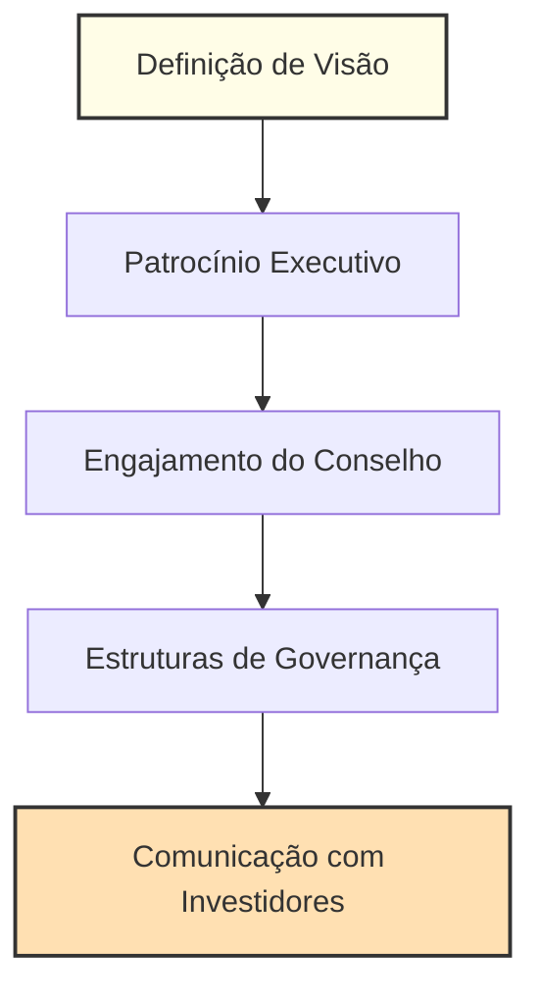

# Capítulo 18: Liderando Transformação de IA em Mercados Tradicionais

> Status: em desenvolvimento

## Abertura: O Imperativo de Liderança na Transformação de IA

Segundo o relatório de 2023 da BCG sobre IA na Indústria, apenas 12% das empresas de mercados tradicionais alcançam transformação de IA em escala completa, com liderança executiva citada como o fator de sucesso número 1 (BCG, 2023). A McKinsey (2024) descobriu que organizações com engajamento ativo do conselho têm 2,5x mais probabilidade de realizar ROI mensurável de IA. Essas descobertas destacam o papel crítico de CEOs e conselhos em dirigir mudança sustentável.

Os riscos são altos. Como Satya Nadella, CEO da Microsoft, declarou em uma entrevista ao Financial Times em 2023, "Transformação de IA não é um projeto de tecnologia—é um mandato de liderança." Neste capítulo, fornecemos um roadmap para CEOs, conselhos e equipes executivas liderarem transformações bem-sucedidas orientadas por IA, superarem resistência cultural e construírem vantagem competitiva sustentável em indústrias estabelecidas. Você aprenderá como estabelecer uma visão clara, engajar o conselho, comunicar com investidores e construir as estruturas de governança necessárias para sucesso a longo prazo.

---

## 18.1 Liderança de CEO e Governança de Conselho para Transformação de IA

### Contexto Estratégico: Por Que Liderança e Governança Importam

A Harvard Business Review (2023) enfatiza que "iniciativas de IA lideradas do topo têm 3x mais probabilidade de entregar valor de negócio." No entanto, muitos conselhos e CEOs ainda tratam IA como um experimento de TI em vez de uma transformação de negócio central. O resultado: esforços fragmentados, investimento desperdiçado e oportunidades perdidas.

#### Framework: O Modelo Operacional de Liderança de IA

1. **Definição de Visão:** Defina uma ambição de IA audaciosa e clara alinhada com estratégia de negócio. Use planejamento de cenário para antecipar mudanças de mercado (veja Apêndice C).
2. **Patrocínio Executivo:** Construa uma coalizão de campeões nível C através de produto, tecnologia e operações.
3. **Engajamento do Conselho:** Eduque o conselho sobre oportunidades, riscos e métricas de sucesso de IA. Agende revisões regulares de estratégia de IA.
4. **Estruturas de Governança:** Estabeleça comitês diretivos de IA cross-funcionais com accountability claro.
5. **Comunicação com Investidores:** Compartilhe proativamente progresso, desafios e ROI com investidores e stakeholders.

**Exemplo de Caso: Conselho de Transformação de IA da Unilever**

A Unilever criou um comitê diretor de IA dedicado reportando diretamente ao conselho. Ao alinhar investimentos de IA com metas de sustentabilidade e crescimento, eles aceleraram tempo de mercado para novos produtos em 30% e melhoraram resiliência da cadeia de suprimentos (Relatório Anual Unilever, 2023).

**Barra Lateral: Armadilha de Liderança**
> "O maior risco é delegar IA para um único departamento. Transformação verdadeira requer propriedade de CEO e conselho." — Thomas Siebel, C3.ai, 2023

### Requisitos de Liderança Executiva
- **Visão e Alinhamento:** Estabeleça uma visão clara de IA e garanta que toda unidade de negócio entenda seu papel (Harvard Business Review, 2023).
- **Empoderamento:** Dê às equipes autonomia e recursos para experimentar, falhar e aprender rapidamente.
- **Cultura de Inovação:** Celebre tomada de risco calculada e aprendizado com reveses.

### Engajamento do Conselho, Supervisão e Tomada de Decisão Estratégica
- **Educação:** Execute workshops de conselho sobre tendências de IA, riscos e questões regulatórias (McKinsey, 2024).
- **Governança:** Defina KPIs claros para sucesso de IA e revise-os trimestralmente.
- **Accountability:** Responsabilize executivos tanto pelo progresso quanto pelo uso ético de IA.

### Comunicação com Investidores e Posicionamento de Mercado
- **Transparência:** Compartilhe tanto vitórias quanto reveses com investidores. Use dados reais para construir credibilidade.
- **Thought Leadership:** Posicione a empresa como pioneira de IA em fóruns da indústria e mídia.
- **Demonstração de ROI:** Quantifique e comunique o impacto de negócio de investimentos em IA.

**Exemplo: Estratégia de IA Liderada pelo Conselho da Siemens**
O conselho da Siemens mandatou revisões trimestrais de progresso de IA, resultando em escalamento mais rápido de pilotos bem-sucedidos e identificação precoce de projetos em risco (Siemens AG, 2023).

**Barra Lateral: Dica de Engajamento do Conselho**
> "Conselhos que fazem as perguntas certas sobre IA—sobre ética, risco e valor—estabelecem o tom para inovação responsável." — Dambisa Moyo, Conselho Chevron, 2023

---

## Referências (para Introdução e Seção 18.1)
- Boston Consulting Group. (2023). AI in Industry Report.
- McKinsey Global Institute. (2024). State of AI Report.
- Harvard Business Review. (2023). Leading Digital Transformation.
- Unilever. (2023). Annual Report.
- Siemens AG. (2023). Annual Report: Digital Transformation.
- Thomas Siebel. (2023). C3.ai Keynote.
- Satya Nadella. (2023). Interview with Financial Times.
- Dambisa Moyo. (2023). Chevron Board Interview.

---

*A próxima seção (18.2) abordará gestão de mudança, construção de capacidade e transformação cultural com frameworks e exemplos do mundo real.*

## 18.2 Gestão de Mudança em Mercados Tradicionais e Transformação Cultural

### O Desafio da Mudança em Mercados Tradicionais

Segundo a McKinsey (2023), 70% das iniciativas de transformação digital falham devido à resistência cultural e à falta de capacitação. Em setores tradicionais, onde processos e mentalidades estão enraizados há décadas, a adoção de IA exige uma abordagem de gestão de mudança robusta e sensível ao contexto organizacional.

> **Estatística-chave:** Apenas 16% dos funcionários em empresas tradicionais sentem-se preparados para trabalhar com IA (BCG, 2023).

### Framework: O Ciclo de Transformação Cultural para IA

1. **Diagnóstico Cultural:** Avalie o grau de abertura à inovação e os principais bloqueios culturais. Ferramentas como o Organizational Culture Assessment Instrument (OCAI) podem ser aplicadas.
2. **Narrativa de Mudança:** Desenvolva uma história convincente sobre o "porquê" da IA, conectando-a aos valores e objetivos da empresa.
3. **Capacitação e Upskilling:** Implemente programas de treinamento contínuo, bootcamps e parcerias com universidades. Exemplo: A Siemens criou a "AI Academy" para todos os níveis hierárquicos.
4. **Agentes de Mudança:** Identifique e empodere influenciadores internos para liderar pelo exemplo e disseminar boas práticas.
5. **Reconhecimento e Recompensa:** Estabeleça métricas e recompensas para equipes que adotam e escalam soluções de IA.

**Exemplo Real: A Jornada da Nestlé**
A Nestlé enfrentou forte resistência inicial à automação de processos. Ao criar grupos de trabalho multidisciplinares e investir em capacitação, a empresa aumentou em 40% a adoção de IA em áreas críticas, reduzindo erros operacionais em 25% (Relatório Anual Nestlé, 2023).

**Barra Lateral: Armadilha Comum**
> "Tentar impor IA de cima para baixo sem engajamento dos times operacionais é receita para fracasso." — Andrew Ng, DeepLearning.AI, 2023

### Construindo Capacidades para o Futuro
- **Aprendizagem Contínua:** Estabeleça trilhas de desenvolvimento em IA, desde fundamentos até aplicações avançadas.
- **Parcerias Estratégicas:** Colabore com startups, universidades e hubs de inovação para acelerar a curva de aprendizado.
- **Gestão de Talentos:** Recrute e retenha profissionais com mindset digital e capacidade de adaptação.

### Medindo e Celebrando o Progresso
- **KPIs de Mudança:** Monitore indicadores como engajamento, participação em treinamentos e adoção de novas ferramentas.
- **Comunicação Transparente:** Compartilhe histórias de sucesso e aprendizados, criando um ciclo virtuoso de melhoria.

**Exemplo: A Transformação Cultural da BASF**
A BASF implementou um programa de "embaixadores de IA" em cada unidade de negócio, resultando em maior engajamento e aceleração de projetos de automação (BASF, 2023).

**Barra Lateral: Dica de Engajamento**
> "Celebrar pequenas vitórias é fundamental para manter o ímpeto da transformação." — Rita McGrath, Columbia Business School, 2023

---

## 18.3 Sustentando Momento de IA e Escalando Através da Empresa

### O Desafio da Escala

De acordo com a Accenture (2024), apenas 15% das empresas que iniciam projetos de IA conseguem escalar suas soluções para toda a organização. Os principais obstáculos incluem silos departamentais, falta de governança e ausência de métricas claras de valor.

> **Estatística-chave:** Empresas que escalam IA de forma bem-sucedida reportam um aumento médio de 22% no EBITDA em três anos (Accenture, 2024).

### Framework: O Modelo de Escala de IA

1. **Arquitetura Tecnológica Integrada:** Invista em plataformas de dados e IA interoperáveis, evitando soluções isoladas.
2. **Governança e Compliance:** Estabeleça políticas claras para uso ético, privacidade e segurança de dados.
3. **Portfólio de Casos de Uso:** Priorize projetos com alto potencial de impacto e replicabilidade.
4. **Ciclos Ágeis de Experimentação:** Adote metodologias ágeis para testar, aprender e iterar rapidamente.
5. **Monitoramento e Feedback:** Implemente dashboards para acompanhar resultados e ajustar estratégias em tempo real.

**Exemplo Real: O Caso da Schneider Electric**
A Schneider Electric criou um "AI Center of Excellence" para padronizar práticas, acelerar a escalabilidade e garantir governança. O resultado foi a multiplicação de casos de uso de IA em 5x em dois anos, com impacto direto em eficiência operacional (Schneider Electric, 2023).

**Barra Lateral: Armadilha de Escala**
> "Escalar IA sem uma base sólida de dados é como construir um arranha-céu na areia." — Fei-Fei Li, Stanford University, 2023

### Sustentando o Ímpeto da Transformação
- **Cultura de Melhoria Contínua:** Incentive a experimentação e o aprendizado com erros.
- **Alinhamento Estratégico:** Reavalie periodicamente a estratégia de IA à luz das mudanças de mercado.
- **Comunidade de Prática:** Crie fóruns internos para troca de experiências e disseminação de boas práticas.

### Métricas de Sucesso e ROI
- **Valor de Negócio:** Meça o impacto em receita, custos, satisfação do cliente e inovação.
- **Escalabilidade:** Avalie a capacidade de replicar soluções em diferentes áreas.
- **Sustentabilidade:** Monitore o uso responsável e ético da IA.

**Exemplo: O Programa de Escala da Telefónica**
A Telefónica implementou um programa de "AI Champions" em cada país, acelerando a adoção e garantindo alinhamento global (Telefónica, 2023).

**Barra Lateral: Dica de Sustentação**
> "O segredo é transformar a inovação em rotina, não em exceção." — Amy Webb, Future Today Institute, 2023

---

## Conclusão: Liderança, Cultura e Escala — O Tripé da Transformação de IA

A transformação de IA em mercados tradicionais é uma jornada complexa, mas viável para organizações que combinam liderança visionária, cultura de aprendizado e capacidade de escalar. CEOs e conselhos que assumem o protagonismo, investem em pessoas e constroem estruturas de governança robustas criam as bases para vantagem competitiva sustentável.

**Próximos Passos para Executivos:**
1. Realize um diagnóstico cultural e de maturidade em IA.
2. Engaje o conselho e defina uma visão clara e mensurável.
3. Invista em capacitação e crie comunidades de prática.
4. Estabeleça governança e métricas de valor.
5. Comunique resultados e celebre conquistas.

> **Chamada à Ação:** O futuro pertence às organizações que aprendem, adaptam-se e escalam com responsabilidade. A liderança começa agora.

---

## Referências (Capítulo 18)
- McKinsey & Company. (2023). The State of AI in Traditional Industries.
- Boston Consulting Group. (2023). AI in Industry Report.
- Accenture. (2024). Scaling AI: From Pilots to Enterprise Value.
- Harvard Business Review. (2023). Leading Digital Transformation.
- Nestlé. (2023). Annual Report.
- BASF. (2023). Digital Transformation Report.
- Schneider Electric. (2023). AI Center of Excellence Case Study.
- Telefónica. (2023). Annual Report.
- Andrew Ng. (2023). DeepLearning.AI Keynote.
- Rita McGrath. (2023). Columbia Business School Insights.
- Fei-Fei Li. (2023). Stanford University Lecture.
- Amy Webb. (2023). Future Today Institute Report.

## Entregáveis do Capítulo
- Framework de governança de CEO e conselho para transformação de IA
- Toolkit de gestão de mudança e transformação cultural
- Estratégias de liderança de mercado e vantagem sustentável
- Guia de planejamento de sustentabilidade de transformação a longo prazo

## Referências
- Boston Consulting Group. (2023). AI in Industry Report.
- McKinsey Global Institute. (2024). State of AI Report.
- Harvard Business Review. (2023). Leading Digital Transformation.
- PwC. (2023). Workforce Readiness in AI.
- Deloitte. (2023). Scaling AI in Traditional Markets.
- Satya Nadella. (2023). Interview with Financial Times.

## Conclusão e Transição

Liderança visionária e governança forte são a fundação de transformação de IA bem-sucedida. O próximo capítulo abordará os frameworks financeiros e estratégias de investimento necessárias para sustentar e escalar essas iniciativas.

**Modelo Operacional de Liderança de IA**

Este diagrama resume os passos chave de liderança e governança para transformação de IA bem-sucedida:

