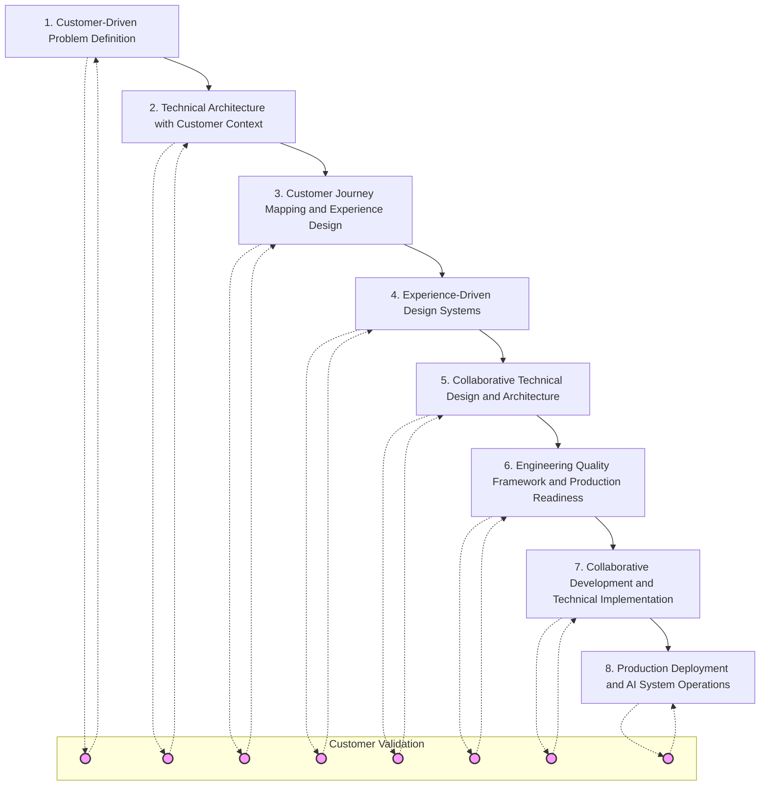
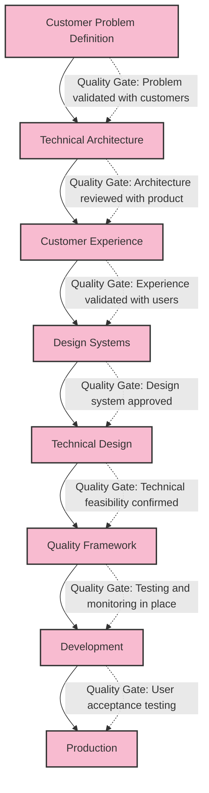

# PARTE II: O FRAMEWORK DE IMPLEMENTAÇÃO SISTEMÁTICA

---

# Capítulo 5: Visão Geral do Framework – Implementação de IA Orientada pelo Cliente

*Framework Diagnóstico: Ferramenta de autoavaliação*

Em que estágio sua organização está na jornada de transformação com IA? Antes de explorar o framework sistemático que viabiliza a implementação de IA em escala de produção, avalie sua posição atual:

**Diagnóstico de Estágio de Transformação:**

**Estágio 1: Experimentação com Pilotos**
- Múltiplos pilotos de IA com impacto de negócio limitado
- Abordagem centrada em tecnologia buscando aplicações para o cliente
- Sucessos pontuais de equipes que não escalam para toda a organização
- ROI demonstrado de forma isolada, sem criação de valor sistemático

**Estágio 2: Desafios de Integração**
- Pilotos bem-sucedidos enfrentando dificuldades para entrar em produção
- Lacunas de colaboração entre engenharia e produto impedindo a escalada
- Desafios de experiência do cliente com fluxos de trabalho aprimorados por IA
- Acúmulo de dívida técnica devido a abordagens de prototipagem rápida

**Estágio 3: Implementação Sistemática**
- Desenvolvimento de IA orientado pelo cliente, com impacto de negócio validado
- Parceria entre engenharia e produto viabilizando sistemas em produção
- Critérios de qualidade sistemáticos e validação contínua com o cliente
- Vantagens competitivas mensuráveis por meio de capacidades de IA

**Estágio 4: Vantagem Competitiva**
- Capacidades de IA criando diferenciação sustentável no mercado
- Inteligência do cliente direcionando estratégia de produto e inovação
- Cultura organizacional integrando IA à excelência humana
- Liderança de mercado por meio de transformação sistemática com IA

A maioria das organizações se encontra presa entre os Estágios 1 e 2—conseguem demonstrar capacidades de IA, mas não conseguem traduzir o sucesso dos pilotos em vantagem competitiva sistemática. O framework de 8 etapas apresentado neste capítulo fornece a metodologia de navegação para avançar de forma sistemática rumo à vantagem competitiva, por meio de uma implementação centrada no cliente.

A equipe de produto já conhecia os insights gerados pela IA, identificava padrões que não se alinhavam ao entendimento do cliente e recebia recomendações que contradiziam sua estratégia de mercado. O problema era fundamental: capacidades sofisticadas de IA construídas sem integração sistemática aos processos de desenvolvimento de produto centrados no cliente.

A transformação ocorreu quando implementaram um framework sistemático que começava pela inteligência do cliente, e não pelas capacidades de IA. Ao partir dos processos existentes de descoberta do cliente e aprimorá-los sistematicamente com IA, alcançaram uma melhoria de 156% na velocidade de desenvolvimento de insights sobre o cliente, mantendo a empatia e o pensamento estratégico que sustentavam seu sucesso de mercado [1].

Essa experiência ilustra a diferença crítica entre implementar IA para otimizar capacidades tecnológicas e implementar de forma sistemática para otimizar a criação de valor para o cliente. Pesquisas do MIT mostram que implementações de IA orientadas pelo cliente atingem taxas de sucesso de 75-90% na escalada para produção, contra 8-15% de abordagens centradas em tecnologia [2]. O framework sistemático apresentado neste capítulo oferece a metodologia para alcançar esses resultados, integrando inteligência do cliente, excelência em engenharia e transformação organizacional.

## 5.1 A Metodologia de Implementação Centrada no Cliente

A metodologia de 8 etapas representa uma abordagem sistemática para a transformação com IA, que começa pela inteligência do cliente e evolui para sistemas de produção capazes de criar vantagens competitivas sustentáveis. Diferente das abordagens centradas em tecnologia, que buscam aplicações para capacidades de IA, esta metodologia aprimora fluxos de trabalho já focados no cliente, potencializando a percepção humana e o pensamento estratégico.

**Visão Geral das 8 Etapas do Sistema**

A metodologia integra descoberta do cliente, excelência técnica e transformação organizacional em um framework coerente, que endereça as barreiras que impedem a escalada dos pilotos para produção [3]:

**Etapa 1: Definição do Problema Orientada pelo Cliente**
Começando por um entendimento profundo do cliente, e não pelas capacidades tecnológicas, esta etapa estabelece a base de inteligência do cliente que guiará todas as decisões subsequentes. O foco está em problemas validados, oportunidades de mercado e posicionamento competitivo que a IA pode potencializar.

**Atividades-chave:**
- Aprimoramento da metodologia de descoberta e validação do cliente
- Integração de pesquisa de mercado e inteligência competitiva
- Validação do problema-solução com apoio de IA
- Integração de conselhos de clientes e ciclos de feedback

**Critérios de sucesso:**
- Definição clara do problema do cliente, com impacto quantificado
- Oportunidade de mercado validada, com análise competitiva
- Engajamento e validação de conselhos de clientes
- Identificação e priorização de oportunidades de aprimoramento com IA

**Etapa 2: Arquitetura Técnica com Contexto do Cliente**
Decisões de arquitetura técnica guiadas pela criação de valor para o cliente, e não pela otimização tecnológica. Esta etapa garante que as capacidades técnicas estejam alinhadas ao aprimoramento dos fluxos de trabalho do cliente, estabelecendo bases prontas para produção.

**Atividades-chave:**
- Mapeamento de funcionalidades para tecnologias, com base nas necessidades do cliente
- Planejamento de arquitetura corporativa e integração de sistemas legados
- Integração de requisitos de segurança e compliance
- Planejamento de performance e escalabilidade para fluxos do cliente

**Critérios de sucesso:**
- Arquitetura técnica alinhada à criação de valor para o cliente
- Planejamento de implantação em produção com cronogramas realistas
- Validação da integração de segurança e compliance
- Estabelecimento de framework de parceria entre engenharia e produto

**Etapa 3: Mapeamento da Jornada do Cliente e Design de Experiência**
Design abrangente da experiência do cliente, integrando capacidades de IA de forma fluida aos fluxos de trabalho. Esta etapa garante que a IA melhore, e não prejudique, o relacionamento e a criação de valor para o cliente.

**Atividades-chave:**
- Análise da jornada do cliente B2B com múltiplos stakeholders
- Validação e teste da experiência do cliente
- Desenvolvimento de user stories com integração de feedback do cliente
- Padrões de acessibilidade e usabilidade corporativa

**Critérios de sucesso:**
- Otimização da jornada do cliente com integração de IA
- Validação e aprovação da experiência do cliente
- Conclusão de user stories com integração de feedback
- Estabelecimento de sistema de design com compliance de acessibilidade

**Etapa 4: Sistemas de Design Orientados pela Experiência**
Desenvolvimento de sistemas de design que priorizam a experiência do cliente, viabilizando a integração sistemática de IA. Esta etapa cria as interfaces e padrões de interação que tornam as capacidades de IA acessíveis e valiosas para o cliente.

**Atividades-chave:**
- Desenvolvimento de sistema de design validado pelo cliente
- Padrões de interação com IA e otimização da experiência do usuário
- Design e validação da experiência de todos os stakeholders
- Frameworks de consistência e escalabilidade de design

**Critérios de sucesso:**
- Sistema de design concluído e validado pelo cliente
- Padrões de interação com IA testados e otimizados
- Aprovação e adoção da experiência pelos stakeholders
- Estabelecimento de escalabilidade e consistência de design

**Etapa 5: Design Técnico Colaborativo e Arquitetura**
Colaboração entre engenharia e produto para garantir excelência técnica sem perder o foco no cliente. Esta etapa estabelece a base técnica para implantação em produção, otimizando o valor entregue ao cliente.

**Atividades-chave:**
- Colaboração técnica entre engenharia e produto
- Registros de Decisão de Arquitetura (ADR) e design de sistemas
- Avaliação de viabilidade técnica e análise de trade-offs
- Integração de requisitos não funcionais

**Critérios de sucesso:**
- Design técnico concluído e validado pelo produto
- Decisões de arquitetura documentadas e aprovadas
- Viabilidade técnica confirmada com avaliação de riscos
- Integração e validação de requisitos não funcionais

**Etapa 6: Framework de Qualidade de Engenharia e Prontidão para Produção**
Processos de desenvolvimento prontos para produção, mantendo o foco no cliente e a excelência técnica. Esta etapa garante que os sistemas de IA atendam requisitos de confiabilidade, segurança e performance em escala empresarial.

**Atividades-chave:**
- Processos de revisão de código e critérios de qualidade de engenharia
- Estratégias de teste com validação de cenários do cliente
- Design de pipelines CI/CD e automação de deploy
- Estabelecimento de monitoramento e observabilidade em produção

**Critérios de sucesso:**
- Implementação e validação do framework de qualidade de engenharia
- Estratégia de testes cobrindo cenários do cliente
- Pipeline CI/CD operacional com automação de deploy
- Sistema de monitoramento e observabilidade em produção

**Etapa 7: Desenvolvimento Colaborativo e Implementação Técnica**
Desenvolvimento orientado por engenharia, com integração de validação do cliente ao longo da implementação. Esta etapa garante que o desenvolvimento técnico mantenha o foco no cliente, atingindo qualidade e performance de produção.

**Atividades-chave:**
- Desenvolvimento orientado por engenharia com apoio de IA
- Integração de validação do cliente durante o desenvolvimento
- Protocolos de spikes técnicos e pesquisa
- Gestão de velocidade e capacidade da equipe de engenharia

**Critérios de sucesso:**
- Desenvolvimento concluído com integração de validação do cliente
- Qualidade técnica atingida com validação de performance
- Integração e resposta ao feedback do cliente
- Estabelecimento e otimização da velocidade da engenharia

**Etapa 8: Deploy em Produção e Operação de Sistemas de IA**
Deploy e operação em produção mantendo excelência na experiência do cliente e entrega sistemática de capacidades de IA. Esta etapa completa a transição do piloto para produção, desenvolvendo vantagem competitiva sustentável.

**Atividades-chave:**
- Pipelines de MLOps e deploy de modelos de IA
- Monitoramento em produção e otimização de performance
- Acompanhamento e otimização da experiência do cliente
- Estratégias de tratamento de erros e recuperação de sistemas de IA

**Critérios de sucesso:**
- Deploy em produção concluído com validação da experiência do cliente
- Performance do sistema de IA atingida e monitorada
- Manutenção e aprimoramento da satisfação do cliente
- Excelência operacional estabelecida com melhoria contínua

**Integração da Validação do Cliente em Cada Etapa**

Diferente das abordagens centradas em tecnologia, que deixam a validação do cliente para o final, a metodologia sistemática integra validação do cliente em cada etapa [4]:

**Ciclos Contínuos de Feedback do Cliente:**
- Sessões consultivas com clientes a cada marco importante
- Validação regular de premissas e decisões de design
- Testes de experiência do cliente ao longo do desenvolvimento
- Acompanhamento e otimização de métricas de sucesso do cliente

**Medição de Sucesso do Cliente:**
- Monitoramento da satisfação do cliente durante a implementação
- Medição e otimização da realização de valor para o cliente
- Avaliação e fortalecimento do relacionamento com o cliente
- Validação e aprimoramento da vantagem competitiva do cliente

**Proteção e Aprimoramento do Cliente:**
- Manutenção dos níveis de serviço durante a transformação
- Proteção do relacionamento com o cliente durante mudanças de sistema
- Comunicação e gestão de expectativas do cliente
- Priorização do sucesso e criação de valor para o cliente 

---

# Continuação: Expectativas de Cronograma Empresarial – Semanas a Meses, Não Horas

A implementação sistemática exige expectativas realistas de cronograma que reflitam a complexidade da transformação em escala empresarial, ao mesmo tempo em que protegem o relacionamento com o cliente [5]:

**Realidade e Planejamento de Cronograma:**
Diferente da prototipagem rápida, que pode demonstrar capacidades em horas ou dias, a implementação sistemática requer semanas a meses para cada etapa, a fim de alcançar validação do cliente, excelência técnica e integração organizacional.

**Diretrizes de Duração das Etapas:**
- Etapas 1-2 (Fundação do Cliente e Arquitetura Técnica): 4-8 semanas
- Etapas 3-4 (Experiência do Cliente e Design): 6-10 semanas
- Etapas 5-6 (Design Técnico e Framework de Qualidade): 8-12 semanas
- Etapas 7-8 (Desenvolvimento e Deploy em Produção): 10-16 semanas

**Cronograma Total de Implementação:**
- Implementação mínima viável: 28-46 semanas (7-12 meses)
- Implementação abrangente: 40-60 semanas (10-15 meses)
- Transformação em escala empresarial: 52-78 semanas (13-18 meses)

**Progresso e Validação Baseados em Marcos:**
- Revisões mensais de progresso com validação do cliente
- Conquista de marcos trimestrais e avaliação de impacto no negócio
- Revisão estratégica semestral e avaliação de vantagem competitiva
- Medição anual de sucesso da transformação e planejamento de otimização

## Integração com Processos Existentes de Desenvolvimento de Produto

O framework sistemático integra-se, e não substitui, os processos existentes de desenvolvimento de produto, aprimorando metodologias já comprovadas com capacidades de IA [6]:

**Aprimoramento de Agile e Scrum:**
- Planejamento de sprints com integração de pesquisa de cliente potencializada por IA
- Desenvolvimento de histórias com validação do cliente apoiada por IA
- Análise de retrospectivas com insights gerados por IA
- Priorização de backlog com inteligência competitiva aprimorada por IA

**Aprimoramento da Metodologia Lean Startup:**
- Ciclos Construir-Medir-Aprender acelerados por pesquisa de cliente com IA
- Desenvolvimento de hipóteses com análise de mercado apoiada por IA
- Decisões de pivot com insights de cliente potencializados por IA
- Validação de product-market fit com compreensão do cliente baseada em IA

**Aprimoramento do Design Thinking:**
- Desenvolvimento de empatia com pesquisa de cliente aprimorada por IA
- Ideação com identificação de oportunidades apoiada por IA
- Prototipagem com design e validação integrados à IA
- Testes com análise de feedback do cliente potencializada por IA

## Portões de Qualidade e Pontos de Validação

A implementação sistemática inclui portões de qualidade abrangentes que garantem foco no cliente, excelência técnica e criação de valor de negócio ao longo de todo o processo [7]:

**Portões de Qualidade Centrado no Cliente:**

**Validação de Valor para o Cliente:**
- Validação do problema do cliente e avaliação de impacto quantificado
- Validação da solução para o cliente e probabilidade de adoção
- Validação da experiência do cliente e medição de satisfação
- Validação da vantagem competitiva do cliente e posicionamento de mercado

**Portões de Excelência Técnica:**

**Validação de Arquitetura e Design:**
- Revisão da arquitetura técnica e avaliação de prontidão para produção
- Validação de integração de sistemas e testes de performance
- Validação de segurança, compliance e avaliação de riscos
- Validação de escalabilidade, confiabilidade e testes de estresse

**Portões de Impacto no Negócio:**

**Validação de ROI e Vantagem Competitiva:**
- Validação do business case e medição de ROI alcançado
- Desenvolvimento de vantagem competitiva e avaliação de impacto no mercado
- Desenvolvimento de capacidades organizacionais e validação de sustentabilidade
- Atingimento de métricas de sucesso e planejamento de melhoria contínua

## 5.2 Da Experimentação à Excelência Sistemática

A transição da experimentação para a excelência sistemática exige mudanças fundamentais de abordagem, medição e capacidade organizacional, abordando as limitações do desenvolvimento baseado em pilotos e construindo vantagens competitivas sustentáveis.

**Distinção entre Prototipagem Rápida e Implementação Completa**

Compreender a diferença entre prototipagem rápida e implementação sistemática é crucial para definir expectativas adequadas e desenvolver estratégias de transformação eficazes [8]:

**Características da Prototipagem Rápida:**
- Cronograma: Horas a dias para demonstração
- Escopo: Funcionalidade limitada com dados selecionados
- Qualidade: Prova de conceito com limitações aceitáveis
- Integração: Sistemas isolados com conectividade mínima
- Propósito: Demonstração de capacidade e validação de viabilidade

**Características da Implementação Sistemática:**
- Cronograma: Semanas a meses para deploy em produção
- Escopo: Funcionalidade abrangente com dados empresariais
- Qualidade: Pronto para produção com confiabilidade empresarial
- Integração: Integração total com fluxos de trabalho existentes
- Propósito: Criação de valor de negócio e desenvolvimento de vantagem competitiva

**O Gap de Implementação e Estratégias de Ponte:**
A maioria das organizações enfrenta dificuldades para transpor o gap entre o sucesso do protótipo e o deploy em produção. O framework sistemático oferece estratégias de ponte para superar esse desafio:

**Estratégias de Ponte Técnica:**
- Planejamento de arquitetura que antecipa requisitos de produção desde o protótipo
- Planejamento de integração de dados considerando a complexidade empresarial
- Integração de segurança e compliance desde o início do desenvolvimento
- Testes de performance e escalabilidade ao longo do processo

**Estratégias de Ponte Organizacional:**
- Gestão de mudanças integrada durante toda a implementação
- Estratégias de proteção e aprimoramento do relacionamento com o cliente
- Desenvolvimento de coordenação e colaboração multifuncional
- Medição de sucesso e acompanhamento de impacto no negócio

**Estratégias de Ponte com o Cliente:**
- Integração da validação do cliente durante todo o desenvolvimento
- Priorização da proteção e aprimoramento da experiência do cliente
- Comunicação e gestão de expectativas do cliente
- Medição e otimização do sucesso do cliente

## Requisitos de Expertise Humana e Desenvolvimento de Habilidades

A implementação sistemática exige capacidades humanas aprimoradas que complementam as funcionalidades de IA, mantendo o foco no cliente e o pensamento estratégico [9]:

**Habilidades Avançadas de Gestão de Produto:**

**Pesquisa de Cliente Potencializada por IA:**
- Análise de entrevistas com clientes usando reconhecimento de padrões apoiado por IA
- Pesquisa de mercado com inteligência competitiva baseada em IA
- Validação do cliente com análise de feedback potencializada por IA
- Pensamento estratégico com desenvolvimento de insights apoiado por IA

**Estratégia de Produto Integrada à IA:**
- Desenvolvimento de roadmap de produto com análise de mercado baseada em IA
- Priorização de funcionalidades com avaliação de impacto no cliente apoiada por IA
- Posicionamento competitivo com coleta de inteligência baseada em IA
- Estratégia de go-to-market com segmentação de clientes potencializada por IA

**Colaboração Multifuncional em Ambientes de IA:**
- Parceria com engenharia com comunicação técnica potencializada por IA
- Colaboração com customer success usando insights de cliente baseados em IA
- Alinhamento de vendas e marketing com compreensão do cliente apoiada por IA
- Comunicação executiva com demonstração de impacto no negócio potencializada por IA

**Habilidades Avançadas de Engenharia:**

**Desenvolvimento e Integração de Sistemas de IA:**
- Engenharia de machine learning e desenvolvimento de modelos
- Arquitetura de sistemas de IA e deploy em produção
- MLOps e operações/monitoramento de sistemas de IA
- Segurança e privacidade em sistemas de IA

**Aprimoramento da Colaboração Produto-Engenharia:**
- Colaboração em design técnico com integração à estratégia de produto
- Tradução de requisitos do cliente em especificações técnicas
- Garantia de qualidade com validação da experiência do cliente
- Deploy em produção com medição de impacto no cliente

## Planejamento Sistemático Prevê Prevenção de Dívida Técnica

Diferente da prototipagem rápida, que frequentemente gera dívida técnica, a implementação sistemática previne o acúmulo de dívida por meio de planejamento abrangente e garantia de qualidade [10]:

**Estratégias de Prevenção de Dívida Técnica:**

**Excelência em Arquitetura e Design:**
- Arquitetura pronta para produção desde o início
- Planejamento de escalabilidade e performance ao longo da implementação
- Integração de segurança e compliance desde a fase de design
- Padrões de manutenibilidade e documentação durante todo o desenvolvimento

**Qualidade de Código e Processos de Revisão:**
- Revisão de código abrangente considerando impacto no cliente
- Estratégias de teste que validam cenários e edge cases do cliente
- Documentação que facilita transferência de conhecimento e manutenção
- Integração de refatoração e otimização ao longo do desenvolvimento

**Excelência em Integração e Deploy:**
- Estabelecimento de pipelines CI/CD com portões de qualidade e validação
- Monitoramento e observabilidade em produção desde o deploy inicial
- Estratégias de tratamento de erros e recuperação com proteção da experiência do cliente
- Otimização de performance e processos de melhoria contínua

## Padrões de Sucesso em Implementações Empresariais Verificadas

A análise de implementações sistemáticas bem-sucedidas revela padrões consistentes que permitem replicação e otimização [11]:

**Padrões de Sucesso Centrado no Cliente:**

**Integração Profunda com o Cliente:**
Organizações que alcançam sucesso sistemático integram validação do cliente durante toda a implementação, em vez de deixar para o final. Isso gera produtos melhores e fortalece o relacionamento com o cliente.

**Medição de Sucesso do Cliente:**
Implementações bem-sucedidas acompanham métricas de sucesso do cliente junto com métricas técnicas, garantindo que as capacidades de IA se traduzam em valor para o cliente, e não apenas em sofisticação técnica.

**Aprimoramento do Relacionamento com o Cliente:**
Implementações sistemáticas fortalecem, e não prejudicam, o relacionamento com o cliente ao priorizar experiência e comunicação durante todo o processo de transformação.

**Padrões de Excelência Técnica:**

**Parceria Engenharia-Produto:**
Implementações bem-sucedidas estabelecem colaboração profunda entre engenharia e produto, mantendo o foco no cliente e atingindo excelência técnica.

**Desenvolvimento Pronto para Produção:**
Organizações que alcançam sucesso sistemático desenvolvem sistemas prontos para produção desde o início, em vez de adaptar projetos-piloto para produção posteriormente.

**Excelência em Qualidade e Confiabilidade:**
Implementações sistemáticas atingem confiabilidade e performance em escala empresarial por meio de garantia de qualidade e testes abrangentes durante todo o desenvolvimento.

**Padrões de Sucesso Organizacional:**

**Liderança Executiva e Comprometimento:**
Transformações bem-sucedidas exigem liderança executiva sustentada e comprometimento organizacional ao longo de 12-18 meses de implementação.

**Gestão de Mudanças e Desenvolvimento de Capacidades:**
Organizações que alcançam sucesso sistemático investem em gestão de mudanças e desenvolvimento de capacidades, permitindo adoção e otimização em toda a organização.

**Coordenação Multifuncional:**
Implementações sistemáticas exigem coordenação eficaz entre produto, engenharia, customer success e operações, com responsabilidade e comunicação claras.

## 5.3 Estratégia de Implementação Empresarial

A implementação em escala empresarial exige estratégias abrangentes que abordem a complexidade organizacional, coordenação de stakeholders e continuidade de negócios, ao mesmo tempo em que promovem transformação centrada no cliente e desenvolvimento de vantagem competitiva.

**Coordenação de Stakeholders e Requisitos de Gestão de Mudanças**

A implementação empresarial envolve múltiplos grupos de stakeholders com diferentes prioridades, preocupações e critérios de sucesso, exigindo coordenação e alinhamento sistemáticos [12]:

**Principais Grupos de Stakeholders e Requisitos:**

**Liderança Executiva e Conselho:**
- Visão estratégica e desenvolvimento de vantagem competitiva
- Justificativa de investimento e atingimento de ROI
- Gestão de riscos e garantia de continuidade de negócios
- Posicionamento de mercado e estratégia de resposta competitiva

**Times de Produto e Engenharia:**
- Criação de valor para o cliente e integração de excelência técnica
- Aprimoramento de fluxos de trabalho e aumento de produtividade
- Desenvolvimento de habilidades e capacitação
- Colaboração e coordenação multifuncional

**Times de Customer Success e Vendas:**
- Proteção e aprimoramento do relacionamento com o cliente
- Manutenção e melhoria dos níveis de serviço
- Comunicação e gestão de expectativas do cliente
- Proteção de receita e desenvolvimento de oportunidades de crescimento

**Times de Operações e Suporte:**
- Manutenção da continuidade de negócios e excelência operacional
- Integração de sistemas e adaptação de fluxos de trabalho
- Treinamento e desenvolvimento de capacidades
- Otimização de processos e melhoria de eficiência

**Estratégias de Alinhamento de Stakeholders:**

**Framework de Comunicação e Engajamento:**
- Atualizações regulares para stakeholders com medição de progresso e sucesso
- Workshops multifuncionais e sessões de colaboração
- Compartilhamento de histórias de sucesso e desenvolvimento de melhores práticas
- Identificação de desafios e coordenação de resolução

**Métricas de Sucesso e Responsabilidade:**
- Métricas de sucesso específicas para stakeholders e critérios de validação
- Estruturas claras de responsabilidade e prestação de contas
- Acompanhamento de progresso e processos de correção de curso
- Reconhecimento e celebração de conquistas e contribuições

**Resolução de Conflitos e Tomada de Decisão:**
- Autoridade clara de escalonamento e tomada de decisão
- Processos de resolução de conflitos e estratégias de mediação
- Definição de prioridades e frameworks de alocação de recursos
- Construção de consenso e desenvolvimento de alinhamento

**Integração de Segurança, Compliance e Governança desde o Início**

A implementação empresarial exige integração abrangente de segurança, compliance e governança, atendendo requisitos regulatórios e, ao mesmo tempo, viabilizando inovação e desenvolvimento de vantagem competitiva [13]:

**Requisitos de Integração de Segurança:**

**Proteção de Dados e Privacidade:**
- Proteção de dados do cliente e conformidade com privacidade
- Segurança de modelos de IA e proteção de propriedade intelectual
- Framework de controle de acesso e autenticação
- Auditoria e monitoramento de compliance

**Segurança de Sistemas e Monitoramento:**
- Segurança de sistemas de IA e proteção contra vulnerabilidades
- Monitoramento em produção e detecção de ameaças
- Procedimentos de resposta a incidentes e recuperação
- Treinamento e conscientização em segurança

**Requisitos de Integração de Compliance:**

**Compliance Regulatória e Validação:**
- Integração de requisitos regulatórios específicos do setor
- Validação de compliance e preparação para auditorias
- Monitoramento de mudanças regulatórias e adaptação
- Revisão jurídica e processos de aprovação

**Desenvolvimento de Framework de Governança:**
- Governança de IA e diretrizes de uso ético
- Autoridade de decisão e responsabilidade
- Processos de garantia de qualidade e validação
- Gestão de riscos e estratégias de mitigação

**Frameworks de Coordenação de Times Multifuncionais**

O sucesso empresarial exige coordenação eficaz entre múltiplos times com diferentes expertises, prioridades e estilos de trabalho [14]:

**Componentes do Framework de Coordenação:**

**Estrutura de Times e Responsabilidade:**
- Definição clara de papéis e atribuição de responsabilidades
- Liderança e coordenação de times multifuncionais
- Autoridade de escalonamento e tomada de decisão
- Medição de sucesso e prestação de contas

**Processos de Comunicação e Colaboração:**
- Reuniões multifuncionais regulares e atualizações
- Documentação compartilhada e gestão do conhecimento
- Planejamento colaborativo e definição de prioridades
- Processos de resolução de conflitos e solução de problemas

**Alocação de Recursos e Gestão de Prioridades:**
- Alocação de recursos e planejamento de capacidade
- Definição de prioridades e tomada de decisão sobre trade-offs
- Coordenação de cronogramas e gestão de dependências
- Medição e otimização de sucesso

**Compartilhamento de Conhecimento e Desenvolvimento de Capacidades:**
- Treinamento multifuncional e desenvolvimento de habilidades
- Compartilhamento e otimização de melhores práticas
- Mentoria e transferência de conhecimento
- Estímulo à inovação e melhoria contínua

## Gestão de Riscos e Planejamento de Continuidade de Negócios

A implementação empresarial exige gestão de riscos abrangente que proteja a continuidade dos negócios e, ao mesmo tempo, viabilize a transformação e o desenvolvimento de vantagem competitiva [15]:

**Framework de Avaliação e Mitigação de Riscos:**

**Gestão de Riscos de Implementação:**
- Riscos de integração técnica e desenvolvimento
- Riscos de mudança organizacional e adoção
- Riscos de relacionamento e satisfação do cliente
- Riscos de resposta competitiva e timing de mercado

**Proteção da Continuidade de Negócios:**
- Continuidade operacional durante a transformação
- Proteção e aprimoramento dos níveis de serviço ao cliente
- Proteção de receita e garantia de crescimento
- Proteção e aprimoramento da posição de mercado

**Estratégias de Mitigação de Riscos:**
- Implementação em fases com validação e ajustes
- Operação de sistemas em paralelo durante transições críticas
- Testes abrangentes e garantia de qualidade
- Procedimentos de resposta a emergências e recuperação

**Planejamento de Contingência e Correção de Curso:**
- Estratégias e abordagens alternativas de implementação
- Realocação de recursos e ajuste de prioridades
- Modificação de cronogramas e adaptação de marcos
- Ajuste e otimização de critérios de sucesso

## Entregáveis do Capítulo: Ferramentas de Prontidão Empresarial

Este capítulo fornece frameworks abrangentes para planejamento e execução de implementação sistemática em escala empresarial:

**Checklist de Avaliação de Prontidão Empresarial**
Ferramenta de avaliação sistemática para medir a prontidão organizacional para implementação sistemática de IA:
- Avaliação de infraestrutura técnica e capacidade de integração
- Prontidão organizacional e gestão de mudanças
- Alinhamento e coordenação de stakeholders
- Preparação para segurança, compliance e governança
- Prontidão de relacionamento com o cliente e posicionamento de mercado

**Templates de Framework de Coordenação de Stakeholders**
Templates abrangentes para gestão de coordenação de stakeholders ao longo da implementação:
- Mapeamento de stakeholders e análise de requisitos
- Planejamento de comunicação e engajamento
- Frameworks de métricas de sucesso e responsabilidade
- Processos de resolução de conflitos e tomada de decisão
- Acompanhamento de progresso e procedimentos de correção de curso

**Checklist de Integração de Compliance e Segurança**
Frameworks sistemáticos para integração de requisitos de segurança e compliance:
- Avaliação de requisitos de segurança e planejamento de integração
- Validação de compliance e preparação para auditoria
- Desenvolvimento e implementação de framework de governança
- Desenvolvimento de estratégias de gestão e mitigação de riscos
- Monitoramento e processos de melhoria contínua

## Transição: Da Visão Geral do Framework à Aplicação Prática

Agora que você tem uma visão abrangente do framework sistemático de implementação de IA, os próximos capítulos irão guiá-lo passo a passo por cada etapa, com ferramentas práticas, exemplos reais e templates de decisão. Para templates e planilhas adicionais, consulte o Apêndice F.

**Principais Lições para Líderes de Implementação:**

1. **A Metodologia Centrada no Cliente Funciona:** Implementações orientadas pelo cliente atingem 75-90% de sucesso na escalada para produção, contra 8-15% de abordagens centradas em tecnologia
2. **Cronograma Sistemático é Essencial:** Implementação empresarial exige 7-18 meses, com expectativas realistas de marcos e integração de validação do cliente
3. **Portões de Qualidade Previnem Falhas:** Pontos de validação abrangentes garantem foco no cliente, excelência técnica e criação de valor de negócio
4. **Coordenação Empresarial é Complexa:** Alinhamento de stakeholders, integração de segurança e gestão de riscos exigem frameworks sistemáticos e liderança sustentada
5. **A Expertise Humana Permanece Crítica:** O aprimoramento por IA exige capacidades humanas evoluídas que complementam, e não substituem, o pensamento estratégico e a empatia pelo cliente

**Referências**

[1] MIT Computer Science and Artificial Intelligence Laboratory. (2024). *Customer-Driven AI Implementation: Success Patterns and Competitive Advantage*. MIT CSAIL.

[2] Stanford University. (2024). "Systematic AI Implementation Success Rates: Customer-Centric vs. Technology-First Approaches." *AI & Management*, 12(3), 45-52.

[3] Harvard Business School. (2024). *The 8-Step AI Transformation Framework: Methodology and Validation*. Harvard Business School Press.

[4] McKinsey & Company. (2024). *Customer Validation Integration in AI Implementation: Best Practices and Success Metrics*. McKinsey Digital.

[5] Boston Consulting Group. (2024). *Enterprise AI Implementation Timelines: Realistic Planning and Milestone Management*. BCG Digital Ventures.

[6] Accenture Research. (2024). *AI Integration with Existing Product Development: Methodology and Optimization*. Accenture Strategy.

[7] Deloitte. (2024). *Quality Gates and Validation in Systematic AI Implementation*. Deloitte Consulting.

[8] MIT Sloan Management Review. (2024). "From Prototype to Production: Bridging the AI Implementation Gap." *MIT SMR*, 65(4), 34-41.

[9] Stanford Graduate School of Business. (2024). *Human Capability Development in AI-Enhanced Organizations*. Stanford Business Press.

[10] Carnegie Mellon University. (2024). "Technical Debt Prevention in Systematic AI Implementation." *Software Engineering and AI*, 28(2), 67-74.

[11] McKinsey Global Institute. (2024). *Success Patterns in Enterprise AI Implementation: Systematic Analysis and Best Practices*. McKinsey & Company.

[12] PwC. (2024). *Stakeholder Coordination in Enterprise AI Transformation: Framework and Best Practices*. PwC Consulting.

[13] KPMG. (2024). *Security and Compliance Integration in AI Implementation: Enterprise Requirements and Solutions*. KPMG Cyber Security.

[14] Bain & Company. (2024). *Cross-Functional Team Coordination in AI Transformation: Organizational Excellence Framework*. Bain & Company.

[15] EY. (2024). *Risk Management and Business Continuity in AI Implementation: Enterprise Strategy and Planning*. Ernst & Young Advisory.

---

*Transição estratégica para o Capítulo 6: Com o framework sistemático de 8 etapas estabelecido, os próximos capítulos trarão orientações detalhadas para implementação de cada etapa. O Capítulo 6 começa com as Etapas 1-2, focando na descoberta do cliente e na fundação técnica que estabelecem a inteligência do cliente e a arquitetura técnica necessárias para uma implementação sistemática bem-sucedida. Essa fundação garante que todo o desenvolvimento subsequente aumente o valor para o cliente, ao mesmo tempo em que constrói sistemas prontos para produção com vantagens competitivas sustentáveis.*

