# Chapter 6: Steps 1-2 - Customer Discovery and Technical Foundation

*Opening with customer-driven technical architecture scenario*

The product team at CloudFlow Analytics had completed their customer discovery phase with impressive results: 47 in-depth customer interviews, comprehensive competitive analysis, and validated problem statements that resonated strongly with their target market. Their customers faced clear challenges with data integration complexity, manual analysis bottlenecks, and delayed insight delivery that impacted critical business decisions.

However, when they transitioned to technical architecture planning, they encountered a fundamental challenge. Their engineering team had developed sophisticated AI capabilities for automated data processing, machine learning-driven pattern recognition, and predictive analytics generation. Yet these capabilities didn't directly address the specific workflow challenges their customers had identified. The disconnect threatened to recreate the pilot trap they had worked to avoid.

The breakthrough came when they implemented an integrated approach that used customer intelligence to drive technical architecture decisions. Instead of building AI capabilities and seeking customer applications, they mapped customer workflow challenges to specific technical solutions, resulting in a system that achieved 89% customer adoption within six months and 156% improvement in customer outcome achievement [1].

This experience demonstrates the critical importance of integrating customer discovery with technical foundation development. Research from Stanford shows that organizations connecting customer intelligence directly to technical architecture decisions achieve 70-85% higher implementation success rates than those treating customer research and technical development as separate phases [2].

The integration of Steps 1 and 2 creates the foundation for systematic implementation by ensuring that customer intelligence drives technical decisions while technical capabilities enable enhanced customer value creation. This customer-technical alignment prevents the common failure pattern where sophisticated AI capabilities fail to translate into customer value or business impact.

## 6.1 Step 1: Customer-Driven Problem Definition

Customer-driven problem definition establishes the customer intelligence foundation that guides all subsequent implementation decisions. Unlike technology-first approaches that begin with AI capabilities, this step starts with deep customer understanding and validates problems that AI enhancement can solve more effectively than existing approaches.

**Customer Discovery and Validation Methodologies**

Systematic customer discovery in AI implementation contexts requires enhanced methodologies that identify not only customer problems but also the specific workflow challenges, decision-making patterns, and value creation opportunities that AI capabilities can enhance [3]:

**Enhanced Customer Interview Frameworks:**

**Problem Context and Workflow Analysis:**
Traditional customer interviews focus on identifying problems and desired solutions. AI-enhanced customer discovery adds systematic analysis of current workflows, decision-making processes, and information sources that reveal AI integration opportunities.

- Current workflow documentation and challenge identification
- Decision-making process analysis and bottleneck identification
- Information source analysis and quality assessment
- Time allocation analysis and efficiency opportunity identification

**AI-Enhancement Opportunity Assessment:**
Customer discovery must identify specific opportunities where AI capabilities can enhance rather than replace human judgment and workflow effectiveness.

- Pattern recognition opportunities in customer data analysis
- Automation potential in routine research and processing tasks
- Insight development enhancement through data integration and analysis
- Decision support improvement through predictive modeling and trend analysis

**Customer Stakeholder Mapping and Multi-Perspective Analysis:**
B2B customer research requires understanding multiple stakeholders with different priorities, challenges, and success criteria that AI implementation must address.

- Primary user workflow analysis and enhancement opportunities
- Decision-maker priority assessment and value proposition alignment
- Influencer concern identification and trust-building requirements
- Economic buyer ROI analysis and business case development

**Validated Customer Discovery Results:**

The customer discovery process should produce validated insights that directly inform AI implementation planning:

**Quantified Problem Impact:**
- Specific customer challenges with measurable business impact
- Current solution limitations and improvement opportunity quantification
- Customer priority ranking and investment willingness assessment
- Competitive comparison and differentiation opportunity identification

**Workflow Enhancement Opportunities:**
- Current process documentation with inefficiency and bottleneck identification
- AI integration points that enhance rather than disrupt existing workflows
- Success criteria definition with customer validation and agreement
- Implementation timeline and change management requirement assessment

**Market Research and Competitive Intelligence**

AI-enhanced market research capabilities enable deeper competitive intelligence and market positioning analysis while maintaining customer focus and strategic insight development [4]:

**AI-Enhanced Competitive Analysis:**

**Systematic Competitive Intelligence Gathering:**
AI capabilities can accelerate competitive research while human analysis provides strategic interpretation and positioning insight.

- Competitive feature analysis and capability comparison
- Market positioning analysis and differentiation opportunity identification
- Pricing strategy analysis and optimization opportunity assessment
- Customer satisfaction analysis and competitive vulnerability identification

**Market Trend Analysis and Opportunity Identification:**
AI-supported market research enables broader trend analysis while human insight provides strategic timing and positioning guidance.

- Industry trend identification and impact assessment
- Customer behavior evolution analysis and prediction
- Technology adoption pattern analysis and timing optimization
- Regulatory change impact analysis and compliance opportunity assessment

**Customer Segment Analysis and Targeting Optimization:**
AI capabilities enable more sophisticated customer segmentation while human insight ensures segment relevance and value proposition alignment.

- Customer segment behavior analysis and characteristic identification
- Segment-specific value proposition development and validation
- Segment prioritization and go-to-market strategy optimization
- Cross-segment opportunity identification and expansion planning

**Problem-Solution Fit Validation with AI Assistance**

Problem-solution fit validation ensures that AI implementation addresses validated customer problems while creating measurable value that justifies investment and adoption [5]:

**Validation Framework Integration:**

**Customer Problem Validation:**
Systematic validation that identified problems represent genuine customer challenges with quantifiable business impact and investment justification.

- Problem impact quantification with customer data and analysis
- Alternative solution evaluation and competitive comparison
- Customer priority validation and investment willingness assessment
- Implementation timeline and change management requirement confirmation

**Solution Approach Validation:**
Validation that proposed AI-enhanced solutions address customer problems more effectively than existing alternatives while maintaining customer workflow integration.

- Solution effectiveness validation through customer scenario testing
- Workflow integration validation with customer process analysis
- Value proposition validation with customer ROI analysis
- Implementation feasibility validation with customer resource assessment

**Market Opportunity Validation:**
Validation that problem-solution fit represents significant market opportunity with competitive positioning and business case justification.

- Market size analysis and growth opportunity assessment
- Competitive positioning validation and differentiation sustainability
- Business model validation and revenue opportunity quantification
- Go-to-market strategy validation and customer acquisition planning

**Customer Advisory Integration and Feedback Loop Establishment:**

Systematic customer advisory integration ensures ongoing customer intelligence throughout implementation while building customer relationships and market positioning [6]:

**Customer Advisory Board Development:**
Establishment of formal customer advisory relationships that provide ongoing validation, feedback, and market intelligence throughout implementation.

- Advisory board member selection and engagement strategy
- Regular advisory session planning and agenda development
- Feedback integration process and customer response protocols
- Advisory relationship development and long-term partnership building

**Continuous Customer Validation Process:**
Integration of ongoing customer validation throughout implementation that maintains customer focus while enabling rapid course correction and optimization.

- Regular customer check-ins and validation sessions
- Customer feedback integration and response processes
- Customer success measurement and optimization tracking
- Customer relationship development and satisfaction enhancement

## 6.2 Step 2: Technical Architecture with Customer Context

Technical architecture development driven by customer value creation rather than technology optimization ensures that AI capabilities enhance customer workflows while establishing production-ready foundations for systematic implementation.

**Feature-to-Technology Mapping Based on Customer Needs**

The systematic mapping of customer needs to technical capabilities ensures that technology architecture decisions optimize customer value creation rather than technical sophistication [7]:

**Customer Workflow Enhancement Mapping:**

**Workflow Analysis and AI Integration Points:**
Systematic analysis of customer workflows identifies specific points where AI capabilities can enhance effectiveness without disrupting established processes.

- Current workflow documentation and bottleneck identification
- AI enhancement opportunity mapping and impact assessment
- Integration point identification and implementation complexity analysis
- Customer change management requirement assessment and planning

**Value Creation Prioritization:**
Customer value creation drives technology prioritization and architecture decisions rather than technical capability availability or sophistication.

- Customer impact quantification and priority ranking
- Implementation complexity versus value creation trade-off analysis
- Resource allocation optimization based on customer value potential
- Timeline planning with customer outcome milestone integration

**Technical Capability and Customer Need Alignment:**
Systematic alignment ensures that technical capabilities directly address validated customer needs while building toward sustainable competitive advantages.

- Customer need specification with technical requirement translation
- AI capability assessment and customer value potential evaluation
- Technology selection optimization for customer outcome achievement
- Scalability planning with customer growth and expansion consideration

**Customer-Driven Technology Selection:**

**AI Technology Stack Optimization:**
Technology selection driven by customer value creation potential rather than technical sophistication or industry trends.

- Machine learning approach selection based on customer data characteristics
- Natural language processing optimization for customer communication patterns
- Data integration technology selection based on customer system requirements
- User interface technology selection based on customer workflow integration

**Performance and Reliability Requirements:**
Customer experience requirements drive technical performance and reliability specifications rather than technical benchmarks or optimization metrics.

- Response time requirements based on customer workflow timing
- Accuracy requirements based on customer decision-making confidence needs
- Reliability requirements based on customer operational dependencies
- Scalability requirements based on customer growth and usage patterns

**Enterprise Architecture and Legacy System Considerations**

Enterprise technical architecture must integrate AI capabilities with existing systems while maintaining operational excellence and customer service continuity [8]:

**Legacy System Integration Strategy:**

**Current System Assessment and Integration Planning:**
Comprehensive assessment of existing technical infrastructure identifies integration requirements, constraints, and optimization opportunities for AI implementation.

- Current system capability assessment and integration point identification
- Data architecture analysis and AI integration requirement evaluation
- Performance impact assessment and optimization planning
- Migration strategy development with operational continuity protection

**Integration Complexity Management:**
Systematic approach to managing integration complexity ensures successful implementation while maintaining system reliability and performance.

- Integration timeline planning with risk assessment and mitigation
- Data migration strategy with quality assurance and validation
- System interdependency analysis and coordination planning
- Rollback and recovery planning with business continuity protection

**Modernization and Optimization Opportunity:**
AI implementation provides opportunity for systematic modernization that enhances overall technical capability while addressing legacy system limitations.

- Modernization priority assessment based on AI integration benefits
- Technical debt reduction planning with customer impact consideration
- Architecture optimization opportunity identification and implementation planning
- Future capability development planning with scalability and flexibility enhancement

**Data Architecture and AI Integration Requirements:**

**Customer Data Integration and Enhancement:**
AI implementation requires comprehensive customer data integration that enhances customer intelligence while maintaining privacy and security requirements.

- Customer data source identification and integration planning
- Data quality assessment and enhancement requirement identification
- Privacy and security requirement integration with customer trust protection
- Data governance framework development with compliance and ethics integration

**AI Model Development and Deployment Architecture:**
Technical architecture must support AI model development, deployment, and optimization while maintaining production reliability and customer experience quality.

- Machine learning pipeline development and deployment architecture
- Model versioning and management system development
- A/B testing and optimization framework integration
- Performance monitoring and optimization system development

**Security and Compliance Requirements from Day One**

Security and compliance integration from initial architecture development ensures customer trust protection while enabling innovation and competitive advantage development [9]:

**Comprehensive Security Framework:**

**Customer Data Protection and Privacy:**
AI implementation must prioritize customer data protection and privacy through systematic security architecture and compliance framework integration.

- Data encryption and access control system development
- Privacy by design principle integration throughout architecture
- Customer consent and data usage transparency framework
- Audit trail and compliance monitoring system development

**AI System Security and Monitoring:**
AI-specific security requirements include model protection, adversarial attack prevention, and systematic monitoring for security threats and vulnerabilities.

- AI model security and intellectual property protection
- Adversarial attack detection and prevention system development
- Security monitoring and threat detection system integration
- Incident response and recovery procedure development

**Regulatory Compliance Integration:**
Industry-specific regulatory requirements must be integrated into technical architecture from initial development rather than retrofitted after implementation.

- Industry regulation analysis and compliance requirement identification
- Compliance validation and audit preparation system development
- Regulatory change monitoring and adaptation capability development
- Legal review and approval process integration

**Performance and Scalability Planning for Customer Workflows**

Technical architecture must anticipate customer growth and usage evolution while maintaining performance and reliability standards that support customer success [10]:

**Customer Usage Pattern Analysis and Planning:**
Understanding customer usage patterns enables architecture optimization for customer workflow enhancement and satisfaction improvement.

- Customer usage pattern analysis and prediction modeling
- Peak usage planning and resource allocation optimization
- Geographic distribution analysis and infrastructure planning
- Customer growth planning and scalability requirement assessment

**Performance Optimization and Monitoring:**
Systematic performance optimization ensures customer experience quality while enabling cost-effective resource utilization and system reliability.

- Performance benchmark establishment based on customer experience requirements
- Monitoring system development with customer impact measurement
- Optimization strategy development with customer value prioritization
- Capacity planning with customer growth and expansion consideration

**Scalability and Future Capability Planning:**
Architecture must support future capability development and customer need evolution while maintaining system reliability and performance standards.

- Scalability architecture development with modular and flexible design
- Future capability integration planning with customer need anticipation
- Technology evolution planning with innovation and competitive advantage consideration
- Partnership and ecosystem integration planning with customer value enhancement

## 6.3 Customer-Technical Alignment Workshops

Customer-technical alignment workshops provide systematic frameworks for integrating customer intelligence with technical architecture decisions, ensuring that implementation maintains customer focus while achieving technical excellence and production readiness.

**Cross-Functional Planning with Customer Advocacy**

Effective customer-technical alignment requires cross-functional collaboration that maintains customer advocacy throughout technical decision-making while enabling engineering excellence and innovation [11]:

**Workshop Structure and Facilitation:**

**Customer Intelligence Presentation and Discussion:**
Workshops begin with comprehensive customer intelligence presentation that establishes customer context for all technical decisions and architecture planning.

- Customer discovery results presentation with problem validation and impact quantification
- Customer workflow analysis and AI integration opportunity identification
- Customer success criteria definition and measurement framework establishment
- Customer feedback and advisory input integration and response planning

**Technical Architecture Collaborative Design:**
Technical architecture development with customer intelligence integration ensures that technical decisions optimize customer value creation while maintaining engineering excellence.

- Customer need to technical requirement translation and validation
- Architecture option evaluation with customer impact assessment
- Technology selection with customer value optimization and risk assessment
- Implementation timeline development with customer outcome milestone integration

**Cross-Functional Decision-Making and Validation:**
Decision-making processes that integrate customer advocacy with technical expertise and business strategy alignment.

- Decision criteria establishment with customer value prioritization
- Trade-off analysis with customer impact and technical feasibility consideration
- Consensus building with stakeholder alignment and commitment development
- Validation framework establishment with customer success measurement integration

**Customer Advocacy Integration:**

**Product Team Customer Representation:**
Product team members serve as customer advocates throughout technical planning, ensuring customer perspective integration in all architecture and implementation decisions.

- Customer persona and use case representation throughout technical discussions
- Customer workflow and integration requirement advocacy
- Customer success criteria and measurement advocacy
- Customer relationship protection and enhancement prioritization

**Customer Validation and Feedback Integration:**
Systematic customer validation integration throughout technical planning ensures customer alignment and reduces implementation risk.

- Customer validation session planning and execution
- Customer feedback integration and response process development
- Customer advisory input solicitation and integration
- Customer communication and expectation management throughout planning

**Risk Assessment and Mitigation Planning**

Comprehensive risk assessment and mitigation planning protects customer relationships while enabling technical innovation and competitive advantage development [12]:

**Customer Relationship and Experience Risk Assessment:**

**Customer Experience Impact Analysis:**
Systematic analysis of implementation impact on customer experience identifies potential risks and mitigation strategies for customer relationship protection.

- Customer workflow disruption risk assessment and minimization planning
- Service level impact analysis and protection strategy development
- Customer communication requirement identification and planning
- Customer success measurement and optimization planning

**Customer Trust and Confidence Protection:**
AI implementation can impact customer trust and confidence, requiring systematic assessment and protection strategy development.

- Customer privacy and data protection risk assessment and mitigation
- AI transparency and explainability requirement assessment and implementation
- Customer control and override capability requirement identification and development
- Customer education and communication strategy development

**Technical Implementation Risk Assessment:**

**Integration Complexity and System Risk:**
Technical implementation risks require systematic assessment and mitigation planning to protect customer experience while enabling innovation.

- Legacy system integration risk assessment and mitigation planning
- Data quality and integration risk assessment and improvement planning
- Performance and scalability risk assessment and optimization planning
- Security and compliance risk assessment and protection strategy development

**Implementation Timeline and Resource Risk:**
Timeline and resource risks can impact customer expectations and business outcomes, requiring systematic planning and mitigation strategy development.

- Implementation timeline risk assessment with customer impact analysis
- Resource allocation risk assessment and contingency planning
- Skill gap and capability risk assessment and development planning
- Vendor and partnership risk assessment and management strategy development

**Technical Complexity vs. Customer Value Analysis**

Balancing technical complexity with customer value creation ensures optimal resource allocation and implementation success while maintaining customer focus and competitive advantage development [13]:

**Value-Complexity Optimization Framework:**

**Customer Value Quantification and Prioritization:**
Systematic customer value quantification enables optimal prioritization of technical complexity and resource allocation decisions.

- Customer impact measurement and quantification methodology
- Customer priority ranking and investment justification analysis
- Customer ROI analysis and value realization planning
- Customer competitive advantage assessment and development planning

**Technical Complexity Assessment and Management:**
Technical complexity assessment enables realistic planning and resource allocation while maintaining implementation quality and timeline achievement.

- Technical complexity scoring and assessment methodology
- Implementation risk assessment and mitigation planning
- Resource requirement analysis and allocation optimization
- Timeline estimation and milestone planning with complexity consideration

**Optimization Strategy Development:**
Value-complexity optimization enables strategic decision-making that maximizes customer value while managing technical complexity and implementation risk.

- Feature prioritization with value-complexity trade-off analysis
- Implementation approach optimization with customer impact prioritization
- Resource allocation optimization with value creation maximization
- Timeline optimization with customer outcome achievement prioritization

**Implementation Approach Selection:**

**Agile and Iterative Implementation Strategy:**
Customer value prioritization enables agile implementation approaches that deliver value incrementally while managing complexity and risk.

- MVP definition with customer value prioritization and validation
- Iterative development planning with customer feedback integration
- Incremental value delivery with customer success measurement
- Continuous optimization with customer outcome achievement tracking

**Customer Validation and Feedback Integration:**
Systematic customer validation throughout implementation enables course correction and optimization while maintaining customer focus and satisfaction.

- Regular customer validation session planning and execution
- Customer feedback integration and response process development
- Customer success measurement and optimization tracking
- Customer relationship development and satisfaction enhancement

**Chapter Deliverables: Discovery and Architecture Toolkit**

This chapter provides comprehensive frameworks for integrating customer discovery with technical foundation development:

**Customer Discovery Toolkit**
Systematic customer discovery frameworks enhanced for AI implementation contexts:
- Enhanced customer interview guides with workflow analysis and AI opportunity assessment
- Customer stakeholder mapping templates for B2B multi-stakeholder environments
- Problem validation frameworks with quantified impact assessment
- Customer advisory board development and engagement templates
- Continuous customer validation process and feedback integration frameworks

**Market Research Automation Framework**
AI-enhanced market research capabilities that maintain customer focus and strategic insight:
- Competitive intelligence gathering and analysis automation tools
- Market trend analysis and opportunity identification frameworks
- Customer segment analysis and targeting optimization methodologies
- Problem-solution fit validation with customer scenario testing

**Enterprise Architecture Assessment**
Technical architecture frameworks that prioritize customer value creation:
- Legacy system integration assessment and planning templates
- Customer workflow enhancement mapping and AI integration planning
- Feature-to-technology mapping frameworks based on customer needs
- Performance and scalability planning with customer growth consideration
- Security and compliance integration frameworks with customer trust protection

**Customer-Technical Alignment Workshop Templates**
Systematic frameworks for integrating customer intelligence with technical architecture:
- Workshop facilitation guides with customer advocacy integration
- Cross-functional decision-making frameworks with customer value prioritization
- Risk assessment and mitigation planning with customer relationship protection
- Value-complexity optimization frameworks with customer impact measurement
- Implementation approach selection with customer outcome achievement prioritization

**Chapter Conclusion and Strategic Transition**

The integration of customer discovery with technical foundation development creates the systematic foundation necessary for successful AI implementation. By ensuring that customer intelligence drives technical architecture decisions while technical capabilities enable enhanced customer value creation, this approach prevents the common failure pattern where sophisticated AI capabilities fail to translate into customer value or business impact.

The customer-technical alignment achieved through Steps 1 and 2 establishes the foundation for all subsequent implementation activities. This alignment ensures that customer experience design, engineering development, and production deployment maintain customer focus while achieving technical excellence and competitive advantage development.

**Key Takeaways for Implementation Teams:**

1. **Customer Intelligence Drives Architecture**: Technical decisions based on customer workflows achieve 70-85% higher success rates than technology-first approaches
2. **Integration Prevents Pilot Trap**: Customer-technical alignment prevents sophisticated AI capabilities from failing to translate into business value
3. **Enterprise Architecture Matters**: Legacy system integration and scalability planning from day one prevents technical debt accumulation
4. **Security Enables Trust**: Comprehensive security and compliance integration from initial development protects customer relationships while enabling innovation
5. **Workshops Enable Alignment**: Systematic customer-technical alignment workshops ensure stakeholder coordination and decision-making optimization

**References**

[1] Stanford University. (2024). *Customer-Driven Technical Architecture: Implementation Success Patterns and Competitive Advantage*. Stanford HAI.

[2] MIT Computer Science and Artificial Intelligence Laboratory. (2024). *Customer Intelligence and Technical Architecture Integration: Success Rate Analysis*. MIT CSAIL.

[3] Harvard Business School. (2024). "Enhanced Customer Discovery for AI Implementation: Methodology and Best Practices." *Harvard Business Review*, 102(5), 78-85.

[4] McKinsey & Company. (2024). *AI-Enhanced Market Research and Competitive Intelligence: Strategic Framework and Implementation*. McKinsey Digital.

[5] Stanford Graduate School of Business. (2024). *Problem-Solution Fit Validation in AI Implementation: Framework and Measurement*. Stanford Business Press.

[6] Boston Consulting Group. (2024). *Customer Advisory Integration in AI Transformation: Relationship Development and Market Intelligence*. BCG Digital Ventures.

[7] MIT Sloan Management Review. (2024). "Feature-to-Technology Mapping: Customer-Driven AI Architecture Development." *MIT SMR*, 65(5), 56-63.

[8] Accenture Research. (2024). *Enterprise Architecture and AI Integration: Legacy System Modernization and Optimization*. Accenture Technology.

[9] Deloitte. (2024). *Security and Compliance in AI Implementation: Customer Trust Protection and Regulatory Integration*. Deloitte Cyber & Strategic Risk.

[10] Gartner Research. (2024). *Performance and Scalability Planning for AI Systems: Customer Experience Optimization*. Gartner, Inc.

[11] PwC. (2024). *Cross-Functional Collaboration in AI Implementation: Customer Advocacy and Technical Excellence Integration*. PwC Digital Services.

[12] KPMG. (2024). *Risk Assessment and Mitigation in Customer-Centric AI Implementation*. KPMG Advisory Services.

[13] Bain & Company. (2024). *Value-Complexity Optimization in AI Implementation: Customer Value Maximization and Technical Excellence*. Bain & Company.

---

*Strategic transition to Chapter 7: With the customer intelligence foundation and technical architecture established through Steps 1-2, Chapter 7 will detail Steps 3-4, focusing on customer experience excellence and design that translates customer intelligence into user experiences that enhance customer workflows while making AI capabilities accessible and valuable. This customer experience focus ensures that AI implementation strengthens rather than disrupts customer relationships while creating competitive advantages through superior customer experience design.*

```mermaid
flowchart LR
    S1[Step 1: Customer Discovery]
    S2[Step 2: Technical Architecture]
    S3[Step 3: Experience Design]
    S4[Step 4: Design Systems]
    S5[Step 5: Technical Design]
    S6[Step 6: Quality Framework]
    S7[Step 7: Development]
    S8[Step 8: Production]
    S1 -->|Customer Feedback| S2
    S2 -->|Customer Feedback| S3
    S3 -->|Customer Feedback| S4
    S4 -->|Customer Feedback| S5
    S5 -->|Customer Feedback| S6
    S6 -->|Customer Feedback| S7
    S7 -->|Customer Feedback| S8
    S8 -->|Continuous Improvement| S1
    style S1 fill:#e3f2fd,stroke:#333,stroke-width:2px
    style S8 fill:#c8e6c9,stroke:#333,stroke-width:2px
```

