# Capítulo 6: Etapas 1-2 - Descoberta do Cliente e Fundação Técnica

*Abertura com cenário de arquitetura técnica orientada pelo cliente*

A equipe de produto da CloudFlow Analytics havia concluído sua fase de descoberta do cliente com resultados impressionantes: 47 entrevistas aprofundadas com clientes, análise competitiva abrangente e declarações de problemas validadas que ressoaram fortemente com seu mercado-alvo. Seus clientes enfrentavam desafios claros com a complexidade da integração de dados, gargalos de análise manual e entrega de insights atrasada que impactava decisões críticas de negócio.

No entanto, quando fizeram a transição para o planejamento da arquitetura técnica, encontraram um desafio fundamental. Sua equipe de engenharia havia desenvolvido capacidades sofisticadas de IA para processamento automatizado de dados, reconhecimento de padrões orientado por machine learning e geração de analytics preditivo. Ainda assim, essas capacidades não abordavam diretamente os desafios específicos de fluxo de trabalho que seus clientes haviam identificado. A desconexão ameaçava recriar a armadilha dos pilotos que eles trabalharam para evitar.

O avanço veio quando implementaram uma abordagem integrada que usou inteligência do cliente para orientar decisões de arquitetura técnica. Em vez de construir capacidades de IA e buscar aplicações para o cliente, mapearam desafios de fluxo de trabalho do cliente para soluções técnicas específicas, resultando em um sistema que alcançou 89% de adoção do cliente em seis meses e 156% de melhoria na conquista de resultados do cliente.

Esta experiência demonstra a importância crítica de integrar descoberta do cliente com desenvolvimento de fundação técnica. Pesquisas de Stanford mostram que organizações que conectam inteligência do cliente diretamente a decisões de arquitetura técnica alcançam taxas de sucesso de implementação 70-85% maiores do que aquelas que tratam pesquisa de cliente e desenvolvimento técnico como fases separadas.

A integração das Etapas 1 e 2 cria a fundação para implementação sistemática ao garantir que a inteligência do cliente oriente decisões técnicas enquanto capacidades técnicas viabilizam criação de valor aprimorada para o cliente. Este alinhamento cliente-técnico previne o padrão comum de falha onde capacidades sofisticadas de IA falham em se traduzir em valor para o cliente ou impacto de negócio.

## 6.1 Etapa 1: Definição de Problema Orientada pelo Cliente

A definição de problema orientada pelo cliente estabelece a fundação de inteligência do cliente que orienta todas as decisões subsequentes de implementação. Diferentemente de abordagens centradas em tecnologia que começam com capacidades de IA, esta etapa inicia com entendimento profundo do cliente e valida problemas que o aprimoramento de IA pode resolver mais efetivamente do que abordagens existentes.

**Metodologias de Descoberta e Validação do Cliente**

A descoberta sistemática do cliente em contextos de implementação de IA requer metodologias aprimoradas que identifiquem não apenas problemas do cliente, mas também os desafios específicos de fluxo de trabalho, padrões de tomada de decisão e oportunidades de criação de valor que capacidades de IA podem aprimorar:

**Frameworks de Entrevista com Cliente Aprimorados:**

**Análise de Contexto de Problema e Fluxo de Trabalho:**
Entrevistas tradicionais com clientes focam em identificar problemas e soluções desejadas. A descoberta do cliente aprimorada por IA adiciona análise sistemática de fluxos de trabalho atuais, processos de tomada de decisão e fontes de informação que revelam oportunidades de integração de IA.

- Documentação de fluxo de trabalho atual e identificação de desafios
- Análise de processo de tomada de decisão e identificação de gargalos
- Análise de fonte de informação e avaliação de qualidade
- Análise de alocação de tempo e identificação de oportunidade de eficiência

**Avaliação de Oportunidade de Aprimoramento por IA:**
A descoberta do cliente deve identificar oportunidades específicas onde capacidades de IA podem aprimorar em vez de substituir julgamento humano e efetividade de fluxo de trabalho.

- Oportunidades de reconhecimento de padrões na análise de dados do cliente
- Potencial de automação em tarefas rotineiras de pesquisa e processamento
- Aprimoramento de desenvolvimento de insights através de integração e análise de dados
- Melhoria de suporte à decisão através de modelagem preditiva e análise de tendências

**Mapeamento de Stakeholders do Cliente e Análise Multi-Perspectiva:**
Pesquisa de cliente B2B requer entendimento de múltiplos stakeholders com diferentes prioridades, desafios e critérios de sucesso que a implementação de IA deve abordar.

- Análise de fluxo de trabalho do usuário primário e oportunidades de aprimoramento
- Avaliação de prioridade do tomador de decisão e alinhamento de proposição de valor
- Identificação de preocupação do influenciador e requisitos de construção de confiança
- Análise de ROI do comprador econômico e desenvolvimento de business case

**Resultados Validados de Descoberta do Cliente:**

O processo de descoberta do cliente deve produzir insights validados que informem diretamente o planejamento de implementação de IA:

**Impacto Quantificado do Problema:**
- Desafios específicos do cliente com impacto de negócio mensurável
- Limitações de solução atual e quantificação de oportunidade de melhoria
- Ranking de prioridade do cliente e avaliação de disposição de investimento
- Comparação competitiva e identificação de oportunidade de diferenciação

**Oportunidades de Aprimoramento de Fluxo de Trabalho:**
- Documentação de processo atual com identificação de ineficiência e gargalo
- Pontos de integração de IA que aprimoram em vez de perturbar fluxos de trabalho existentes
- Definição de critérios de sucesso com validação e acordo do cliente
- Avaliação de cronograma de implementação e requisito de gestão de mudança

**Pesquisa de Mercado e Inteligência Competitiva**

Capacidades de pesquisa de mercado aprimoradas por IA viabilizam análise mais profunda de inteligência competitiva e posicionamento de mercado enquanto mantêm foco no cliente e desenvolvimento de insight estratégico:

**Análise Competitiva Aprimorada por IA:**

**Coleta Sistemática de Inteligência Competitiva:**
Capacidades de IA podem acelerar pesquisa competitiva enquanto análise humana fornece interpretação estratégica e insight de posicionamento.

- Análise de recursos competitivos e comparação de capacidades
- Análise de posicionamento de mercado e identificação de oportunidade de diferenciação
- Análise de estratégia de preços e avaliação de oportunidade de otimização
- Análise de satisfação do cliente e identificação de vulnerabilidade competitiva

**Análise de Tendência de Mercado e Identificação de Oportunidade:**
Pesquisa de mercado apoiada por IA viabiliza análise mais ampla de tendências enquanto insight humano fornece orientação estratégica de timing e posicionamento.

- Identificação de tendência da indústria e avaliação de impacto
- Análise de evolução de comportamento do cliente e predição
- Análise de padrão de adoção de tecnologia e otimização de timing
- Análise de impacto de mudança regulatória e avaliação de oportunidade de compliance

**Análise de Segmento de Cliente e Otimização de Targeting:**
Capacidades de IA viabilizam segmentação de cliente mais sofisticada enquanto insight humano garante relevância de segmento e alinhamento de proposição de valor.

- Análise de comportamento de segmento de cliente e identificação de características
- Desenvolvimento e validação de proposição de valor específica por segmento
- Priorização de segmento e otimização de estratégia go-to-market
- Identificação de oportunidade cross-segmento e planejamento de expansão

**Validação de Fit Problema-Solução com Assistência de IA**

A validação de fit problema-solução garante que a implementação de IA aborde problemas validados do cliente enquanto cria valor mensurável que justifica investimento e adoção:

**Integração de Framework de Validação:**

**Validação de Problema do Cliente:**
Validação sistemática de que problemas identificados representam desafios genuínos do cliente com impacto de negócio quantificável e justificação de investimento.

- Quantificação de impacto do problema com dados e análise do cliente
- Avaliação de solução alternativa e comparação competitiva
- Validação de prioridade do cliente e avaliação de disposição de investimento
- Confirmação de cronograma de implementação e requisito de gestão de mudança

**Validação de Abordagem de Solução:**
Validação de que soluções propostas aprimoradas por IA abordam problemas do cliente mais efetivamente do que alternativas existentes enquanto mantêm integração de fluxo de trabalho do cliente.

- Validação de efetividade de solução através de teste de cenário do cliente
- Validação de integração de fluxo de trabalho com análise de processo do cliente
- Validação de proposição de valor com análise de ROI do cliente
- Validação de viabilidade de implementação com avaliação de recurso do cliente

**Validação de Oportunidade de Mercado:**
Validação de que fit problema-solução representa oportunidade significativa de mercado com posicionamento competitivo e justificação de business case.

- Análise de tamanho de mercado e avaliação de oportunidade de crescimento
- Validação de posicionamento competitivo e sustentabilidade de diferenciação
- Validação de modelo de negócio e quantificação de oportunidade de receita
- Validação de estratégia go-to-market e planejamento de aquisição de cliente

**Integração de Consultoria do Cliente e Estabelecimento de Loop de Feedback:**

A integração sistemática de consultoria do cliente garante inteligência contínua do cliente ao longo da implementação enquanto constrói relacionamentos com clientes e posicionamento de mercado:

**Desenvolvimento de Conselho Consultivo do Cliente:**
Estabelecimento de relacionamentos formais de consultoria do cliente que fornecem validação contínua, feedback e inteligência de mercado ao longo da implementação.

- Seleção de membro do conselho consultivo e estratégia de engajamento
- Planejamento de sessão consultiva regular e desenvolvimento de agenda
- Processo de integração de feedback e protocolos de resposta ao cliente
- Desenvolvimento de relacionamento consultivo e construção de parceria de longo prazo

**Processo de Validação Contínua do Cliente:**
Integração de validação contínua do cliente ao longo da implementação que mantém foco no cliente enquanto viabiliza correção rápida de curso e otimização.

- Check-ins regulares com cliente e sessões de validação
- Integração de feedback do cliente e processos de resposta
- Medição de sucesso do cliente e rastreamento de otimização
- Desenvolvimento de relacionamento com cliente e aprimoramento de satisfação

## 6.2 Etapa 2: Arquitetura Técnica com Contexto do Cliente

O desenvolvimento de arquitetura técnica orientado pela criação de valor para o cliente em vez de otimização de tecnologia garante que capacidades de IA aprimorem fluxos de trabalho do cliente enquanto estabelecem fundações prontas para produção para implementação sistemática.

**Mapeamento Recurso-para-Tecnologia Baseado em Necessidades do Cliente**

O mapeamento sistemático de necessidades do cliente para capacidades técnicas garante que decisões de arquitetura de tecnologia otimizem criação de valor para o cliente em vez de sofisticação técnica:

**Mapeamento de Aprimoramento de Fluxo de Trabalho do Cliente:**

**Análise de Fluxo de Trabalho e Pontos de Integração de IA:**
Análise sistemática de fluxos de trabalho do cliente identifica pontos específicos onde capacidades de IA podem aprimorar efetividade sem perturbar processos estabelecidos.

- Documentação de fluxo de trabalho atual e identificação de gargalo
- Mapeamento de oportunidade de aprimoramento de IA e avaliação de impacto
- Identificação de ponto de integração e análise de complexidade de implementação
- Avaliação e planejamento de requisito de gestão de mudança do cliente

**Priorização de Criação de Valor:**
Criação de valor para o cliente orienta priorização de tecnologia e decisões de arquitetura em vez de disponibilidade ou sofisticação de capacidade técnica.

- Quantificação de impacto do cliente e ranking de prioridade
- Análise de trade-off de complexidade de implementação versus criação de valor
- Otimização de alocação de recurso baseada em potencial de valor para o cliente
- Planejamento de cronograma com integração de marco de resultado do cliente

**Alinhamento de Capacidade Técnica e Necessidade do Cliente:**
Alinhamento sistemático garante que capacidades técnicas abordem diretamente necessidades validadas do cliente enquanto constroem em direção a vantagens competitivas sustentáveis.

- Especificação de necessidade do cliente com tradução de requisito técnico
- Avaliação de capacidade de IA e avaliação de potencial de valor para o cliente
- Otimização de seleção de tecnologia para conquista de resultado do cliente
- Planejamento de escalabilidade com consideração de crescimento e expansão do cliente

**Seleção de Tecnologia Orientada pelo Cliente:**

**Otimização de Stack de Tecnologia de IA:**
Seleção de tecnologia orientada por potencial de criação de valor para o cliente em vez de sofisticação técnica ou tendências da indústria.

- Seleção de abordagem de machine learning baseada em características de dados do cliente
- Otimização de processamento de linguagem natural para padrões de comunicação do cliente
- Seleção de tecnologia de integração de dados baseada em requisitos de sistema do cliente
- Seleção de tecnologia de interface de usuário baseada em integração de fluxo de trabalho do cliente

**Requisitos de Performance e Confiabilidade:**
Requisitos de experiência do cliente orientam especificações técnicas de performance e confiabilidade em vez de benchmarks técnicos ou métricas de otimização.

- Requisitos de tempo de resposta baseados em timing de fluxo de trabalho do cliente
- Requisitos de acurácia baseados em necessidades de confiança de tomada de decisão do cliente
- Requisitos de confiabilidade baseados em dependências operacionais do cliente
- Requisitos de escalabilidade baseados em padrões de crescimento e uso do cliente

**Considerações de Arquitetura Empresarial e Sistema Legacy**

Arquitetura técnica empresarial deve integrar capacidades de IA com sistemas existentes enquanto mantém excelência operacional e continuidade de serviço ao cliente:

**Estratégia de Integração de Sistema Legacy:**

**Avaliação de Sistema Atual e Planejamento de Integração:**
Avaliação abrangente de infraestrutura técnica existente identifica requisitos de integração, restrições e oportunidades de otimização para implementação de IA.

- Avaliação de capacidade de sistema atual e identificação de ponto de integração
- Análise de arquitetura de dados e avaliação de requisito de integração de IA
- Avaliação de impacto de performance e planejamento de otimização
- Desenvolvimento de estratégia de migração com proteção de continuidade operacional

**Gestão de Complexidade de Integração:**
Abordagem sistemática para gerenciar complexidade de integração garante implementação bem-sucedida enquanto mantém confiabilidade e performance do sistema.

- Planejamento de cronograma de integração com avaliação e mitigação de risco
- Estratégia de migração de dados com garantia de qualidade e validação
- Análise de interdependência de sistema e planejamento de coordenação
- Planejamento de rollback e recuperação com proteção de continuidade de negócio

**Oportunidade de Modernização e Otimização:**
Implementação de IA fornece oportunidade para modernização sistemática que aprimora capacidade técnica geral enquanto aborda limitações de sistema legacy.

- Avaliação de prioridade de modernização baseada em benefícios de integração de IA
- Planejamento de redução de dívida técnica com consideração de impacto do cliente
- Identificação de oportunidade de otimização de arquitetura e planejamento de implementação
- Planejamento de desenvolvimento de capacidade futura com aprimoramento de escalabilidade e flexibilidade

**Requisitos de Arquitetura de Dados e Integração de IA:**

**Integração e Aprimoramento de Dados do Cliente:**
Implementação de IA requer integração abrangente de dados do cliente que aprimora inteligência do cliente enquanto mantém requisitos de privacidade e segurança.

- Identificação de fonte de dados do cliente e planejamento de integração
- Avaliação de qualidade de dados e identificação de requisito de aprimoramento
- Integração de requisito de privacidade e segurança com proteção de confiança do cliente
- Desenvolvimento de framework de governança de dados com integração de compliance e ética

**Arquitetura de Desenvolvimento e Deploy de Modelo de IA:**
Arquitetura técnica deve apoiar desenvolvimento, deploy e otimização de modelo de IA enquanto mantém confiabilidade de produção e qualidade de experiência do cliente.

- Desenvolvimento de pipeline de machine learning e arquitetura de deploy
- Desenvolvimento de sistema de versionamento e gerenciamento de modelo
- Integração de framework de teste A/B e otimização
- Desenvolvimento de sistema de monitoramento e otimização de performance

**Requisitos de Segurança e Compliance desde o Dia Um**

Integração de segurança e compliance desde desenvolvimento inicial de arquitetura garante proteção de confiança do cliente enquanto viabiliza inovação e desenvolvimento de vantagem competitiva:

**Framework Abrangente de Segurança:**

**Proteção e Privacidade de Dados do Cliente:**
Implementação de IA deve priorizar proteção e privacidade de dados do cliente através de arquitetura sistemática de segurança e integração de framework de compliance.

- Desenvolvimento de sistema de criptografia e controle de acesso de dados
- Integração de princípio de privacy by design ao longo da arquitetura
- Framework de consentimento do cliente e transparência de uso de dados
- Desenvolvimento de sistema de trilha de auditoria e monitoramento de compliance

**Segurança e Monitoramento de Sistema de IA:**
Requisitos específicos de segurança de IA incluem proteção de modelo, prevenção de ataque adversarial e monitoramento sistemático para ameaças e vulnerabilidades de segurança.

- Segurança de modelo de IA e proteção de propriedade intelectual
- Desenvolvimento de sistema de detecção e prevenção de ataque adversarial
- Integração de sistema de monitoramento de segurança e detecção de ameaça
- Desenvolvimento de procedimento de resposta a incidente e recuperação

**Integração de Compliance Regulatório:**
Requisitos regulatórios específicos da indústria devem ser integrados à arquitetura técnica desde desenvolvimento inicial em vez de retrofit após implementação.

- Análise de regulação da indústria e identificação de requisito de compliance
- Desenvolvimento de sistema de validação de compliance e preparação para auditoria
- Desenvolvimento de capacidade de monitoramento de mudança regulatória e adaptação
- Integração de processo de revisão legal e aprovação

**Planejamento de Performance e Escalabilidade para Fluxos de Trabalho do Cliente**

Arquitetura técnica deve antecipar crescimento do cliente e evolução de uso enquanto mantém padrões de performance e confiabilidade que apoiam sucesso do cliente:

**Análise e Planejamento de Padrão de Uso do Cliente:**
Entender padrões de uso do cliente viabiliza otimização de arquitetura para aprimoramento de fluxo de trabalho do cliente e melhoria de satisfação.

- Análise de padrão de uso do cliente e modelagem de predição
- Planejamento de uso de pico e otimização de alocação de recurso
- Análise de distribuição geográfica e planejamento de infraestrutura
- Planejamento de crescimento do cliente e avaliação de requisito de escalabilidade

**Otimização e Monitoramento de Performance:**
Otimização sistemática de performance garante qualidade de experiência do cliente enquanto viabiliza utilização eficiente de recurso e confiabilidade do sistema.

- Estabelecimento de benchmark de performance baseado em requisitos de experiência do cliente
- Desenvolvimento de sistema de monitoramento com medição de impacto do cliente
- Desenvolvimento de estratégia de otimização com priorização de valor para o cliente
- Planejamento de capacidade com consideração de crescimento e expansão do cliente

**Planejamento de Escalabilidade e Capacidade Futura:**
Arquitetura deve apoiar desenvolvimento de capacidade futura e evolução de necessidade do cliente enquanto mantém padrões de confiabilidade e performance do sistema.

- Desenvolvimento de arquitetura de escalabilidade com design modular e flexível
- Planejamento de integração de capacidade futura com antecipação de necessidade do cliente
- Planejamento de evolução de tecnologia com consideração de inovação e vantagem competitiva
- Planejamento de integração de parceria e ecossistema com aprimoramento de valor para o cliente

## 6.3 Workshops de Alinhamento Cliente-Técnico

Workshops de alinhamento cliente-técnico fornecem frameworks sistemáticos para integrar inteligência do cliente com decisões de arquitetura técnica, garantindo que implementação mantenha foco no cliente enquanto alcança excelência técnica e prontidão para produção.

**Planejamento Cross-Funcional com Advocacia do Cliente**

Alinhamento cliente-técnico efetivo requer colaboração cross-funcional que mantém advocacia do cliente ao longo da tomada de decisão técnica enquanto viabiliza excelência de engenharia e inovação:

**Estrutura e Facilitação de Workshop:**

**Apresentação e Discussão de Inteligência do Cliente:**
Workshops começam com apresentação abrangente de inteligência do cliente que estabelece contexto do cliente para todas as decisões técnicas e planejamento de arquitetura.

- Apresentação de resultados de descoberta do cliente com validação de problema e quantificação de impacto
- Análise de fluxo de trabalho do cliente e identificação de oportunidade de integração de IA
- Definição de critérios de sucesso do cliente e estabelecimento de framework de medição
- Integração e planejamento de resposta de feedback e input consultivo do cliente

**Design Colaborativo de Arquitetura Técnica:**
Desenvolvimento de arquitetura técnica com integração de inteligência do cliente garante que decisões técnicas otimizem criação de valor para o cliente enquanto mantêm excelência de engenharia.

- Tradução e validação de necessidade do cliente para requisito técnico
- Avaliação de opção de arquitetura com avaliação de impacto do cliente
- Seleção de tecnologia com otimização de valor para o cliente e avaliação de risco
- Desenvolvimento de cronograma de implementação com integração de marco de resultado do cliente

**Tomada de Decisão Cross-Funcional e Validação:**
Processos de tomada de decisão que integram advocacia do cliente com expertise técnica e alinhamento de estratégia de negócio.

- Estabelecimento de critérios de decisão com priorização de valor para o cliente
- Análise de trade-off com consideração de impacto do cliente e viabilidade técnica
- Construção de consenso com desenvolvimento de alinhamento e compromisso de stakeholder
- Estabelecimento de framework de validação com integração de medição de sucesso do cliente

**Integração de Advocacia do Cliente:**

**Representação do Cliente da Equipe de Produto:**
Membros da equipe de produto servem como advogados do cliente ao longo do planejamento técnico, garantindo integração de perspectiva do cliente em todas as decisões de arquitetura e implementação.

- Representação de persona do cliente e caso de uso ao longo de discussões técnicas
- Advocacia de fluxo de trabalho do cliente e requisito de integração
- Advocacia de critério de sucesso do cliente e medição
- Priorização de proteção e aprimoramento de relacionamento com cliente

**Validação do Cliente e Integração de Feedback:**
Integração sistemática de validação do cliente ao longo do planejamento técnico garante alinhamento do cliente e reduz risco de implementação.

- Planejamento e execução de sessão de validação do cliente
- Integração de feedback do cliente e desenvolvimento de processo de resposta
- Solicitação e integração de input consultivo do cliente
- Comunicação do cliente e gestão de expectativa ao longo do planejamento

**Avaliação de Risco e Planejamento de Mitigação**

Avaliação abrangente de risco e planejamento de mitigação protege relacionamentos com clientes enquanto viabiliza inovação técnica e desenvolvimento de vantagem competitiva:

**Avaliação de Risco de Relacionamento e Experiência do Cliente:**

**Análise de Impacto de Experiência do Cliente:**
Análise sistemática de impacto de implementação na experiência do cliente identifica riscos potenciais e estratégias de mitigação para proteção de relacionamento com cliente.

- Avaliação de risco de perturbação de fluxo de trabalho do cliente e planejamento de minimização
- Análise de impacto de nível de serviço e desenvolvimento de estratégia de proteção
- Identificação e planejamento de requisito de comunicação do cliente
- Planejamento de medição e otimização de sucesso do cliente

**Proteção de Confiança e Confiança do Cliente:**
Implementação de IA pode impactar confiança e confiança do cliente, requerendo avaliação sistemática e desenvolvimento de estratégia de proteção.

- Avaliação e mitigação de risco de privacidade e proteção de dados do cliente
- Avaliação e implementação de requisito de transparência e explicabilidade de IA
- Identificação e desenvolvimento de requisito de capacidade de controle e override do cliente
- Desenvolvimento de estratégia de educação e comunicação do cliente

**Avaliação de Risco de Implementação Técnica:**

**Complexidade de Integração e Risco de Sistema:**
Riscos de implementação técnica requerem avaliação sistemática e planejamento de mitigação para proteger experiência do cliente enquanto viabilizam inovação.

- Avaliação e planejamento de mitigação de risco de integração de sistema legacy
- Avaliação de risco de qualidade e integração de dados e planejamento de melhoria
- Avaliação de risco de performance e escalabilidade e planejamento de otimização
- Avaliação de risco de segurança e compliance e desenvolvimento de estratégia de proteção

**Risco de Cronograma e Recurso de Implementação:**
Riscos de cronograma e recurso podem impactar expectativas do cliente e resultados de negócio, requerendo planejamento sistemático e desenvolvimento de estratégia de mitigação.

- Avaliação de risco de cronograma de implementação com análise de impacto do cliente
- Avaliação de risco de alocação de recurso e planejamento de contingência
- Avaliação de risco de lacuna de habilidade e capacidade e planejamento de desenvolvimento
- Avaliação de risco de fornecedor e parceria e desenvolvimento de estratégia de gestão

**Análise de Complexidade Técnica vs. Valor para o Cliente**

Balancear complexidade técnica com criação de valor para o cliente garante alocação ótima de recurso e sucesso de implementação enquanto mantém foco no cliente e desenvolvimento de vantagem competitiva:

**Framework de Otimização Valor-Complexidade:**

**Quantificação e Priorização de Valor para o Cliente:**
Quantificação sistemática de valor para o cliente viabiliza priorização ótima de complexidade técnica e decisões de alocação de recurso.

- Metodologia de medição e quantificação de impacto do cliente
- Ranking de prioridade do cliente e análise de justificação de investimento
- Análise de ROI do cliente e planejamento de realização de valor
- Avaliação e planejamento de desenvolvimento de vantagem competitiva do cliente

**Avaliação e Gestão de Complexidade Técnica:**
Avaliação de complexidade técnica viabiliza planejamento realista e alocação de recurso enquanto mantém qualidade de implementação e conquista de cronograma.

- Metodologia de pontuação e avaliação de complexidade técnica
- Avaliação de risco de implementação e planejamento de mitigação
- Análise de requisito de recurso e otimização de alocação
- Estimativa de cronograma e planejamento de marco com consideração de complexidade

**Desenvolvimento de Estratégia de Otimização:**
Otimização valor-complexidade viabiliza tomada de decisão estratégica que maximiza valor para o cliente enquanto gerencia complexidade técnica e risco de implementação.

- Priorização de recurso com análise de trade-off valor-complexidade
- Otimização de abordagem de implementação com priorização de impacto do cliente
- Otimização de alocação de recurso com maximização de criação de valor
- Otimização de cronograma com priorização de conquista de resultado do cliente

**Seleção de Abordagem de Implementação:**

**Estratégia de Implementação Ágil e Iterativa:**
Priorização de valor para o cliente viabiliza abordagens de implementação ágil que entregam valor incrementalmente enquanto gerenciam complexidade e risco.

- Definição de MVP com priorização e validação de valor para o cliente
- Planejamento de desenvolvimento iterativo com integração de feedback do cliente
- Entrega de valor incremental com medição de sucesso do cliente
- Otimização contínua com rastreamento de conquista de resultado do cliente

**Validação do Cliente e Integração de Feedback:**
Validação sistemática do cliente ao longo da implementação viabiliza correção de curso e otimização enquanto mantém foco no cliente e satisfação.

- Planejamento e execução de sessão de validação regular do cliente
- Integração de feedback do cliente e desenvolvimento de processo de resposta
- Medição de sucesso do cliente e rastreamento de otimização
- Desenvolvimento de relacionamento com cliente e aprimoramento de satisfação

**Entregáveis do Capítulo: Toolkit de Descoberta e Arquitetura**

Este capítulo fornece frameworks abrangentes para integrar descoberta do cliente com desenvolvimento de fundação técnica:

**Toolkit de Descoberta do Cliente**
Frameworks sistemáticos de descoberta do cliente aprimorados para contextos de implementação de IA:
- Guias de entrevista aprimorada com cliente com análise de fluxo de trabalho e avaliação de oportunidade de IA
- Templates de mapeamento de stakeholder do cliente para ambientes B2B multi-stakeholder
- Frameworks de validação de problema com avaliação de impacto quantificado
- Templates de desenvolvimento e engajamento de conselho consultivo do cliente
- Frameworks de processo de validação contínua do cliente e integração de feedback

**Framework de Automação de Pesquisa de Mercado**
Capacidades de pesquisa de mercado aprimoradas por IA que mantêm foco no cliente e insight estratégico:
- Ferramentas de automação de coleta e análise de inteligência competitiva
- Frameworks de análise de tendência de mercado e identificação de oportunidade
- Metodologias de análise de segmento de cliente e otimização de targeting
- Validação de fit problema-solução com teste de cenário do cliente

**Avaliação de Arquitetura Empresarial**
Frameworks de arquitetura técnica que priorizam criação de valor para o cliente:
- Templates de avaliação e planejamento de integração de sistema legacy
- Mapeamento de aprimoramento de fluxo de trabalho do cliente e planejamento de integração de IA
- Frameworks de mapeamento recurso-para-tecnologia baseados em necessidades do cliente
- Planejamento de performance e escalabilidade com consideração de crescimento do cliente
- Frameworks de integração de segurança e compliance com proteção de confiança do cliente

**Templates de Workshop de Alinhamento Cliente-Técnico**
Frameworks sistemáticos para integrar inteligência do cliente com arquitetura técnica:
- Guias de facilitação de workshop com integração de advocacia do cliente
- Frameworks de tomada de decisão cross-funcional com priorização de valor para o cliente
- Avaliação de risco e planejamento de mitigação com proteção de relacionamento com cliente
- Frameworks de otimização valor-complexidade com medição de impacto do cliente
- Seleção de abordagem de implementação com priorização de conquista de resultado do cliente

**Conclusão do Capítulo e Transição Estratégica**

A integração de descoberta do cliente com desenvolvimento de fundação técnica cria a fundação sistemática necessária para implementação bem-sucedida de IA. Ao garantir que inteligência do cliente oriente decisões de arquitetura técnica enquanto capacidades técnicas viabilizam criação de valor aprimorada para o cliente, esta abordagem previne o padrão comum de falha onde capacidades sofisticadas de IA falham em se traduzir em valor para o cliente ou impacto de negócio.

O alinhamento cliente-técnico alcançado através das Etapas 1 e 2 estabelece a fundação para todas as atividades subsequentes de implementação. Este alinhamento garante que design de experiência do cliente, desenvolvimento de engenharia e deploy de produção mantenham foco no cliente enquanto alcançam excelência técnica e desenvolvimento de vantagem competitiva.

**Principais Takeaways para Equipes de Implementação:**

1. **Inteligência do Cliente Orienta Arquitetura**: Decisões técnicas baseadas em fluxos de trabalho do cliente alcançam taxas de sucesso 70-85% maiores do que abordagens centradas em tecnologia
2. **Integração Previne Armadilha de Piloto**: Alinhamento cliente-técnico previne capacidades sofisticadas de IA de falharem em se traduzir em valor de negócio
3. **Arquitetura Empresarial Importa**: Integração de sistema legacy e planejamento de escalabilidade desde o dia um previne acúmulo de dívida técnica
4. **Segurança Viabiliza Confiança**: Integração abrangente de segurança e compliance desde desenvolvimento inicial protege relacionamentos com clientes enquanto viabiliza inovação
5. **Workshops Viabilizam Alinhamento**: Workshops sistemáticos de alinhamento cliente-técnico garantem coordenação de stakeholder e otimização de tomada de decisão

---

*Transição estratégica para o Capítulo 7: Com a fundação de inteligência do cliente e arquitetura técnica estabelecida através das Etapas 1-2, o Capítulo 7 detalhará as Etapas 3-4, focando em excelência de experiência do cliente e design que traduz inteligência do cliente em experiências de usuário que aprimoram fluxos de trabalho do cliente enquanto tornam capacidades de IA acessíveis e valiosas. Este foco em experiência do cliente garante que implementação de IA fortaleça em vez de perturbar relacionamentos com clientes enquanto cria vantagens competitivas através de design superior de experiência do cliente.*

```mermaid
flowchart LR
    S1[Etapa 1: Descoberta do Cliente]
    S2[Etapa 2: Arquitetura Técnica]
    S3[Etapa 3: Design de Experiência]
    S4[Etapa 4: Sistemas de Design]
    S5[Etapa 5: Design Técnico]
    S6[Etapa 6: Framework de Qualidade]
    S7[Etapa 7: Desenvolvimento]
    S8[Etapa 8: Produção]
    S1 -->|Feedback do Cliente| S2
    S2 -->|Feedback do Cliente| S3
    S3 -->|Feedback do Cliente| S4
    S4 -->|Feedback do Cliente| S5
    S5 -->|Feedback do Cliente| S6
    S6 -->|Feedback do Cliente| S7
    S7 -->|Feedback do Cliente| S8
    S8 -->|Melhoria Contínua| S1
    style S1 fill:#e3f2fd,stroke:#333,stroke-width:2px
    style S8 fill:#c8e6c9,stroke:#333,stroke-width:2px
```

